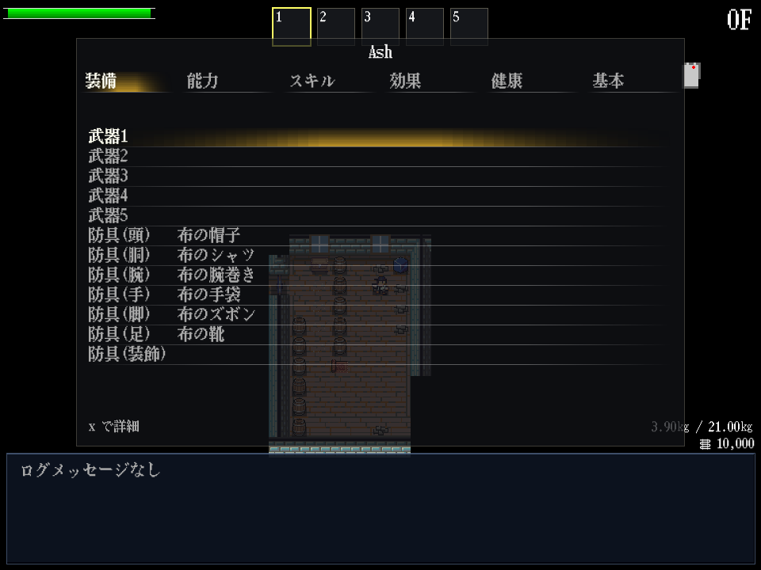
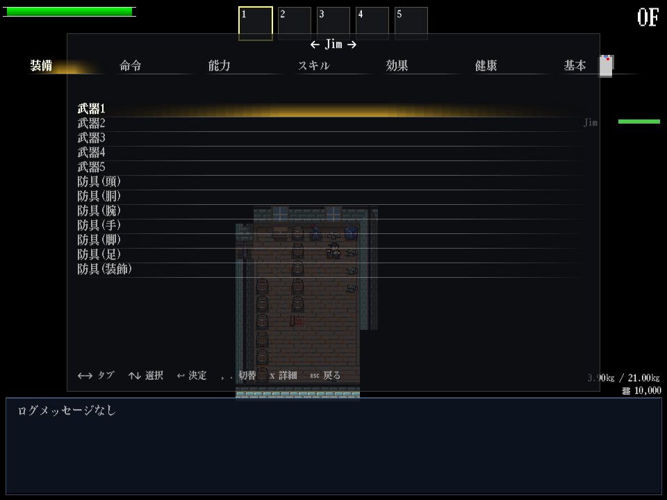
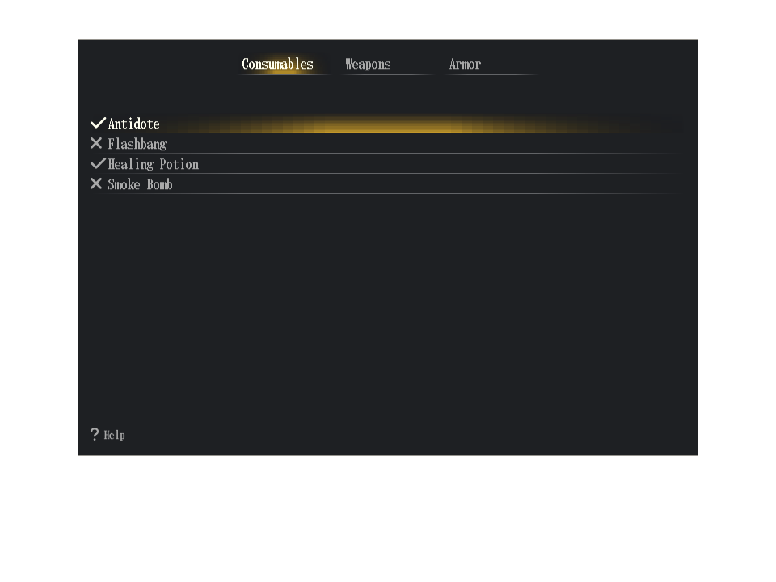
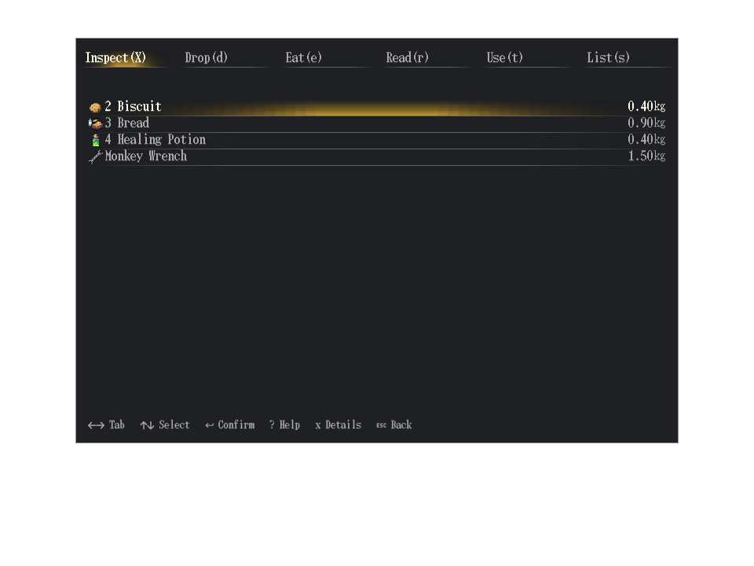
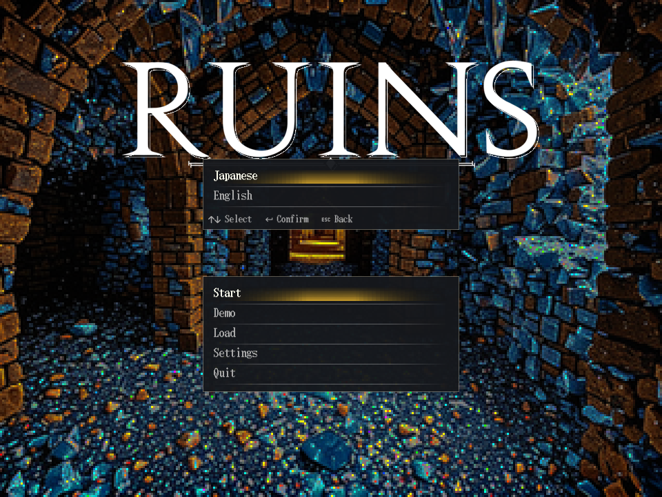
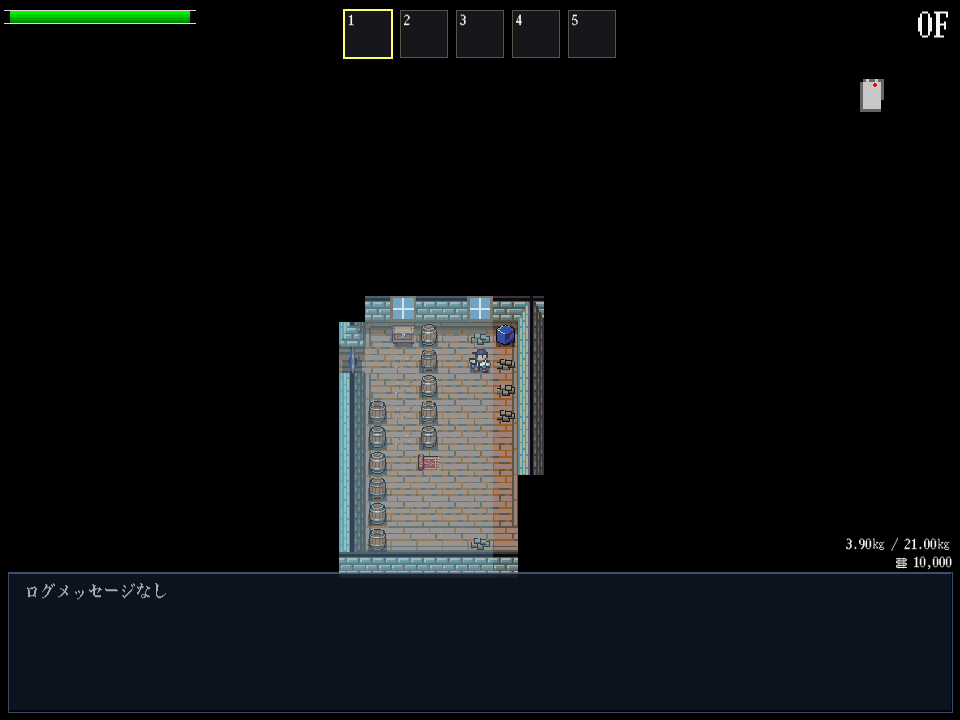
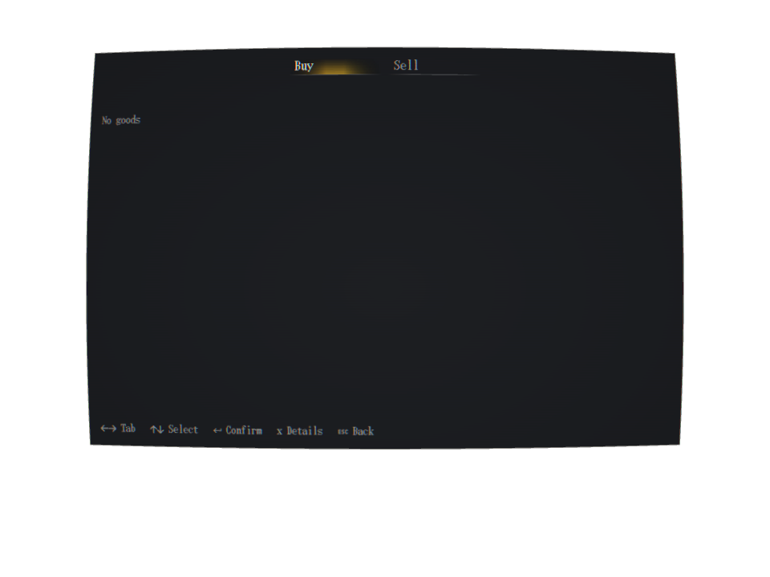
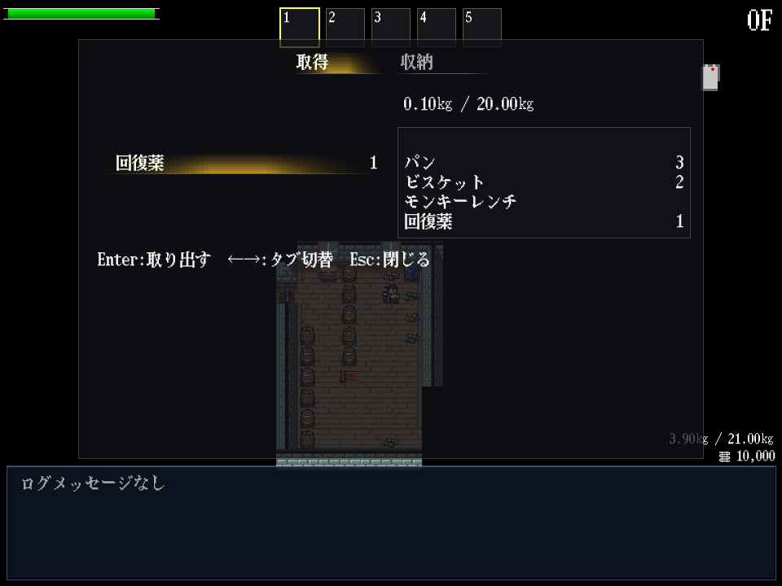
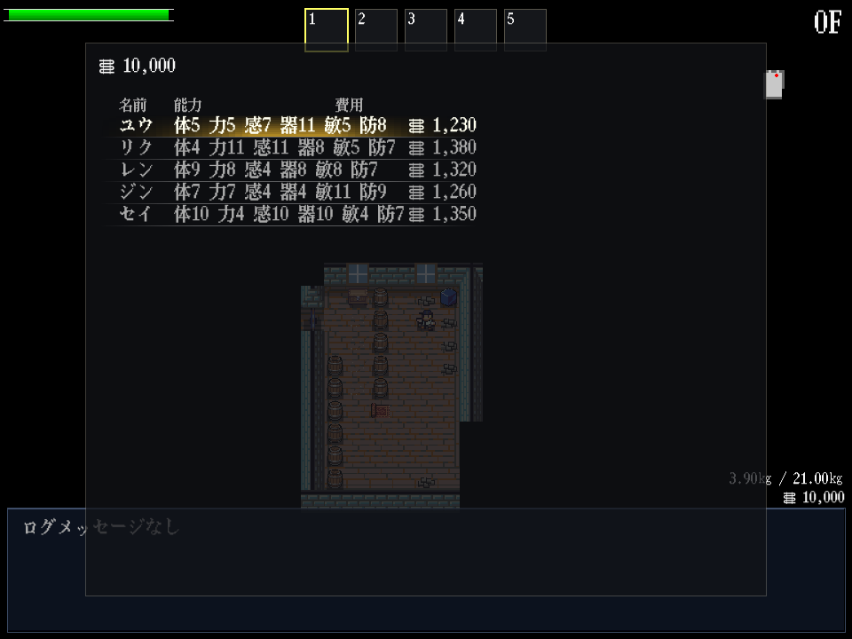

ローグライク。

- [Steam](https://store.steampowered.com/app/4791810/Ruins/)
- [Play](https://kijimad.github.io/ruins/)
- [Test Report](https://kijimad.github.io/ruins/cov/)
- [Raw Spec](https://kijimad.github.io/ruins/raw-spec/)
- [Godoc](https://pkg.go.dev/github.com/kijimaD/ruins)

## Play Images

| | | | |
|---|---|---|---|
| <br>Character | <br>CharacterJob | <br>CharacterMember | <br>CharacterNaming |
| <br>ComponentDebug | <br>CraftMenu | <br>CubePanel | <br>DebugMenu |
| <br>Dungeon | <br>GameOver | <br>ItemAction | <br>ItemActionDetail |
| <br>LanguageMenu | <br>LoadMenu | <br>LookAround | <br>MainMenu |
| <br>Message | <br>Overworld | <br>OverworldFrost | <br>OverworldMap |
| <br>PersistentMessage | <br>SaveMenu | <br>SettingsMenu | <br>Shooting |
| <br>ShopMenu | <br>StorageMenu | <br>TavernMenu | |


各画像はゴールデンテストで自動生成される。

## キーボード操作

### ダンジョン探索
- **W** - 上
- **S** - 下
- **A** - 左
- **D** - 右
- **C / PageDown** - ズームアウト
- **E / PageUp** - ズームイン
- **マウスホイール** - ズーム操作

### メニューナビゲーション
- **↑ / ↓** - 項目の上下移動
- **← / →** - グリッド表示時の左右移動
- **Tab** - 次の項目へ移動
- **Shift + Tab** - 前の項目へ移動
- **Enter** - 項目選択・決定
- **Escape** - キャンセル・戻る

## 開発

依存関係はDockerfileを参考にする。

```
$ make help
```

## 設計ドキュメントの状況

`docs/design` の frontmatter から自動生成される。`go run . designdoc list` で絞り込める。

| status | 件数 |
|---|---|
| draft | 3 |
| done | 80 |

### 未完了

| No. | status | ドキュメント | 進捗 | tags |
|---|---|---|---|---|
| [67](docs/design/20260724_67.md) | draft | 難所調査から抽出した自走可能な改善のバックログ | 0/11（見送り3） | refactor, ci, ecs, combat, meta |
| [79](docs/design/20260731_79.md) | draft | 施設内装の生成 —— doc 70 の未着手バックログ | 1/33 | worldgen |
| [81](docs/design/20260801_81.md) | draft | OSS 調査 2026-08 | 0/5 | meta, worldgen, combat, ui |


## Reference

ゲーム作成で参考にしたコード等。

- https://github.com/x-hgg-x/sokoban-go
  - 最初にコピペして作成をはじめ、改変していった
  - ECSの使い方まわりで参考にした
- https://github.com/x-hgg-x/goecsengine
  - ゲームステートまわりで参考にした
- https://bfnihtly.bracketproductions.com/
  - 設定ファイルによるファクトリ、ゲームログまわりを参考にした
- https://krkrz.github.io/krkr2doc/kag3doc/contents/
  - サウンドノベルに必要な記法を参考にした
- https://ebitengine.org/en/examples/raycasting.html
  - レイキャストの実装の参考にした
- https://cataclysmdda.org/
  - ローグライクシステムの参考にした
- ゲームシステム面で、KONAMIのビデオゲーム『パワプロクンポケット』シリーズ10・11・12を参考にした
  - 途中の方針転換で、あまり残っていない

使用した素材類。

フォント。

- http://jikasei.me/font/jf-dotfont/
- https://github.com/googlefonts/morisawa-biz-ud-gothic
- https://font.download/font/augustus

画像。

- https://www.pixilart.com
- https://pixabay.com/photos/forest-fog-woods-trees-mystical-3394066/
- https://pixabay.com/photos/beer-drink-alcohol-heineken-bar-5940890/
- https://pixabay.com/photos/lost-places-monastery-past-masonry-4019367/
