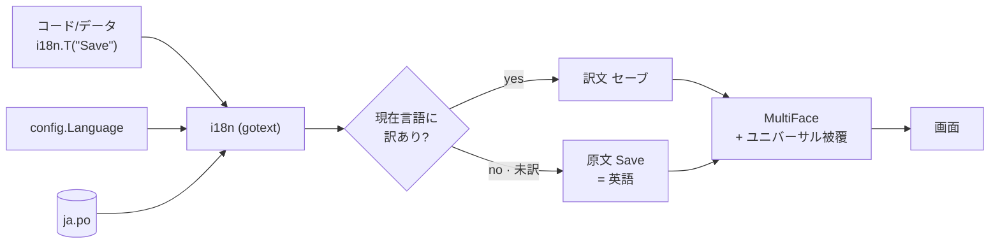
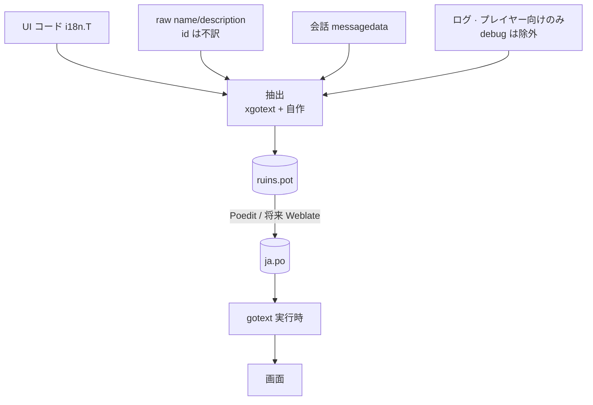
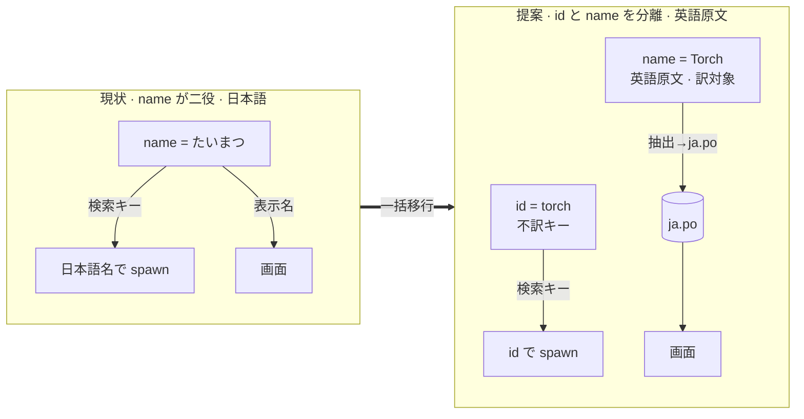

# 国際化 i18n を実装する

## 背景

Ruins は Steam ストアページと Web 版を持つ商用志向のローグライクだが、表示は日本語のみで国際化基盤が無い。現状は次のとおり。

- `config.Language` に `"ja"/"en"` のスタブがあるが、切り替えは未実装。
- 表示文字列はすべて日本語で、コードとデータに直接埋め込まれている。
- フォントは ebiten `text/v2` の `text.NewMultiFace` でフォールバック構成済み。主フォントは日本語ドットの Dougenzaka、ラテンの augustus、記号の nerd。
- ユーザー向け文字列が4系統に散在する。
  1. コード: 約372ファイルに日本語ハードコード。UI ラベル・メッセージ。
  2. データ: `raw.toml` の name/description が1735行。アイテム・敵・prop の名前と説明。
  3. 会話: `messagedata`。NPC 会話・物語。
  4. ログ: `gamelog`。変数を差し込む動的メッセージ。プレイヤー向けと debug が混在。
- VRT ゴールデンはすべて日本語で描画される。

**最大の制約**: raw エンティティは `name` を検索キーにしている。`NewItemSpec(raws, name)`・`NewPropSpec(raws, name)`・`NewMemberSpec(raws, name)` が name で引く。prop は `name = "window"` の ascii、item は `name = "たいまつ"` の日本語と識別方式が不統一。表示名が検索キーを兼ねるため、名前をそのまま翻訳できない。

## この設計の前提となった調査

CDDA と OSS ゲーム、翻訳業界の実態を調べ、当初案を業界標準へ寄せて改訂した。要点。

- **OSS ゲームの i18n 標準は gettext / PO 形式**。CDDA・Wesnoth・0 A.D.・OpenTTD・Minetest・Godot が採用。翻訳者は Poedit・Weblate・Crowdin・Transifex で PO を編集する。
- CDDA は **原文（英語）を msgid（＝翻訳の検索キー）**にするソース方式。データは **機械 id を不訳、`name` を訳**として分離し、`str_pl`（複数形）・`ctxt`（文脈）・`//~`（翻訳者注記）を持つ。
- 当初案の **go-i18n + 独自 TOML はソースでも標準でもなく**、翻訳プラットフォーム対応が弱い。「リポジトリの TOML 文化に合う」という開発者都合で選んでいた。i18n の受益者は翻訳者なので、**翻訳エコシステムの標準に乗る**べき。
- CDDA にも無い業界標準として、擬似ローカライズ・ロケール別書式が欠けていた。

## 要件

- **原文を英語にする**。msgid は英語。日本語は1つの翻訳として `ja.po` に持つ。既定の実行時言語は ja。
- まず ja と en に対応し、**将来の言語追加に耐える**。言語追加が「PO 1枚 + 必要ならフォント追加」で完結すること。
- **業界標準の gettext / PO 形式**に沿う。ただし**大規模な運用基盤は今は入れない**。Poedit 手編集で始め、翻訳者が増えたら同じ PO を Weblate 等へ載せる。
- **既定言語 ja の完全性を保証する**。ja.po に未訳が無いことを CI で強制し、日本語プレイヤーへ英語が漏れないようにする。
- 既存の日本語ゴールデンを壊さない。英語などの**テキスト伸長で UI が破綻しない**。

## 設計

### 全体像

gettext / PO 方式を採り、**英語原文を msgid** にする。実行時は純 Go の `gotext` が `.po` を直接読み、現在言語の訳を引く。未訳は **原文（英語）へフォールバック**する。日本語は `ja.po`、英語は原文そのものなので `.po` 不要。

`internal/i18n` は `gotext` の薄いラッパにする。翻訳器は **`Translator` 値**にし、フォントと同様に `Resources` 経由で注入する。API を**メソッドにしてグローバル state を持たない**ので、`go test -parallel` でも言語ごとに独立した `Translator` を注入でき、レースしない。package-level のトップレベル関数は置かない。言語切替は **バージョンカウンタ**で行い、切替時にキャッシュを一括無効化してオブジェクト走査を避ける。CDDA の手法に倣う。

```go
// internal/i18n — gotext の薄いラッパ。Resources が Translator を保持し、呼び出し側は res.I18N.T で引く
type Translator struct{ /* gotext ドメイン、現在言語、バージョンカウンタを持つ */ }

// T は原文(英語 msgid)に対応する現在言語の訳を返す。未訳なら原文を返す。
func (tr *Translator) T(msgid string) string
// TC は文脈つき。同じ原文の曖昧さを解く。gettext の msgctxt に対応
func (tr *Translator) TC(ctxt, msgid string) string
// TN は複数形。数で語形を選ぶ。gettext の msgid_plural に対応
func (tr *Translator) TN(msgid, plural string, n int) string
// SetLanguage は言語を切り替え、バージョンカウンタを進めてキャッシュを無効化する
func (tr *Translator) SetLanguage(lang string) error
```

以降の `i18n.T("English")` は、注入された `res.I18N.T("English")` の短縮表記とする。トップレベル関数でなく Resources 上の Translator を指す。

PO エントリの形。原文が全言語共通のキーになる。

```po
# ja.po
#: internal/states/save_menu.go:42
msgid "Save"
msgstr "セーブ"

msgid "%d item"
msgid_plural "%d items"
msgstr[0] "%d個のアイテム"   # 日本語は複数形が無いので1形
"Plural-Forms: nplurals=1; plural=0;\n"
```

### 形式とライブラリの選択

| 方式 | 評価 |
|---|---|
| **gettext / PO + gotext** ⭐採用 | OSS ゲーム標準。Poedit/Weblate/Crowdin が native。`gotext` が `.po` 直読み、複数形・文脈対応。運用は Poedit 手編集から始め軽いまま。原文変更は fuzzy で耐える |
| ICU MessageFormat + JSON/ARB | 商用エンジン標準で複数形・性が最も表現力高い。Go の ICU は成熟度が落ちる |
| go-i18n + TOML（当初案） | Go の i18n ライブラリで最多スターだが独自形式で非標準。翻訳プラットフォーム対応が弱く、データが形式にロックインされ将来載せ替えが要る |

PO は**形式と運用を分離できる**。標準形式だけ採用し、Weblate のような基盤は今は入れない。将来同じ PO をそのまま基盤へ流せる。これが「大差なければ標準」という基準に最も合う。

- **ライブラリの人気と形式の可搬性は別軸**。go-i18n は Go の i18n ライブラリで最多スターだが、それは Go ライブラリとしての人気で、翻訳者標準でも形式の可搬性でもない。PO 方式はデータが標準形式なので、実行時リーダの `gotext` が仮に廃れても別の PO リーダへ差し替えるだけで済み、品質がリーダの人気に依存しない。go-i18n は独自形式にデータがロックインされ、載せ替え時にデータごと移行が要る。i18n の成否は翻訳者が標準ツールで作業できるかと形式の可搬性で決まるので、スター数は決め手にならない。
- **`gotext` の位置づけ**: `github.com/leonelquinteros/gotext` は純 Go の PO/MO リーダで、複数形・文脈・ドメインに対応する。役割は「標準 PO を実行時に引く」だけの薄い層で独自形式を持ち込まない。仮に非活発化しても差し替え対象は数十行のラッパだけで、データは無傷。
- **`golang.org/x/text` との比較**: x/text は number/collate の書式・整列基盤としては採るが、翻訳カタログは Go の catalog を前提とし PO を native に扱わない。翻訳者ツール、Poedit 等、が編集できる形式が要件なので、カタログは PO とし、x/text は書式整列にだけ使う。
- 弱点は Go の**抽出ツール**が C++ ほど枯れていないこと。`xgotext` はジェネリクス構文に追従しない既知の制限があり、このコードベースはジェネリクス、`findByKey[T any]` 等、を使う。よって抽出は**自作を主として全体を賄い**、`xgotext` は参考程度に留める。

### 原文を英語にする

英語を原文にすると gettext の前提に乗り、日本語も他言語と同じ1翻訳になる。多言語展開でも英語を軸に翻訳者を集めやすい。

- 含意: 日本語は `ja.po` に依存する。**ja.po の完全性を CI で強制**し、未訳 msgid があればビルドを失敗させる。日本語文言は既存コードから種を採れるので、ja.po は最初から埋まった状態を作る。
- English は原文＝msgid なので `en.po` は不要。未訳フォールバックが即英語になる。

### データの id / name 分離

raw が name を検索キーにする問題を解く。CDDA と同じく **機械 id を不訳のキー、name/description を訳の表示**へ分離する。

```toml
# raw.toml — id が正準キー、name は英語原文
[[items]]
id = "torch"
name = "Torch"
description = "Lights the dark"
```

日本語訳は抽出して `ja.po` が持つ。複数形・文脈・翻訳者注記が要る名前は、CDDA の `str_pl`/`ctxt`/`//~` に相当する形で PO 側に表現する。

- **移行方針: 構造は一括、英語文言は翻訳作業**。id 付与と spawn 箇所の id 参照化、`name` の英語化は機械変換とスクリプトで一度に移し切り、橋渡しフォールバックは残さない。ただし英語原文の文言そのものは日本語からの翻訳で、人手または LLM 補助 + レビューの内容作業になる。`make check` と生成物差分で構造の網羅を担保する。

### 文字列4系統の対応

| 系統 | 方式 |
|---|---|
| コード UI ラベル | 英語原文を `i18n.T("English")` で包む。抽出して POT へ |
| データ name/description | 英語原文を raw に、id を機械キーに。抽出して POT へ。訳は ja.po |
| 会話 messagedata | 英語原文 + 文脈。長文は PO の複数行。訳は ja.po |
| ログ gamelog | プレイヤー向けは複数形テンプレートで翻訳。**debug/error は翻訳しない**。バグ報告の再現性のため英語のまま |

### フォント

MultiFace のフォールバック鎖に、**字形被覆の広いユニバーサルフォントを常に最後に付ける**。CDDA が GNU Unifont を常時付与するのと同じ発想で、言語別 source を細かく選ぶより単純で堅牢。ja/en は現フォントで足りる。ライセンスは同梱前に確認する。

### ロケール別の書式と整列

数値・通貨・一覧の並びは言語で変わる。通貨 10,000 の桁区切りや、アイテム一覧のソート順をロケール依存にする。CDDA は `localized_compare` を使う。`golang.org/x/text` の number/collate で対応する。

### テキスト伸長と擬似ローカライズ

英語は日本語より長い。固定幅 UI がはみ出すので、i18n と同時にレイアウトを可変長対応にする。後追いは全ゴールデン焼き直しになる。

- **擬似ローカライズ**を入れる。原文を `[!!! Ŝávé !!!]` 風へ機械変換した擬似ロケールで、ハードコード漏れ・切れ・伸長を実翻訳前に検出する。CDDA にも無い予防策で、安価に効く。
- 主要画面に en レイアウト用ゴールデンを追加。既定 ja ゴールデンは維持する。vrt に言語を渡せるようにする。

### RTL のスコープ

ebiten `text/v2` の双方向テキスト対応は限定的。アラビア・ヘブライは行の反転やレイアウト鏡映が要る別物なので、**当面 LTR 言語限定**と明記する。RTL は将来の別 doc で扱う。

### 実装上の規約

- **静的初期化で訳さない**。訳を package 変数へ焼かず、描画時に解決する。言語切替に追従させるため。
- **debug/error ログは訳さない**。バグ報告を再現可能に保つ。
- 未訳キーは原文（英語）へフォールバックする。フォールバックしたことをテストで検出できるようにする。
- **CJK 禁止 linter は go/analysis のカスタムアナライザにする**。移行済み領域の Go リテラルに含まれる CJK 文字を禁止し、`make lint` に統合する。単純な grep では領域限定と lint 統合が難しい。既存のカスタム linter 方式に揃える。

### ゴールデンとテスト

既定 ja。ゴールデンは ja.po 経由で日本語描画。**ja.po 完全性を CI で強制**するので、未訳漏れがゴールデンに英語で出ることを防ぐ。ユニットテストは言語を明示注入して ja/en 両方を検証する。

## 移行ステップ

構造の変更は機械的に一括、英語原文の文言は翻訳作業、という二面を分けて進める。全体を1つの協調した移行として完遂し、出荷時に日本語のまま残る中間状態は作らない。コミットは領域別に分けてレビュー可能性を確保する。

### Step 1 — 基盤導入（文字列は変えない）
- `gotext` を依存に追加。`internal/i18n` に `T`/`TC`/`TN`/`SetLanguage` を実装。空の `ja.po` を `embed` で読む。
- `config.Language` を i18n 初期化へ連動。既定 ja。`Resources` へ注入。`LanguageMenu` をバージョンカウンタ方式のライブ切替にする。
- 抽出ツールを用意。自作抽出を主とし、コードとデータ raw を1つの POT、`ruins.pot`、へ束ねる。`xgotext` はジェネリクス非対応のため参考に留める。
- 擬似ローカライズ生成**ツール**と、MultiFace のユニバーサルフォント付与を入れる。擬似ロケールの当て込みは UI 置換が進む Step 4 以降に行うので、ここではツールだけ用意する。
- 検証: ここまでで表示は日本語のまま、i18n の配管だけ通る。

### Step 2 — 抽出と対訳表の作成
- 現在のユーザー向け日本語文字列を全て集める。コードは CJK grep と AST、データは name/description、会話、ログ。
- 各文字列の **英語原文**を起こす。日本語→英語の翻訳パス。LLM 補助 + 人手レビュー。文脈が要るものは `ctxt`、複数形が要るものは `msgid_plural` を決める。
- **英語原文の品質基準を用語集で固定する**。固有名詞・世界観用語・ゲーム専門語は先に用語集、glossary、へ確定訳を登録し、対訳表はそれに従う。訳語の一貫性は用語集との照合でレビューし、原文起こしとレビューは別の担当が行う。用語集は `ja.po` の外に置き、翻訳者にも配る。
- 成果物: 「英語原文 → 日本語」の対訳表。これが `ja.po` の元になり、コード・データの書き換え表にもなる。
- 検証: 対訳表のカバレッジが元の文字列集合と一致することを機械で確認する。

### Step 3 — データの英語原文化と id 分離（一括・機械）
- 全 raw エンティティへ ascii の `id` を付与。`name`/`description` を英語原文へ置換。日本語は POT→`ja.po` へ移す。
- 全 spawn 箇所 `NewItemSpec`/`NewPropSpec`/`NewMemberSpec` を id 参照へスクリプト一括置換。橋渡しは残さない。
- 検証: `make check` 緑、生成物差分ゼロ、ja で従来と同一表示。

### Step 4 — UI コードの英語原文化
- メニュー・HUD・設定の順に、日本語リテラルを `i18n.T("English")` へ置換。POT と `ja.po` を更新。
- 各領域の完了時に、その領域の生の日本語リテラルを **CJK 禁止 linter** で固定する。
- 領域が英語原文化できたら**擬似ローカライズを当てて確認**する。ハードコード漏れ・切れ・伸長を実翻訳前に検出する。Step 1 で用意したツールをここから使う。
- 検証: ja/en 両言語のゴールデンで表示と伸長を確認。

### Step 5 — 会話とログ
- 会話 messagedata を英語原文 + 文脈でカタログ化。
- ログ gamelog は**プレイヤー向けを複数形テンプレートで翻訳**し、**debug/error は英語のまま除外**する。
- 検証: 動的文の差し込みと複数形を ja/en で検証。

### Step 6 — 仕上げ
- 擬似ローカライズを全画面へ通し、ハードコード漏れ・切れを洗う。
- CJK 禁止 linter を全 UI・データ領域へ拡大。ja.po 完全性の CI ゲートを有効化。
- ロケール別の数値・通貨・整列を適用。en/ja ゴールデンを整える。

## 図解

### 実行時の解決フロー : ソース方式 PO

原文(英語)を msgid に、現在言語の `.po` から訳を引く。未訳は原文へフォールバック。



### 文字列4系統と PO パイプライン

各系統から英語原文を抽出して1つの POT へ束ね、翻訳者が `.po` を編集する。



### id と name の分離

id は不訳の検索キー、name は英語原文で訳の対象。



## 変更箇所

| ファイル | 変更内容 |
|---|---|
| go.mod | `gotext` を依存追加 |
| internal/i18n/ | 新設。gotext ラッパ `T`/`TC`/`TN`/`SetLanguage`、埋め込み `ja.po`、バージョンカウンタ |
| internal/resources/resources.go | i18n を Resources へ注入 |
| internal/resources/fonts.go | ユニバーサルフォントを鎖の最後に常時付与 |
| internal/config/config.go | Language を i18n 初期化へ連動 |
| internal/states/settings_menu.go | LanguageMenu のライブ切替 |
| internal/widgets/**, internal/states/** | 日本語リテラルを英語原文 `i18n.T` へ置換 |
| internal/messagedata/, internal/gamelog/ | 会話・ログの英語原文化。debug は除外 |
| internal/raw/, assets/metadata/entities/raw/ | id 導入、name/description の英語原文化 |
| tools/i18n/ | 抽出ツール、自作を主とし xgotext は参考、擬似ローカライズ生成 |
| assets/i18n/ruins.pot | 抽出した英語原文の POT テンプレート |
| assets/i18n/ja.po | 日本語訳。CI で完全性を強制 |
| internal/vrt/ | ゴールデンへ言語を渡せるように |
| tools/ の go/analysis linter | 移行済み領域の Go リテラルの CJK 禁止。make lint へ統合 |
| CI | ja.po 完全性ゲート |

## 採用しなかった方法

- **go-i18n + 独自 TOML でキー方式**（当初案）: Go の i18n ライブラリで最多スターだが、それは Go ライブラリの人気で翻訳者標準ではない。ソースでも業界標準でもなく、翻訳プラットフォーム対応が弱く独自形式にデータがロックインされる。将来 Weblate 等へ載せる段で移行コストが出る。標準の PO へ寄せる。
- **日本語を原文のまま PO 化する**: 動作はするが、gettext は英語原文前提で発達し、翻訳者集めと多言語展開で不利。英語を原文にする。
- **name をデータの正準キーのまま翻訳する**: 表示名を変えられず、名前変更で参照が壊れる潜在バグを残す。id を正準にする。
- **橋渡しフォールバックでの緩慢な id 移行**: 「id 未設定なら name をキー」の暫定二重解決を残すと出荷ビルドに歪みが残る。構造は一括で移す。
- **ICU MessageFormat**: 表現力は上だが Go の実装が未成熟。OSS ゲーム標準の PO を採る。
- **Weblate 等の運用基盤を最初から入れる**: ja+en 規模には過剰。Poedit 手編集で始め、必要になってから同じ PO を載せる。

## コメント

- i18n の受益者は開発者でなく翻訳者。形式は「コードベースに馴染むか」でなく「翻訳エコシステムの標準に乗るか」で選ぶ。だから TOML でなく PO。
- 作業の9割は仕組みでなく**文字列の英語原文化と棚卸し**。構造変更は機械的だが、英語文言は翻訳の内容作業で、ここに人手 + レビューがかかる。
- 英語原文化で日本語は ja.po 依存になる。**ja.po 完全性の CI ゲートが主要言語の品質を守る要**。
- テキスト伸長と擬似ローカライズは i18n と同時に。後追いはゴールデン再生成コストが跳ねる。
- id/name 分離とテキスト伸長対応は業界標準に合致。擬似ローカライズは CDDA に無い予防策で、ここは標準を超えられる。
- RTL は当面スコープ外。将来言語に含めるなら別 doc。

## 進捗

- [ ] Step 1 基盤. `gotext` 依存、`internal/i18n`、config 連動、LanguageMenu ライブ切替、抽出ツール、擬似ローカライズ、ユニバーサルフォント
- [ ] Step 2 抽出と対訳表. 全日本語文字列の収集と英語原文の起こし、文脈・複数形の決定
- [ ] Step 3 データ. 全 raw へ id 付与、name/description 英語化、spawn 箇所を id 参照へ一括、日本語を ja.po へ
- [ ] Step 4 UI コード. メニュー・HUD・設定を英語原文 `i18n.T` へ、CJK 禁止 linter を領域拡大
- [ ] Step 5 会話とログ. 英語原文化、debug 除外、複数形テンプレート
- [ ] Step 6 仕上げ. 擬似ローカライズ通し、ja.po 完全性 CI ゲート、ロケール別書式・整列、ja/en ゴールデン
- [ ] `make check` 緑
