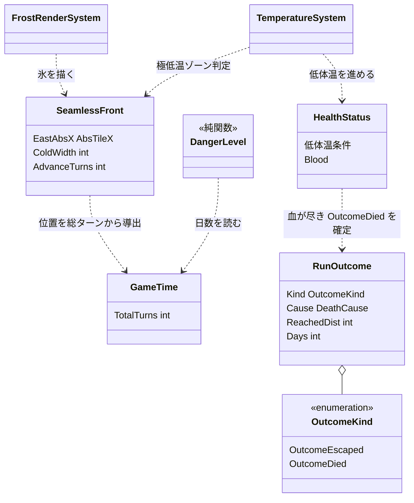
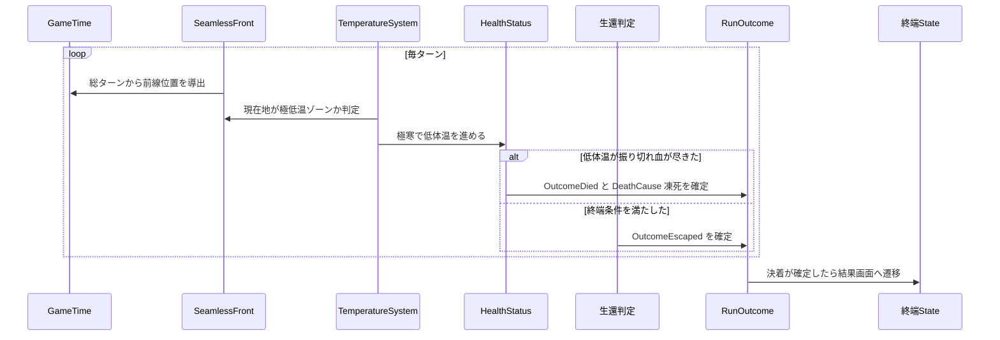

# 大きなゲームループ: 一方向逃避を駆動と終端で閉じる

## 背景

ruins には漁る・使う・送る・捨てる・売る・戦うというミクロの動詞が既に揃い、単体では回る。にもかかわらず「一本のゲームとして成立していない」感触が残る。原因を上位から辿ると、動詞の欠落ではなく、動詞を前へ押し出す原動機と run を締める終わりが無いこと、すなわち**大きなループが閉じていない**ことに行き着いた。

さらにコードには方向の異なる2つのマクロループが同居している。

- **旧・ダンジョン潜降型**: 深さ `Depth` で難易度が上がり、全遺跡のボスを倒す `EventAllCleared` で勝利し、拠点ショップ `ShopMenuState` へ戻る。死で汎用のゲームオーバー。ほぼ完成している。
- **新・一方向逃避型**: 設計 doc `260813235334`・`260814170822` が賭けたビジョン。冷気に呑まれた世界を一方向へ逃げ、道中で漁り、積載の重さがコストを決め、拾った物に市場という第二の需要を足して通販で捌く。**署名メカニズムはここにある。だがマクロの駆動と終端が未実装。**

新ループの背骨を4つの臓器に分けて現状を確かめた。

| 臓器 | 役割 | 現状 |
|---|---|---|
| ① 駆動 | 冷気が前進し滞在を罰し、前進を強制する | 前進・極寒・進入不可・低体温は実装済み。欠けるのは勾配の予兆と予報、死が終端へ接続されないこと |
| ② 終端 | 逃げ切り=生還 / 呑まれ=到達距離、で run を締める | 無い。`Destination` は移動先の意味のみ。締めは旧 `EventAllCleared` と汎用の死だけ |
| ③ 経済の閉環 | 金は前方の補給へ即消費される | 売りは通販に在るが、買いが戻れる固定ショップなら 260813235334 の Anti と矛盾する。要確認 |
| ④ 逓増 | 距離・日数で危険と希少性が上がる | 今も `Depth` 基準。逃避型なら距離・日数が軸 |

動詞は回るのに①②④が無く、③が逆を向いている。だから遊びは無限に続けられるが終われず、ゲームに閉じない。加えて旧潜降型が完成しているぶん欠落を覆い隠しつつ逆向きに引く。この doc は、**新逃避型に一本化し、欠けた臓器を作り、旧潜降型を退役させる**方向を確定させる。個別数値の確定と面白さの検証は着手後に別 doc へ回す。

## 要件

満たすべき抽象条件。Hard は満たさねば ruins でない、Soft は最大化したい、Anti は踏んではいけない罠。260813235334 の不変条件を継承し、マクロ層へ拡張する。

**Hard**

- run の背骨は一方向逃避である。始まり・盛り上がり・終わりを持つ一本の弧になる。
- 冷気前線が時間で前進し、極寒の場として滞在を罰する。追いつかれても即ゲームオーバーにせず、死は低体温から身体を通って訪れる。
- run に終端がある。前へ逃げ切れば生還、力尽きても到達距離が記録される。締めは必ず訪れる。
- 危険と希少性は前進距離と経過日数で逓増する。深さ `Depth` を逓増の軸にしない。
- 経済は前方へ向く。売って得た金は前進の糧に消える。旧潜降型の残骸を退役させ、二骨格の同居を解消する。

**Soft**

- 到達距離がスコアとして残り、次の run へ挑む動機になる。
- 前線の前進が予報でき、いつ漁りを切り上げ前へ動くかの読みが生まれる。
- 生還と踏破が対称の余韻を持つ。逃げ切りの安堵と、呑まれるまでの距離の誇り。

**Anti**

- 戻れる固定市場・固定拠点を作らない。注文は遠隔で届く。260813235334 の Anti を継承する。
- 代金を安全へ貯め込ませない。前方の一歩へ即消費させる。
- 深さ難易度・全遺跡クリア勝利を残さない。新旧の綱引きを温存しない。
- 前線を演出だけに留めない。前進する極寒の場として run を駆動させる。ただし追いつきの即敗北判定は足さず、圧力は温度だけで表す。
- 逃げ切りを唯一の正解にしない。倒れた run も到達距離という決着で報いる。

## 設計

### 全体方針: 4つの臓器を足し、旧骨格を退役させる

新ループを絵にすると次の一周になる。①〜④は上の表に対応する。

```
   ┌──────────────────────────────────────────────┐
   │  冷気前線が時間で前進する。留まれば凍える      │ ← ① 駆動
   ▼                                              │
 前へ逃げる。積載が重いほど遅い＝常時の圧力        │
   │                                              │
   ├─→ 遺跡へ寄り道して漁る。危険↔報酬            │ ← ④ 逓増：距離/日数が軸
   │        使う / 送る / 捨てる                   │
   │        通販で売る → 金 → 前方の補給へ即消費   │ ← ③ 経済：戻る拠点を断つ
   ▼                                              │
 逃げ切って生還 ／ 力尽きて到達距離が記録される    │ ← ② 終端
   └──────────────────────────────────────────────┘
```

決定論を全面採用する。ruins はワールドを `SeamlessBand.RunSeed` と PCG RNG で決定論生成し、天気設計 `260805144630` も状態を増やさず `GameTime` と seed から純関数で出す方針を取った。前線位置・逓増・終端判定もこれに揃え、保存状態を増やさず `GameTime.TotalTurns` から都度算出する。

各臓器の詳細設計は子 doc に分割した。この doc は方向と整合の親に徹する。

- ① 駆動 `260822014347`: 前線は極寒の場。追いつき即敗北にせず、勾配と予報を足す
- ② 終端 `260822014348`: 生還と死の2種で締め、到達距離を記録する
- ③ 経済 `260822014349`: 行商人と遠隔注文で金を前方へ流す
- ④ 逓増 `260822014350`: 危険軸を深さから距離と日数へ移す

静的構造。4臓器がどのデータを読み書きするかを1枚で示す。



動的振る舞い。毎ターンの追いつき判定から run の決着までを時系列で示す。

前線は判定を持たず、温度を通じてだけ圧力をかける。決着は生還判定と身体系が確定する。



### ① 駆動: 冷気前線は極寒の場

前線の物理は大部分が実装済みである。`SeamlessFront` の位置 `EastAbsX` は config と総ターン数から毎ターン導出され冪等、`frostZoneModifier` が極低温ゾーンの生存不能な極寒を `CalculateEnvTemperature` へ注入済み、`IsWestOfFront` が進入不可ラインを判定する。前線は既に前進する温度場として働いている。

方針を1つ確定する。**追いつかれても即ゲームオーバーにしない**。前線は極端な冷たさを提供するだけで、プレイヤーは低体温が進んで死にやすくなる。死は体温系から身体モデル `260821232324` の血経路を通り、凍死として終端へ届く。専用の裁定 system は作らない。

残る設計は二値の崖を勾配へ変える予兆と、純関数導出を将来時刻で評価する予報で、駆動 doc `260822014347` に定める。

### ② 終端: 生還と到達距離で run を締める

run の決着をシングルトンで持ち、終端 State が読んで結果画面を出す。

```go
// OutcomeKind は run の決着の種類。2種に固定し、死因の詳細は Cause で記録して膨張を防ぐ
type OutcomeKind int

const (
	OutcomeEscaped OutcomeKind = iota // 終端条件を満たして生還。主軸が距離でも日数でも定義は変わらない
	OutcomeDied                       // 力尽きた。凍死・餓死・失血死などの死因は Cause に持つ
)

// DeathCause は OutcomeDied の死因。結果画面の表示に使う。凍死・餓死のほか、
// 身体モデル 260821232324 の失血死が傷・臓器・病の別で加わる
type DeathCause string

// RunOutcome は run の決着を表すシングルトン。run 終了時に確定し、終端 State が消費する。
type RunOutcome struct {
	Kind        OutcomeKind
	Cause       DeathCause // OutcomeDied のときのみ
	ReachedDist int        // 到達した前進距離。スコアの主軸
	Days        int        // 生存日数
}
```

勝利条件は「前進距離が閾値 D に達したら生還」あるいは「日数 N を生存」。どちらを主軸にするかは要決定だが、`OutcomeEscaped` は終端条件を満たした生還として抽象化してあるので、決定が型定義へ跳ねない。死はすべて `OutcomeDied` で死因を `Cause` に記録し、前線での死も凍死としてここへ合流する。いずれも `RunOutcome` を確定させ、生還/踏破の結果 State へ遷移する。旧 `EventAllCleared` と全遺跡クリア勝利はこの終端へ置き換えて退役させる。詳細は終端 doc `260822014348` に定める。

### ③ 経済: 前方へ即消費させ、戻る拠点を断つ

現ショップ `ShopMenuState` はコードで確認した結果、固定の拠点 State ではない。`NewShopMenuState(merchant ecs.Entity)` が商人エンティティの在庫を読む仕組みで、会話から開く。つまり「戻れる固定拠点」になるかは商人の配置次第で決まる。方針は、戻って会える固定配置をやめ、道中の行商人と通販の遠隔注文へ寄せる。これなら Anti「戻る固定市場を作らない」に抵触しない。売って得た金は前方の補給、たとえば燃料・食料・装備の遠隔注文へ即消費させ、安全に貯め込む装置にしない。詳細な注文機構は 260814170822 の通販機構の延長として別 doc で定める。

### ④ 逓増: 深さから距離・日数へ

危険度を前進距離と経過日数から出す純関数へ移し、`Depth` を逓増の軸から外す。

```go
// DangerLevel は前進距離と経過日数から危険度を返す。Depth を置き換える逓増の軸。
func DangerLevel(world w.World) int
```

`raw.go` の spawn テーブルは現在 `MinDepth`/`MaxDepth` でゲートしている。これを距離・日数由来の危険度でゲートする形へ移し、`consts.GameClearDepth` を退役させる。移行は spawn テーブルの参照点が限られるので段階的に進められる。

### 退役する旧機構

| 旧機構 | 退役の仕方 |
|---|---|
| `Depth` 難易度・`consts.GameClearDepth` | ④ の距離/日数逓増へ置換 |
| `EventAllCleared`・全遺跡クリア勝利 | ② の生還/踏破終端へ置換 |
| 戻って会える固定配置の商人 | ③ で道中の行商人と遠隔注文へ寄せる。`ShopMenuState` 自体は商人依存なので残せる |

## 変更箇所

| ファイル | 変更内容 |
|---|---|
| `internal/world/query/` ほか | `DangerLevel` と前線予報の決定論純関数を追加する |
| `internal/systems/temperature.go` | 極寒の二値の崖を勾配へ置き換える。詳細は駆動 doc `260822014347` |
| `internal/components/` | `RunOutcome`・`OutcomeKind`・`DeathCause` を追加する。前線の前進は既存 `AdvanceTurns` を使う |
| `internal/states/` | 生還/踏破の終端 State を新規追加し、敗北・餓死・凍死を終端へ接続する。`EventAllCleared` を退役する |
| `raw.toml`・商人の配置 | 戻って会える固定配置をやめ、道中の行商人と遠隔注文へ寄せる |
| `internal/raw/raw.go` | spawn テーブルのゲートを `MinDepth`/`MaxDepth` から距離/日数の危険度へ移す |
| `internal/consts/consts.go` | `GameClearDepth` を退役する |

## 採用しなかった方法

- **旧潜降型を磨いて完成させる**。深さ難易度・全遺跡クリアを整えれば早く「ゲーム」になる。却下。ビジョンと逆を向き、署名メカである一方向逃避と通販の第二需要が死ぬ。他インディーとの差別化を自ら捨てる。
- **新旧の両骨格を併存させる**。潜降と逃避を選べるようにする。却下。二つの原動機が逆向きに引き、どちらの一周も閉じない。今の「成立してない感じ」の構造的原因そのものを温存する。
- **監査バグ `260817001843` を先に潰す**。中身の正直さを先に直す。却下。測る対象＝ループが無いのに中身だけ磨いても成立しない。順序が逆で、大きなループを閉じてから中身の傷を潰す。
- **追いつき即敗北の `ColdPursuitSystem`**。前線とプレイヤーの X を比較し、追いつかれたら run を終える。却下。唐突で理不尽なうえ、断熱・焚き火・シェルターという対抗手段を無意味化する。前線は温度だけで圧力をかけ、死は低体温から血へ流れる既存経路に任せる。裁定 system が1つ減り実装も軽い。
- **`OutcomeKind` を死因ごとに増やす**。餓死・凍死・病死・失血死を定数で列挙する。却下。死因が増えるたび定数が膨らみ、身体モデル doc との横断管理になる。2種に固定し死因は `Cause` のデータで持つ。
- **前線位置の新算出関数を別途作る**。却下。`EastAbsX` は config と総ターン数から毎ターン導出済みで冪等。二重の真実を作らない。予報も同じ導出の将来時刻評価で足りる。

## コメント

この doc はマクロループの方向確定に絞る。前進速度・生還距離 D・日数 N・危険度カーブといった数値は、①②を最小で組んで実際に一周遊び、面白さを測ってから別 doc で定める。260813235334・260814170822 が「遊んで測る以外に確かめようがない」と述べたのと同じ立場を取る。

`RunOutcome` と前線状態は新コンポーネントなので `add-component` の手順に従い、登録表への追加・`make generate`・serde 除外・クエリ設計を漏らさない。

## 進捗

- [x] ③の前提確認: `ShopMenuState` は商人エンティティ依存で固定 State ではない。固定拠点になるかは商人の配置次第。道中の行商人と遠隔注文へ寄せる方針とした
- [x] 前線の扱いを確定する: 追いつき即敗北にせず、極寒の場として低体温経由で効かせる
- [x] 各臓器の詳細設計を子 doc へ分割する: `260822014347`・`260822014348`・`260822014349`・`260822014350`
- [ ] 勝利条件の主軸を決める: 前進距離 D 到達か、日数 N 生存か。`OutcomeEscaped` は抽象化済みで型定義へ跳ねない
- [ ] ① 駆動: 勾配と予報。詳細は `260822014347`
- [ ] ② 終端: `RunOutcome` と結果 State、`EventAllCleared` 退役。詳細は `260822014348`
- [ ] ③ 経済: 行商人と遠隔注文へ寄せる。詳細は `260822014349`
- [ ] ④ 逓増: `DangerLevel` と spawn 移行、`GameClearDepth` 退役。詳細は `260822014350`
- [ ] 最小の一周を実プレイして面白さを測り、数値と次段の設計 doc を起こす
