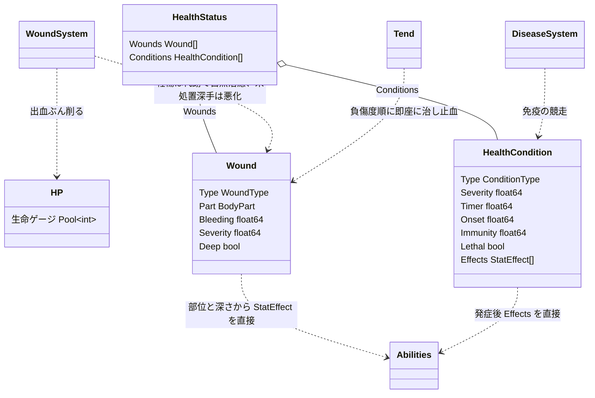
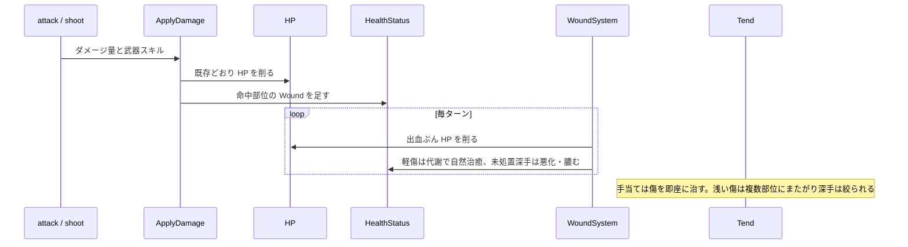

# 身体の不調: 少数部位の負傷と、まとめて配る手当て

## 背景

サバイバルの消耗にリアリティとアイテムの動機を持たせつつ、複雑さを絞る。狙いは2つ。負った場所が効くリアリティと、傷ついたら物が要るアイテムの動機。

複雑さの元は2つあった。部位ごとの耐久と機能を細かく持つこと、そして部位ごとに治療すること。前者は1体への微管理、後者は治療の煩雑さになる。そこで、**部位は少数に絞って負傷は部位に分けるが、治療は身体まとめて1アクションで行う**。負った場所が効く面白さは残し、部位ごとに看る煩雑さは避ける。部位ごとの機能を算出する中間層は持たず、負傷は能力へ直接効かせる。

現状:

- HP は単一プール `type HP Pool[int]`。ダメージは `gameaction.ApplyDamage` の1経路で削り、0で死亡する。この生命ゲージはそのまま使う。
- `HealthCondition`。部位に付く1つの状態を表す既存の型。`Type`・`Severity`・`Timer`・`Effects []StatEffect`。`StatEffect` は `stats_changed.go` を経て6能力へ配線済み。現状は体温 `Hypothermia`・`Hyperthermia` にしか使われていない。
- `Abilities` 6種 STR/SEN/DEX/AGI/VIT/DEF。ruins はこの能力値を戦闘式へ流している。

## 要件

Hard は満たさねばならない、Soft は最大化したい、Anti は踏んではいけない罠。

**Hard**

- 生命ゲージは既存の HP をそのまま使う。
- 部位は少数に絞る。頭・胴・腕・脚。部位ごとの耐久プールや機能算出の層は持たない。
- 負傷は部位に付き、部位に応じて能力へ直接効く。脚を負えば鈍り、腕を負えば狙いが乱れる。
- 治療は身体まとめて1アクションで行う。部位を選ばず、負傷度の重い順に自動で配る。
- 傷は放置で悪化し、深手は傷跡として残る。
- 病気は悪化と免疫の競走で決着する。主効果は機能低下、致死性の病だけが死なせる。潜伏期を持ち、感染から発症の自覚まで時間差がある。
- 傷ついたら物が要る。手当てには薬を消費し、傷が多い/深いほど薬が要る。
- 軽い負傷は手当てせずとも代謝で癒える。手当てが要るのは深手・強い出血・病気だけで、戦闘のたびの手当てを強いない。
- 手当てすれば傷は即座に治る。治るのを待たせずテンポを止めない。良い治療道具ほど深い傷まで一度に治せる。

**Soft**

- 負った場所が読める。腕の傷で狙いが乱れ、脚の傷で鈍る、が体感できる。
- 手当ての判断が生まれる。多くの傷を負ったとき、良い薬を使うか温存するか。
- 手当ては危機の局面の判断になる。死にかけたときに薬を切るかの決断で、routine な作業にしない。
- よく食べ休むほど速く回復する。食料が回復の動機になる。
- 早期治療は浅く安く、放置は深手・感染・傷跡と高くつく。

**Anti**

- 部位ごとの耐久プールや機能算出の層を作らない。
- 部位ごとに治療させない。治療のアクション数を負傷数から切り離す。
- 治療を療養ミニゲームにしない。全快の安全地帯を作らず、前進の合間に手当てする。
- 病気を必ず出血させない。機能低下を主にする。

## 設計

### 全体方針: 部位に負傷、身体に手当て

負傷は少数の部位に付き、部位に応じた能力ペナルティを直接与える。治療は身体まとめて1アクションで、負傷度の重い順に自動で配る。生命ゲージの HP はそのまま残し、出血と致死性の不調がこれを削る。





### ① HP と部位と不調リスト

生命ゲージは既存の HP をそのまま使う。不調は `HealthStatus` の平坦リストで持つ。部位は少数の enum で、傷の付き先と効果先の能力を決める。部位ごとの耐久プールは持たない。

```go
// BodyPart は部位。少数に絞る。負傷の付き先と効果先の能力を決める
type BodyPart int

const (
	BPHead  BodyPart = iota // 頭。SEN 系、射撃と視界
	BPTorso                 // 胴。VIT 系、耐久
	BPArm                   // 腕。DEX 系、命中
	BPLeg                   // 脚。AGI 系、移動と回避
)

// HealthStatus は不調の平坦リストを持つ。生命ゲージは既存の HP をそのまま使う
type HealthStatus struct {
	Wounds     []Wound           // 傷。命中部位付き
	Conditions []HealthCondition // 病気・体調
}
```

不調は `HealthStatus` を持つ生き物に適用する。什器やロボットなど不調を持たない対象は従来どおり HP と単純な耐久で壊す。

### ② 傷: 部位に付き、悪化し、傷跡を残す

傷は命中部位に付く。部位と深さから能力ペナルティを直接出す。機能を算出する中間層は挟まない。

```go
// WoundType は傷の種類。武器の性質から決まる
type WoundType int

const (
	WoundLaceration WoundType = iota // 裂傷。斬撃
	WoundStab                        // 刺し傷。刺突
	WoundBlunt                       // 打撲。打撃
	WoundGunshot                     // 銃創。射撃
	WoundBurn                        // 熱傷。火
)

// Wound は1つの傷。命中部位と、深さ・出血を持つ
type Wound struct {
	Type     WoundType
	Part     BodyPart
	Bleeding float64 // 出血の強さ。合算して毎ターン HP を削る。手当てで止まる
	Severity float64 // 深さ 0-1。手当てで即座に癒える。未処置の深手は悪化する
	Deep     bool    // 深手だったか。未処置のまま自然に癒えると傷跡を残す
}

// woundEffect は傷の部位と深さから能力ペナルティを出す。頭→SEN、胴→VIT、腕→DEX、脚→AGI
func woundEffect(w Wound) StatEffect
```

傷の種類は既存の武器スキルから導く。命中部位は部位サイズの重みで抽選する。傷は毎ターン `WoundSystem` が進める。**手当てすれば傷は即座に癒える**。良い治療道具ほど、より深い傷まで一度に治せる。治るのを待たせずテンポを止めず、薬を使えば効くという手応えを与える。手当てしない傷は、軽い掠り傷なら代謝で自然に癒えるが、深手は膿んで悪化し `Severity` が上がり出血が増し感染創の感染判定に掛かる。だから戦闘のたびに手当てせずとも掠り傷は放っておけ、手当てが要るのは深手・強い出血・病気の危険なときだけ。未処置の深手が自然に癒えると傷跡として軽いペナルティを残すが、手当てで治せば傷跡は残らない。出血は手当てで止まり、放置で HP を脅かすのは強い出血だけ。演出はログと敵ステータスに出す。命中時に `左腕を切り裂いた！ 出血` とログし、ステータス欄へ HP と傷と病気を並べる。

### ③ 病気: 悪化と免疫の競走、潜伏を持つ

病気は悪化と免疫の競走で決める。悪化が振り切れば深刻化し、免疫が先に満ちれば治る。既存 `HealthCondition` に免疫と致死性と発症閾値を足す。

```go
// HealthCondition に発症閾値と免疫と致死性を足す
type HealthCondition struct {
	Type     ConditionType
	Severity float64
	Timer    float64 // 悪化度 0-100
	Onset    float64 // 発症閾値。Timer がこれ未満は潜伏期。機能低下も自覚も無い
	Immunity float64 // 免疫 0-100。Timer より先に100へ着けば治癒
	Lethal   bool    // 致死性か
	Effects  []StatEffect
}

// DiseaseSystem は病気系条件の悪化と免疫の競走を毎ターン進める。傷は WoundSystem が担う
type DiseaseSystem struct{}
```

競走の1ターンは、`Timer` を悪化速度ぶん進め、`Immunity` を免疫速度ぶん進め、`Immunity` が満ちたら治癒、`Timer` が振り切れたら致死性の病は死なせ、非致死は最大 severity で衰弱を続ける。両方満ちたら治癒を優先する。

病気は**潜伏期**を持つ。感染直後は `Timer` が `Onset` 未満で、`Effects` は効かず不調リストにも現れない。背後で `Timer` と `Immunity` だけが進む。`Timer` が `Onset` を超えると発症し、機能低下が効き始めて初めて自覚できる。感染から自覚まで時間差があり、腐敗食を食った時点では分からず後から症状が出る。潜伏中は治療の対象にならないので予防が効く。潜伏の長さは病気ごとにカタログの `Onset` で定める。

感染の契機は既存の曝露へ紐づける。寒冷は `Hypothermia` が Severe で風邪、腐敗食は `Perishable` の rotten 段階の摂取で疫病、負傷は深手の放置で感染創。

### ④ 代謝: 回復速度

HP の再生速度、軽い傷の自然治癒、病気の免疫獲得速度を、代謝という1つの係数で決める。基礎は VIT、満腹度で上下する。よく食べ休めば速く治り、飢えれば遅い。食料が回復の動機になる。細かい内臓機能へは分解せず、1つの派生値に留める。

```go
// Metabolism は回復速度の係数。HP再生と免疫獲得を左右する。VIT と満腹度から出す派生値
func Metabolism(world w.World, entity ecs.Entity) consts.Percent
```

### ⑤ 手当て: 負傷度でまとめて配る1アクション

治療は身体まとめて1アクションで行う。部位を選ばない。手当ては1回ぶんの治療量を持ち、それを負傷の重い順に自動で配る。

```go
// Tend は1回の手当て。治療量 budget を負傷度の重い順に配り、傷を即座に治し止血する。
// 良い薬ほど budget が大きく、より多く深い傷まで一度に治せる
func Tend(hs *HealthStatus, budget float64)
```

- 治療量 `budget` は薬品のグレードと量、`SkillHealing` から決まる。良い道具ほど大きい。
- 出血する傷を最優先に、次いで深手から順に、`budget` の続く限り即座に治す。1傷に要る量は `Severity` に比例する。
- 浅い傷は少量で済むので、1回の手当てが複数部位にまたがる。深手は量を食うので、`budget` が尽きれば残りは未処置のまま次の手当てへ持ち越す。
- 手当てで治した傷は傷跡を残さない。`budget` が余れば発症中の病気の悪化を鈍らせる。

**手当ては戦闘のたびの routine ではない**。多くの掠り傷は代謝で勝手に癒えるので、手当てが要るのは、放置すれば悪化する深手、自然に止まらない強い出血、発症した病気、という危険な場合だけ。危機の局面でだけ薬を切る判断になる。

プレイヤーは「手当て」を選ぶだけで、どこから治すかは負傷度で自動に決まる。深手が多いほど1回で足りず薬が要る。良い薬ほど深い傷まで一度に治せる。傷ついた→薬で即座に治す、のループが、テンポを止めず、良い薬を使うか温存するかの判断とともに回る。全快の安全地帯は作らず、前進の合間に手当てする。治療効果は既存 `ModHealingEffect`・`SkillHealing` を再利用する。

### ⑥ 死

死は HP が0で訪れる。外傷の出血が HP を削り、致死ダメージが一気に削り、致死性の病は終端で HP を尽きさせ、寒暑と飢餓も終端で HP を尽きさせる。死因は失血・凍死・餓死・病死などのラベルで区別し、run の終端 State へ渡す。決着の型 `RunOutcome` は終端の設計 doc `260822014348` に定義する。既存の汎用ゲームオーバーはこの経路へ置き換える。

## 変更箇所

| ファイル | 変更内容 |
|---|---|
| `internal/components/health_status.go` | `HealthStatus` を `Wounds`・`Conditions` の平坦構造へ。`Wound` へ `Part`・`Stage`、`HealthCondition` へ `Onset`・`Immunity`・`Lethal` を足す。HP には手を入れない |
| `internal/components/enum.go` | `BodyPart` を頭・胴・腕・脚へ絞る。`WoundType`・`ConditionType` を足す |
| `internal/world/query/` | `woundEffect`・`Metabolism` を足す |
| `internal/components/stats_changed.go` | 傷と病気の `StatEffect` を6能力の Modifier へ写す。既存経路を再利用 |
| `internal/world/gameaction/`（ApplyDamage） | `HealthStatus` 持ちに命中部位の `Wound` を足す。HP を削る処理は共通 |
| `internal/activity/attack.go`・`shoot.go` | 武器スキルから傷種を導き命中部位を抽選して `Wound` を足す |
| `internal/systems/wound.go` | `WoundSystem` を追加し、軽い傷は代謝で自然治癒させ、未処置の深手は膿んで悪化・感染させ、未処置のまま癒えた深手は傷跡を残す。出血合計で HP を削る |
| `internal/systems/disease.go` | `DiseaseSystem` を追加し、悪化と免疫の競走を進める。潜伏中は Effects と表示を抑える。致死病は終端で死なせる |
| `internal/systems/helper.go` ほか初期化 | `WoundSystem`・`DiseaseSystem` を `InitializeSystems` へ登録する |
| `internal/activity/`（新規 tend アクション） | `Tend` を追加し、薬を消費して治療量を負傷度順に配り、傷を即座に治し止血する。良い薬ほど深い傷まで治せる。部位は選ばない |
| `internal/systems/temperature.go`・飢餓経路 | 寒暑と飢餓を終端で HP を尽きさせる。低体温 Severe で風邪の感染判定。満腹度を代謝に効かせる |
| `internal/activity/`（摂食経路） | 腐敗食の摂取で疫病の感染判定 |
| UI（ステータス） | 既存 HP バーへ傷と病気の不調リストを並べる。潜伏中の病気は表示しない |
| serde 経路 | `HealthStatus` の平坦化、傷と `Part`・`Deep`・傷跡・`Onset`・`Immunity` を保存対象に含める |
| `raw.toml`・`internal/raw/` | 薬品のグレードと量、病気カタログの致死性・発症閾値・`Effects` を定義する |

## 採用しなかった方法

- **部位ごとに治療させる**。傷を部位ごとに個別に手当てする。却下。負傷数だけアクションが要り煩雑になる。治療は身体まとめて1回で、負傷度の重い順に自動で配る。アクション数を負傷数から切り離す。
- **全ての傷に手当てを要求する**。掠り傷まで手当てしないと治らない。却下。戦闘のたびの手当てが routine な作業になる。軽傷は代謝で自然治癒させ、手当ては深手・強い出血・病気という危険な場合だけに要る形にして、頻度を下げる。
- **治療に時間をかけ、手当てを治癒速度の改善に留める**。薬は治りを速めるだけで即座には治さず、閉じるのは時間が担う。却下。リアルだが、治るのを待つ間テンポが悪く、薬を使った手応えも薄い。即座に治すほうがテンポが良く、良い薬ほど深い傷まで治せる、というアイテムの意味もはっきり出る。深手の重みは、未処置なら悪化・感染・傷跡という別の形で残す。
- **部位ごとの機能を算出する中間層を持つ**。部位損傷から意識・視覚・操作などの機能を出す。却下。機能はアイテムの動機を生まず、抽象値は体感しにくい。負傷は部位から能力へ直接効かせれば足りる。
- **部位ごとの耐久プールを持つ**。却下。1体への微管理になる。負傷度は傷の `Severity` で表す。
- **治療品質を薬品と操作の式で細かく出す**。却下。治療量 `budget` の大小で回復とリスクは足りる。良い薬ほど budget が大きい、で十分。
- **病気を必ず出血させて死なせる**。却下。多くの病は衰弱させて死ぬのが自然。機能低下を主にする。

## コメント

死は HP が尽きる1点に集約した。出血率・HP再生率・代謝の係数・傷の悪化速度・傷跡ペナルティ・病気の機能低下量と致死速度・潜伏の長さ・手当ての budget と 1傷あたりの消費は、着手後に実プレイで測る。

HP には手を入れないので生命ゲージの移行は無い。`HealthStatus` を平坦リストへ変え `Part` などを足すので serde は変わる。`ruins-review` の serde 観点で点検し、旧セーブとの互換は維持せず、バージョン記録と不一致警告で扱う。

## 進捗

- [ ] `HealthStatus` を `Wounds`・`Conditions` の平坦構造へ変え、`BodyPart` を頭・胴・腕・脚へ絞る
- [ ] `Wound` へ `Part`・`Deep` を足し、`woundEffect` で部位と深さから能力ペナルティを直接出す
- [ ] `WoundSystem` を足し、軽傷は代謝で自然治癒、未処置の深手は膿んで悪化・感染、未処置のまま癒えた深手は傷跡、出血で HP を削る
- [ ] `HealthCondition` へ `Onset`・`Immunity`・`Lethal` を足し、`DiseaseSystem` を追加して登録する。潜伏中は Effects と表示を抑える
- [ ] `Metabolism` を VIT・満腹度から出し、HP再生と免疫獲得に効かせる
- [ ] `Tend` を足し、治療量を負傷度順に配って傷を即座に治し止血する。良い薬ほど深い傷まで治せる
- [ ] 感染源を配線する: 寒冷 Severe→風邪、腐敗食→疫病、深手の放置→感染創
- [ ] 寒暑・飢餓を終端で HP を尽きさせ、死因ラベルつきで run 終端 `260822014348` へ接続する
- [ ] 既存 HP バーへ傷と病気の不調リストを並べる
- [ ] serde の平坦化と新フィールドの保存経路を確認する
- [ ] 最小の一周を実プレイし、傷・手当て・病気・代謝の数値を測る
