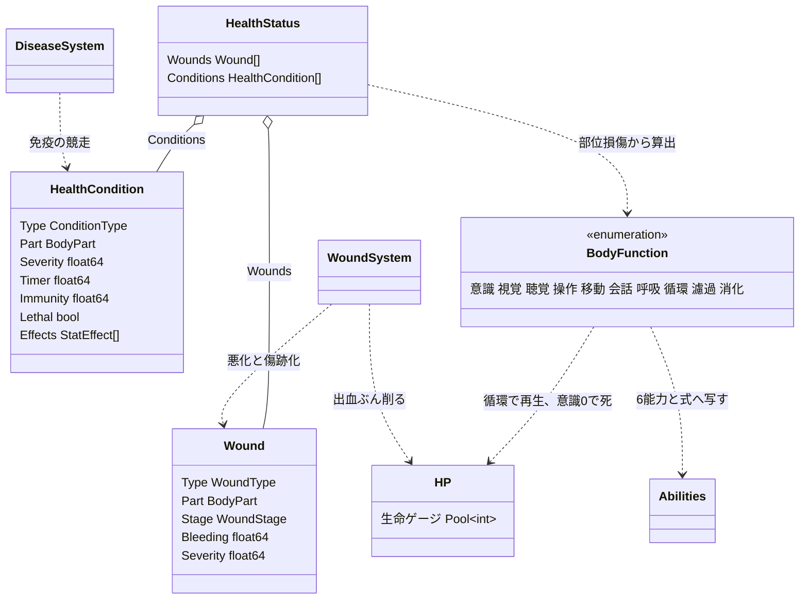
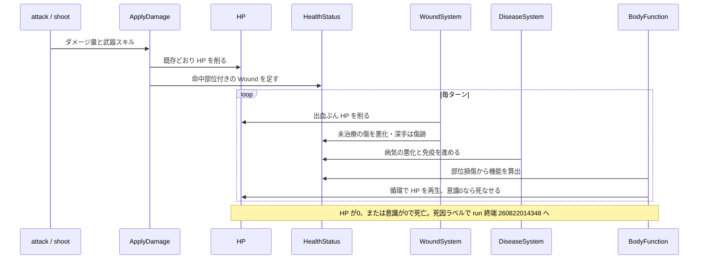

# 身体の不調: 少数の部位と、部位から算出する身体機能

## 背景

身体ペナルティと病気を、生命ゲージの HP と、傷・病気の不調リストと、部位から算出する身体機能で表す。部位は少数に絞り、機能は絞らない。少数の部位から多数の機能を出すことで、部位の管理は軽く、機能の表現力は保つ。

狙いは、負った場所が意味を持つことである。脚を負えば遅くなり、腕を負えば狙いが乱れ、胴を負えば全身が弱る。この因果を、部位ごとの耐久プールでなく、部位に付いた傷の重さから機能へ写して出す。

現状:

- HP は単一プール `type HP Pool[int]`。ダメージは `gameaction.ApplyDamage` の1経路で削り、0で死亡する。この生命ゲージはそのまま使う。
- `HealthCondition`。部位に付く1つの状態を表す既存の型。`Type`・`Severity`・`Timer`・`Effects []StatEffect`。`StatEffect` は `stats_changed.go` を経て6能力へ配線済み。現状は体温 `Hypothermia`・`Hyperthermia` にしか使われていない。
- `Abilities` 6種 STR/SEN/DEX/AGI/VIT/DEF。ruins はこの能力値を戦闘式へ流している。

目的は、既存の HP を生命ゲージのまま活かし、部位ごとの傷と病気の不調リストを足し、その損傷から**身体機能**を算出して6能力と各式へ効かせること。

## 要件

Hard は満たさねばならない、Soft は最大化したい、Anti は踏んではいけない罠。

**Hard**

- 生命ゲージは既存の HP をそのまま使う。HP を別名へ置き換えない。
- 部位は少数に絞る。頭・胴・腕・脚。部位ごとの耐久プールや敵ごとの身体構成は作らない。
- 部位の損傷度は、その部位に付いた傷と条件の重さの合算から出す。0が健全、1が壊れた状態。
- 身体機能は部位の損傷度から算出する派生値にする。状態を増やさない。
- 機能は6能力と各式へ効かせる。負った場所が命中・移動・視界・回復などに跳ね返る。
- 傷は放置で悪化し、深手は傷跡として残る。
- 病気は悪化と免疫の競走で決着する。主効果は機能低下、致死性の病だけが死なせる。
- 死は HP が0、または意識が0で訪れる。死因はラベルで区別する。

**Soft**

- 負った場所が読める。腕の傷で狙いが乱れ、脚の傷で鈍る、が体感できる。
- 早期治療は浅く安く済み、放置は深手・感染・傷跡と機能低下で高くつく。
- よく食べ休むほど速く回復する。栄養が循環と濾過を上げ、回復と免疫を支える。
- 敵にも傷が乗り並ぶ。深手や弱点を突く読みが生まれる。

**Anti**

- 部位ごとの耐久プールと身体構成を作らない。損傷度は傷の重さから出す。
- 機能を戦闘に効くものだけへ絞らない。呼吸・循環・濾過・消化まで持ち、胴の損傷が全身へ波及するようにする。
- HP を血などへ改名しない。
- 治療を療養ミニゲームにしない。全快の安全地帯を作らず、治療は前進の合間に行う。
- 病気を必ず出血させない。機能低下を主にする。

## 設計

### 全体方針: 傷と病気を部位へ、部位から機能へ

因果を3段にする。傷と病気が部位に付き、部位の損傷が機能を下げ、機能が6能力と式へ効く。生命ゲージの HP はそのまま残し、出血と致死性の不調がこれを削る。





### ① 部位と不調リスト、HP

部位は少数に絞る。傷と条件はどの部位かを持ち、部位の損傷度はその部位の重さの合算から出す。部位ごとの耐久プールは持たない。

```go
// BodyPart は部位。少数に絞る。左右はまとめる
type BodyPart int

const (
	BPHead  BodyPart = iota // 頭。意識・視覚・聴覚・会話の由来
	BPTorso                 // 胴。意識・呼吸・循環・濾過・消化の由来
	BPArm                   // 腕。操作の由来
	BPLeg                   // 脚。移動の由来
)

// HealthStatus は不調の平坦リストを持つ。生命ゲージは既存の HP をそのまま使う
type HealthStatus struct {
	Wounds     []Wound           // 傷。命中部位付き
	Conditions []HealthCondition // 病気・体調。部位付き。病気は全身
}

// PartDamage は部位の損傷度 0-1 を返す。その部位の傷と条件の Severity 合算から出す
func PartDamage(hs *HealthStatus, part BodyPart) float64
```

不調リストは `HealthStatus` を持つ生き物に適用する。什器やロボットなど不調を持たない対象は従来どおり HP と単純な耐久で壊す。

### ② 傷: 命中部位に残り、悪化し、傷跡を残す

傷は命中部位に付く。位置は表示の彩りであると同時に、部位の損傷度を通じて機能へ効く。

```go
// WoundType は傷の種類。武器の性質から決まる
type WoundType int

const (
	WoundLaceration WoundType = iota // 裂傷。斬撃
	WoundStab                        // 刺し傷。刺突
	WoundBlunt                       // 打撲。打撃
	WoundGunshot                     // 銃創。射撃
	WoundBurn                        // 熱傷。火
)

// WoundStage は傷のライフサイクル段階
type WoundStage int

const (
	WoundOpen       WoundStage = iota // 未治療。放置で悪化し出血が続く
	WoundStabilized                   // 治療済み。悪化と出血が止まり癒えていく
	WoundScar                         // 深手が癒えた痕。軽い機能低下を永続で残す
)

// Wound は1つの傷。命中部位と段階を持つ
type Wound struct {
	Type     WoundType
	Part     BodyPart
	Stage    WoundStage
	Bleeding float64 // 出血の強さ。合算して毎ターン HP を削る。止血で0
	Severity float64 // 深さ 0-1。未治療で上がる。部位損傷度へ寄与する
}
```

傷の種類は既存の武器スキルから導く。命中部位は部位サイズの重みで抽選する。胴が当たりやすい。傷は毎ターン `WoundSystem` が進める。

- **放置で悪化**: 未治療の `WoundOpen` は `Severity` が上がる。深手閾値を超えると出血が増し、④の感染創の発症判定に掛かる。
- **治療で安定**: 治療は `WoundOpen` を `WoundStabilized` にする。悪化が止まり、出血が0になり、`Severity` が安静と治療でゆっくり下がって閉じる。
- **傷跡が残る**: 深手まで進んだ傷は、癒えても `WoundScar` として残り、軽い損傷度を永続で部位へ残す。浅いまま閉じた傷は跡を残さず消える。

演出はログと敵ステータスに出す。命中時に `左腕を切り裂いた！ 出血` とログし、ステータス欄へ HP と不調リストと機能の効率を並べる。

### ③ 病気: 悪化と免疫の競走、機能低下が主

病気は悪化と免疫の競走で決める。悪化が振り切れば深刻化し、免疫が先に満ちれば治る。現状の `HealthCondition` は `Timer` が上下するだけでこの競走が無いので、免疫と致死性をここだけ足す。

```go
// HealthCondition に部位と免疫と致死性を足す
type HealthCondition struct {
	Type     ConditionType
	Part     BodyPart // 全身の病気は胴に置くなど、影響部位を持つ
	Severity float64
	Timer    float64 // 悪化度 0-100
	Immunity float64 // 免疫 0-100。Timer より先に100へ着けば治癒。病気のみ
	Lethal   bool    // 致死性か
	Effects  []StatEffect
}

// DiseaseSystem は病気系条件の悪化と免疫の競走を毎ターン進める。傷は WoundSystem が担う
type DiseaseSystem struct{}
```

競走の1ターンは、`Timer` を悪化速度ぶん進め、`Immunity` を免疫速度ぶん進め、`Immunity` が満ちたら治癒、`Timer` が振り切れたら致死性の病は死なせ、非致死は最大 severity で衰弱を続ける。同一ターンに両方満ちたら治癒を優先する。免疫の速度は身体機能の**濾過**が左右する。

病気の主な効き目は `Effects` の機能低下である。severity が上がるほどペナルティが強まる。死ぬのは致死性の病の終端だけで、大半は衰弱させて他の死因を招き寄せる。

### ④ 発症源

新たな乱数源を単独で持たず、既存の曝露と選択へ紐づける。

```go
const (
	ConditionInfection ConditionType = "Infection" // 感染創。深手の化膿。致死性
	ConditionFlu       ConditionType = "Flu"       // 風邪。寒冷曝露。非致死。衰弱のみ
	ConditionPlague    ConditionType = "Plague"    // 疫病。腐敗食の摂取。致死性
)
```

- **寒冷**: `Hypothermia` が Severe まで進んだら風邪の発症判定。
- **腐敗食**: `Perishable` の rotten 段階を食べたら疫病の発症判定。腐敗 doc `260815125506` の劣化段階を入力にする。
- **負傷**: 傷が放置で深手まで悪化したら感染創の発症判定。②の傷から連鎖する。

### ⑤ 身体機能: 部位から算出し、6能力と式へ効かせる

身体機能は、部位の損傷度から算出する派生値で、6能力と各式の間に立つ中間層である。機能は絞らない。戦闘に直結するものから、呼吸・循環・濾過・消化まで持つ。

```go
// BodyFunction は身体機能。部位の損傷度から算出する派生値
type BodyFunction int

const (
	FuncConsciousness BodyFunction = iota // 意識。頭・胴から。全行動の土台
	FuncSight                             // 視覚。頭から
	FuncHearing                           // 聴覚。頭から
	FuncManipulation                      // 操作。腕から
	FuncMoving                            // 移動。脚から
	FuncTalking                           // 会話。頭から
	FuncBreathing                         // 呼吸。胴から
	FuncCirculation                       // 循環。胴から
	FuncFiltration                        // 濾過。胴から
	FuncDigestion                         // 消化。胴から
)

// FunctionLevel は機能効率 0-100 を由来部位の損傷度から返す。派生値で状態を増やさない
func FunctionLevel(world w.World, entity ecs.Entity, f BodyFunction) consts.Percent
```

機能から効果への写像:

| 機能 | 由来 | 効かせ先 |
|---|---|---|
| 意識 | 頭・胴 | 命中と作業の全体倍率。0で死 |
| 視覚 | 頭 | 射撃命中と視界 |
| 聴覚 | 頭 | 敵の察知と不意打ち回避、取引 |
| 操作 | 腕 | 近接と射撃の命中、治療成功率、作業効率 |
| 移動 | 脚 | 移動コストと回避 |
| 会話 | 頭 | 交渉と取引と勧誘 |
| 呼吸 | 胴 | スタミナと持久、移動と作業の下支え |
| 循環 | 胴 | HP の再生と失血回復 |
| 濾過 | 胴 | 免疫の獲得速度 |
| 消化 | 胴 | 食事の満腹回復効率 |

胴の内臓系機能、呼吸・循環・濾過・消化は、部位損傷に加えて **VIT と満腹度** を基礎にする。よく食べ体が丈夫なほど高く、胴の損傷と病気が下げる。前案の代謝はこの循環と濾過へ畳んだ。HP 再生は循環、免疫獲得は濾過が担う。単独の代謝プリミティブは持たない。

機能は既存の `stats_changed`・`CharModifiers` の経路へ乗せ、6能力の Modifier と各式の倍率へ写す。操作は DEX、移動は AGI、視覚は SEN の系へ、意識は全体倍率へ、循環は HP 再生率へ、濾過は免疫速度へ。既存の能力から式への配線をそのまま使う。

### ⑥ 治療アクション

薬アイテムを消費して、出血を止め、傷を安定させ、HP を戻し、病気の悪化を鈍らせる。前方へ消費する資源の sink になる。治療の主眼は傷の安定化で、早く手当てするほど浅い段階で止まり、部位損傷が浅く済み傷跡も残らない。治療成功率は身体機能の操作が左右する。全快の安全地帯は作らない。治療効果は既存 `ModHealingEffect`・`SkillHealing` を再利用する。

### ⑦ 死と終端

死は2つのゲートで訪れる。HP が0、または意識が0。前者は外傷の出血や致死ダメージ、後者は頭と胴の重い損傷で意識効率が尽きること。致死性の病・餓死・凍死は、機能を削り出血や意識低下を通じて最終的にどちらかのゲートへ至る。死因は失血・凍死・餓死・病死・脳挫傷などのラベルで区別し、run の終端 State へ渡す。決着の型 `RunOutcome` は終端の設計 doc `260822014348` に定義する。既存の汎用ゲームオーバーはこの経路へ置き換える。

## 変更箇所

| ファイル | 変更内容 |
|---|---|
| `internal/components/health_status.go` | `HealthStatus` を `Wounds`・`Conditions` の平坦構造へ。`Wound`・`HealthCondition` へ `Part` を足す。`HealthCondition` へ `Immunity`・`Lethal`。`PartDamage` を足す。HP には手を入れない |
| `internal/components/enum.go` | `BodyPart` を頭・胴・腕・脚へ絞る。`WoundType`・`WoundStage`・`ConditionType` を足す |
| `internal/world/query/` | `FunctionLevel` を部位損傷と VIT・満腹度から算出する派生関数を足す |
| `internal/components/modifiers.go`・`stats_changed.go` | 身体機能を6能力の Modifier と各式の倍率へ写す。循環→HP再生、濾過→免疫、意識→全体倍率 |
| `internal/world/gameaction/`（ApplyDamage） | `HealthStatus` 持ちに命中部位付き `Wound` を足す。HP を削る処理は共通のまま |
| `internal/activity/attack.go`・`shoot.go` | 武器スキルから傷種を導き、命中部位を抽選して `Wound` を足す。命中と治療に操作・視覚を掛ける |
| `internal/systems/wound.go` | `WoundSystem` を新規追加し、傷の悪化・深手化・治癒・傷跡化を進め、出血合計で HP を削る |
| `internal/systems/disease.go` | `DiseaseSystem` を新規追加し、悪化と免疫の競走を進める。免疫速度に濾過を掛け、致死病は終端で死なせる |
| `internal/systems/helper.go` ほか初期化 | `WoundSystem`・`DiseaseSystem` を `InitializeSystems` へ登録する |
| `internal/systems/temperature.go` | 低体温 Severe で風邪の発症判定へ渡す。終端で死なせる |
| 飢餓・回復経路 | 満腹度を消化と循環・濾過の基礎に効かせる。HP 再生に循環を掛ける |
| `internal/activity/`（摂食・tend） | 腐敗食で疫病の発症判定。薬で止血・傷の安定・HP回復・病気鈍化 |
| UI（ステータス） | 既存 HP バーへ、不調リストと身体機能の効率を並べる |
| serde 経路 | `HealthStatus` の平坦化、傷と `Part`・`Stage`・傷跡・`Immunity` を保存対象に含める |
| `raw.toml`・`internal/raw/` | 薬、病気カタログの致死性・部位・`Effects` を定義する |

## 採用しなかった方法

- **部位ごとの耐久プールと敵ごとの身体構成を持つ解剖モデル**。却下。部位ごとの身体は多数キャラ・医療ループ・人型敵の土台があって成り立つ。ソロの ruins には無く、1体の微管理になる。損傷度は傷の重さから出し、耐久プールは持たない。
- **身体機能を戦闘に効くものだけへ絞る**。意識・操作・移動・視覚の4つに留める。却下。呼吸・循環・濾過・消化まで持つと、胴の損傷が全身へ波及し、内臓と回復と栄養が一本の因果で繋がる。少数の部位から出すので管理は増えない。
- **代謝を単独プリミティブで持つ**。HP再生と免疫を代謝1つで束ねる。却下。身体機能を入れるなら、HP再生は循環、免疫は濾過へ由来を戻せる。VIT と満腹度がその機能を上げる筋が通る。
- **生命ゲージを血へ改名する**。却下。名前を変えても機能は変わらず、HP 廃止の重い移行を招くだけ。
- **HP だけで不調を持たない現状維持**。却下。傷のドラマも放置の緊張も、負った場所の意味も出ない。
- **傷を固定の深さにする**。却下。時間の緊張と早期治療の価値が消える。悪化と傷跡を持たせる。

## コメント

死は HP0 と意識0の2ゲートに整理した。出血率・HP再生率・機能から効果への係数・傷の悪化速度・傷跡の損傷度・病気の機能低下量と致死速度・意識が0へ落ちる部位損傷の閾値は、着手後に実プレイで測る。傷跡と機能低下は積もりすぎると死のスパイラルを生むので、1つあたりは軽くし、悪化と意識低下は反応の猶予を残す。

HP には手を入れないので生命ゲージの移行は無い。`HealthStatus` を部位配列から平坦リストへ変え `Part` を足すので serde は変わる。`ruins-review` の serde 観点で点検し、旧セーブとの `HealthStatus` の互換は維持せず、バージョン記録と不一致警告で扱う。

身体機能は派生値で状態を持たない。毎ターンの算出コストは部位4と機能10前後なので軽い。敵にも同じ機能を持たせるかは、戦闘の手触りを見てから決める。

## 進捗

- [ ] `BodyPart` を頭・胴・腕・脚へ絞り、`HealthStatus` を `Wounds`・`Conditions` の平坦構造へ変える
- [ ] `Wound`・`HealthCondition` へ `Part` を足し、`PartDamage` を実装する
- [ ] `Wound`・`WoundType`・`WoundStage` と武器→傷の写像、命中部位の抽選を足す
- [ ] `WoundSystem` を足し、傷の悪化・深手化・治癒・傷跡化を進め、出血合計で HP を削る
- [ ] `HealthCondition` へ `Immunity`・`Lethal` を足し、`DiseaseSystem` を追加して `InitializeSystems` へ登録する
- [ ] `FunctionLevel` を部位損傷と VIT・満腹度から算出する派生関数を足す
- [ ] 身体機能を6能力と各式へ写す: 意識→全体倍率、操作→DEX、移動→AGI、視覚→SEN、循環→HP再生、濾過→免疫
- [ ] 感染創・風邪・疫病を足し、致死性・部位・`Effects` をカタログで持たせ、寒冷 Severe・腐敗食・放置した深手から発症させる
- [ ] 死を HP0 と意識0の2ゲートへ整理し、死因ラベルつきで run の終端 `260822014348` へ接続する
- [ ] 薬を消費する治療アクションを足し、止血・傷の安定・HP回復・病気鈍化を効かせる。治療成功率に操作を掛ける
- [ ] 既存 HP バーへ不調リストと身体機能の効率を並べる
- [ ] `HealthStatus` 平坦化と `Part`・傷跡・`Immunity` の serde 保存経路を確認する
- [ ] 最小の一周を実プレイし、部位損傷・機能・傷・免疫・薬の数値を測る
