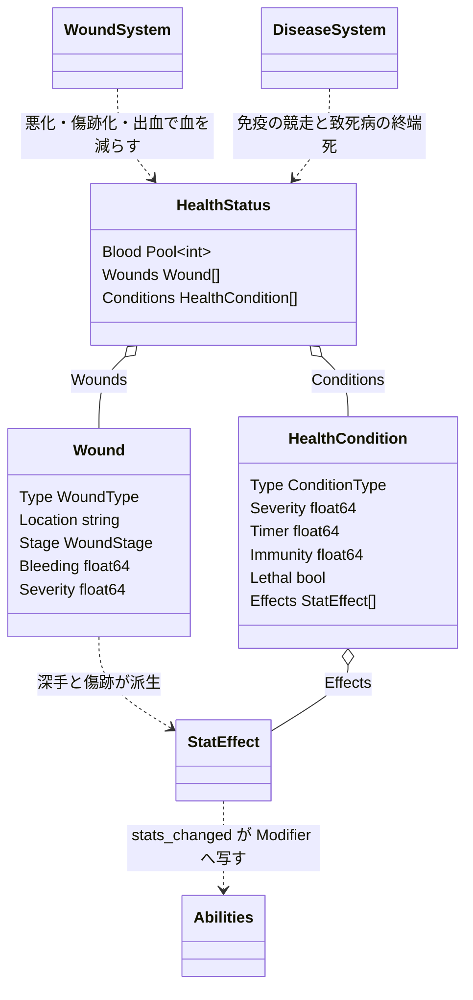
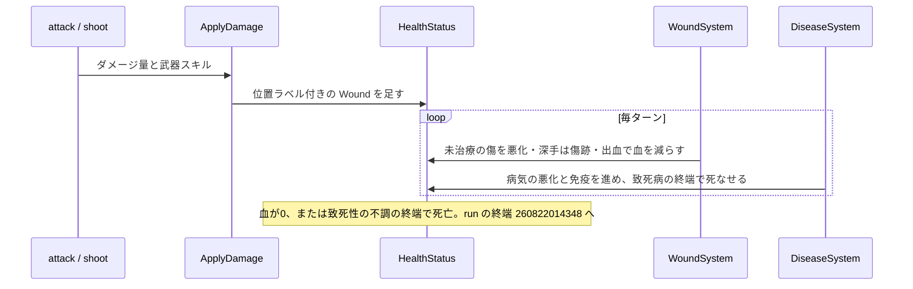

# 身体の不調: 血の生命ゲージと、傷・病気の不調リスト

## 背景

身体ペナルティと病気を、血という1本の生命ゲージと、平坦な不調リストで表す。部位ごとに耐久を持つ解剖モデルは採らない。

理由は ruins の規模にある。部位ごとの身体は、多数のキャラに細部が分散し、療養できる医療ループが受け皿になり、敵が人型で使い回せる、という土台があって初めて微管理でなくテクスチャになる。ruins はソロと少人数のサバイバルで、療養する安全地帯を持たず、敵も人型に限らない。土台が無いまま部位ごとの耐久を1体へ集中させると、対応する遊びの無い微管理になる。だから解剖の作り込みはやめ、1体に素直な「生命ゲージ＋不調リスト」に寄せる。傷のドラマは、部位の耐久でなく傷の**位置ラベル**で出す。

現状:

- HP は単一プール `type HP Pool[int]`。ダメージは `gameaction.ApplyDamage` の1経路で削り、0で死亡する。
- `HealthCondition`。部位に付く1つの状態を表す既存の型。`Type`・`Severity`・`Timer`・`Effects []StatEffect`。`StatEffect` は `stats_changed.go` を経て6能力へ配線済みで、ペナルティは戦闘に効く。現状は体温 `Hypothermia`・`Hyperthermia` にしか使われていない。
- `Abilities` 6種 STR/SEN/DEX/AGI/VIT/DEF。ruins はこの能力値を戦闘式へ流している。

目的は、この土台へ**血の生命ゲージ**と**傷・病気・体調を同じ器で持つ不調リスト**を足すこと。得たいのは、いま自分に何が起きているかが並んで読める手応えと、放置が悪化する緊張である。部位ごとの耐久配列は持たない。

## 要件

Hard は満たさねばならない、Soft は最大化したい、Anti は踏んではいけない罠。

**Hard**

- 生命は1本のゲージ、血で表す。UI の生命ゲージは血にする。血が0で死ぬ。
- 不調は平坦なリストで持つ。傷・病気・体調を同じ器で扱い、部位ごとの耐久配列や敵ごとの身体構成は作らない。
- 傷は位置ラベルを持ち「左腕の裂傷」のように見せる。ラベルは表示の彩りで、解剖構造ではない。
- 未治療の傷は悪化し、深手は傷跡として残る。
- 病気は悪化と免疫の競走で決着する。主な効き目は機能低下で、致死性の病だけが死なせる。出血は出血性の病だけが持つ。
- 機能低下は既存6能力への `StatEffect` に写す。
- 回復は代謝で決まる。血の再生と免疫の獲得を同じ代謝が左右する。

**Soft**

- 不調が並んで読め、いま何が危ういかが分かる。傷に位置ラベルが付き、攻撃した手応えにもなる。
- 早期治療は浅く安く済み、放置は深手・感染・傷跡と高くつく。傷跡の蓄積が消耗を厚くする。
- よく食べ休むほど速く回復する。栄養と回復が繋がり、飢えれば治りが遅い。
- 敵にも不調が乗り、傷が並ぶ。深手や弱点を突く読みが生まれる。

**Anti**

- 部位ごとの耐久と身体構成を作らない。1体の微管理へ落とさない。位置は表示ラベルに留める。
- 部位ごとの機能値を別層で持たない。機能低下は6能力で表す。
- 治療を療養ミニゲームにしない。全快の安全地帯を作らず、治療は前進の合間に行う。
- 病気を必ず出血させない。機能低下を主にし、出血は出血性の病だけの追加効果にする。
- 死因をその場限りのフラグで乱立させない。血が尽きる死と、致死性の不調の終端死に整理する。

## 設計

### 全体方針: 生命ゲージと不調リスト

身体を2つで表す。生命ゲージの血と、傷・病気・体調を並べる平坦な不調リスト。部位ごとの耐久は持たない。既存 `HealthCondition` の配線を活かし、傷を並列の小さな型で足す。

静的構造。血と2つのリスト、2つの system の関係を1枚で示す。



動的振る舞い。被弾1回から死までを時系列で示す。



### ① 生命ゲージ = 血

血を1本の生命ゲージにする。UI の HP バーは血にする。血は出血で減り、致死ダメージで一気に落ち、代謝に応じて安静と食事で戻る。0で死ぬ。

```go
// HealthStatus は生命ゲージと不調の平坦リストを持つ。部位ごとの配列は持たない
type HealthStatus struct {
	Blood      Pool[int]         // 生命ゲージ。0で死亡。UI はこれを表示する
	Wounds     []Wound           // 傷。位置ラベル付きの不調
	Conditions []HealthCondition // 病気・体調の不調
}
```

血モデルは `HealthStatus` を持つ生き物に適用する。什器やロボットなど血を持たない対象は従来の単純な耐久で壊す。`ApplyDamage` は対象が `HealthStatus` を持つかで経路を分ける。

### ② 傷: 位置ラベルと悪化と傷跡

傷は位置ラベルを持つ不調で、時間で状態が進む。位置は表示の彩りで、解剖構造ではない。

```go
// WoundType は傷の種類。武器の性質から決まる
type WoundType int

const (
	WoundLaceration WoundType = iota // 裂傷。斬撃
	WoundStab                        // 刺し傷。刺突
	WoundBlunt                       // 打撲。打撃
	WoundGunshot                     // 銃創。射撃
	WoundBurn                        // 熱傷。火
)

// WoundStage は傷のライフサイクル段階
type WoundStage int

const (
	WoundOpen       WoundStage = iota // 未治療。放置で悪化し出血が続く
	WoundStabilized                   // 治療済み。悪化と出血が止まり癒えていく
	WoundScar                         // 深手が癒えた痕。軽いペナルティを永続で残す
)

// Wound は1つの傷。位置ラベルと段階を持つ
type Wound struct {
	Type     WoundType
	Location string     // 表示用の位置ラベル。左腕・胴 など。解剖構造ではない
	Stage    WoundStage
	Bleeding float64 // 出血の強さ。合算して毎ターン血を減らす。止血で0
	Severity float64 // 深さ 0-1。未治療で上がる。閾値超で深手。治癒時の深さで傷跡が決まる
}
```

傷の種類は既存の武器スキルから導く。別テーブルを持たず単一の写像で変換する。位置ラベルは小さな候補から抽選するだけで、当たり判定や耐久には関与しない。

```go
// weaponWound は武器スキルから傷の種類を導く
var weaponWound = map[SkillID]WoundType{
	SkillSword:   WoundLaceration, SkillSpear: WoundStab, SkillFist: WoundBlunt,
	SkillBow:     WoundStab, SkillHandgun: WoundGunshot, SkillRifle: WoundGunshot, SkillCannon: WoundGunshot,
}
```

傷は毎ターン状態を進める。実行主体は `WoundSystem`。

- **放置で悪化**: 未治療の `WoundOpen` は `Severity` が上がる。深手閾値を超えると出血が増し、⑤の感染創の発症判定に掛かる。浅い切り傷も手当てを怠れば深手になる。
- **治療で安定**: 治療は `WoundOpen` を `WoundStabilized` にする。悪化が止まり、出血が0になり、`Severity` が安静と治療でゆっくり下がって閉じていく。
- **傷跡が残る**: 深手まで進んだ傷は、癒えても `WoundScar` として残り、軽い `StatEffect` を永続で出す。浅いまま閉じた傷は跡を残さず消える。

深手と傷跡の `StatEffect` は条件の `StatEffect` と同じ集約へ合流し、6能力へ効く。演出はログと敵ステータスに出す。命中時に `左腕を切り裂いた！ 出血` とログし、ステータス欄へ血のゲージと不調リストを並べる。`Severity` は 0.25 刻みで4段に量子化して `StatEffect` へ写す。

### ③ 病気: 悪化と免疫の競走、機能低下が主

病気は悪化と免疫の競走で決める。悪化が振り切れば深刻化し、免疫が先に満ちれば治る。現状の `HealthCondition` は `Timer` が上下するだけでこの競走が無いので、免疫と致死性をここだけ足す。

```go
// HealthCondition に免疫と致死性を足す。病気系の条件が使う
type HealthCondition struct {
	Type     ConditionType
	Severity float64
	Timer    float64 // 悪化度 0-100
	Immunity float64 // 免疫 0-100。Timer より先に100へ着けば治癒。病気のみ
	Lethal   bool    // 致死性か。終端で死なせる
	Effects  []StatEffect
}

// DiseaseSystem は病気系条件の悪化と免疫の競走を毎ターン進める。傷は WoundSystem が担う
type DiseaseSystem struct{}
```

競走の1ターンは次の順で更新する。悪化は既存 `UpdateTimer` を経由して二重更新を避ける。

1. `Timer` を悪化速度ぶん進める。resist 系スキルが速度を鈍らせる
2. `Immunity` を免疫速度ぶん進める。速度は代謝 `Metabolism` を基礎に `SkillHealing` と治療が上乗せする
3. `Immunity` が満ちたら治癒として条件を除去する。同一ターンに両方が満ちたときも治癒を優先し、判定順の偶然で理不尽に死なせない
4. `Timer` が振り切れたら、致死性の病は臓器不全で直接死なせる。非致死の病は最大 severity で衰弱を続け、免疫が勝つのを待つ

病気の主な効き目は `Effects` の機能低下である。severity が上がるほど `StatEffect` のペナルティが強まり弱く遅くなる。死ぬのは致死性の病の終端だけで、大半の病は衰弱させて他の死因を招き寄せる。出血性の病は例外として `Bleeding` を持つ傷に近い扱いを追加する。

### ④ 発症源

新たな乱数源を単独で持たず、既存の曝露と選択へ紐づける。病気の致死性・出血性・機能低下 `Effects` は raw のカタログに持たせる。

```go
const (
	ConditionInfection ConditionType = "Infection" // 感染創。深手の化膿。致死性
	ConditionFlu       ConditionType = "Flu"       // 風邪。寒冷曝露。非致死。衰弱のみ
	ConditionPlague    ConditionType = "Plague"    // 疫病。腐敗食の摂取。致死性かつ出血性
)
```

- **寒冷**: `Hypothermia` が Severe まで進んだら風邪の発症判定。体温系の延長。
- **腐敗食**: `Perishable` の rotten 段階を食べたら疫病の発症判定。腐敗 doc `260815125506` の劣化段階を入力にする。
- **負傷**: 傷が放置で深手まで悪化したら感染創の発症判定。②の傷から連鎖する。

### ⑤ 代謝: 回復速度

血の再生速度と病気の免疫獲得速度を、代謝という1つの係数で束ねる。基礎は VIT、満腹度で上下し、一部の病気が下げる。よく食べ休めば速く治り、飢えれば遅い。栄養と回復が繋がる。

```go
// Metabolism は代謝。血の再生と免疫の獲得の速度係数。100が基準。
// VIT を基礎に満腹度で上下し、一部の病気が下げる。毎ターン導出する派生値で状態を増やさない
func Metabolism(world w.World, entity ecs.Entity) consts.Percent
```

### ⑥ 治療アクション

薬アイテムを消費して、出血を止め、傷を安定させ、血を戻し、病気の悪化を鈍らせる。これは前方へ消費する資源の sink になる。金で薬を前方注文し、前進の合間に使う。治療の主眼は傷の安定化にあり、`WoundOpen` を `WoundStabilized` へ移す。早く手当てするほど浅い段階で止まり、薬の消費が少なく傷跡も残らない。全快の安全地帯は作らない。治療効果は既存 `ModHealingEffect`・`SkillHealing` を再利用して算出する。

### ⑦ 死と終端

死は2系統ある。血が0になる失血死と、機能が尽きる臓器不全死。前者は傷の出血や致死ダメージ、後者は低体温・飢餓・致死性の病の終端。どちらも run の終端 State へ渡す。決着の型 `RunOutcome` は終端の設計 doc `260822014348` に定義し、死因を失血・凍死・餓死・病死などのラベルで区別する。既存の汎用ゲームオーバーはこの経路へ置き換える。

## 変更箇所

| ファイル | 変更内容 |
|---|---|
| `internal/components/components.go` | `HealthStatus` を持つ生き物の生命ゲージを単一 HP から血へ移す |
| `internal/components/health_status.go` | `HealthStatus` を `Blood`・`Wounds`・`Conditions` の平坦構造へ変える。部位ごとの `Parts` 配列を廃す。`HealthCondition` へ `Immunity`・`Lethal` を足す |
| `internal/components/enum.go` | `WoundType`・`WoundStage`・`ConditionType` を足し表示名を配線する |
| `internal/world/gameaction/`（ApplyDamage） | `HealthStatus` を持つ対象は位置ラベル付き `Wound` を足して血へ、持たない什器は従来の耐久へ、と経路を分ける |
| `internal/activity/attack.go`・`shoot.go` | 武器スキルから傷種を導き、位置ラベルを抽選して `Wound` を足す |
| `internal/activity/rest.go`・回復経路 | 単一 HP でなく血を癒す。回復速度に代謝を掛ける |
| `internal/systems/wound.go` | `WoundSystem` を新規追加し、傷の悪化・深手化・治癒・傷跡化・出血合計を毎ターン進める |
| `internal/systems/disease.go` | `DiseaseSystem` を新規追加し、悪化と免疫の競走を進める。致死病は終端で死なせる |
| `internal/systems/helper.go` ほか初期化 | `WoundSystem`・`DiseaseSystem` を `InitializeSystems` へ登録する |
| `internal/systems/temperature.go` | 寒暑は機能低下の条件のまま。終端で臓器不全死させ、低体温 Severe で風邪の発症判定へ渡す |
| 飢餓経路 | 飢餓は機能低下のまま。終端で餓死させる。満腹度は代謝にも効かせる |
| `internal/world/query/` | `Metabolism` を VIT・満腹度・条件から導出する派生関数を足す |
| `internal/activity/`（摂食経路） | 腐敗食の摂取で疫病の発症判定を回す |
| `internal/activity/`（新規 tend アクション） | 薬を消費し止血・傷の安定・血の回復・病気鈍化を効かせる |
| UI（生命ゲージ・敵ステータス） | HP バーを血にし、傷と病気の不調リストを並べる |
| serde 経路 | 血 `Blood`・傷と `Stage`・傷跡・`Immunity` を保存対象に含める |
| `raw.toml`・`internal/raw/` | 敵とプレイヤーの血量、薬、病気カタログの致死性・出血性・`Effects` を定義する |

## 採用しなかった方法

- **部位ごとの耐久と敵ごとの身体構成を持つ解剖モデル**。部位に HP を持たせ、敵種ごとに身体構成を定義する。却下。部位ごとの身体は、多数のキャラ・療養できる医療ループ・人型で使い回せる敵、という土台があって成り立つ。ソロと少人数の ruins にはその土台が無く、1体への微管理と実装コストばかりが残る。傷のドラマは位置ラベルで足りる。
- **部位ごとの機能層を別に持つ**。耐久とは別に、意識・操作力・移動力などの連続的な機能値を持つ。却下。機能は6能力への `StatEffect` で表せる。別層は二重管理で、必要が証明されてから。YAGNI。
- **抽象 HP を被弾で直接削る現状維持**。却下。傷のドラマも放置の緊張も出ない。血ゲージと不調リストで、いま何が起きているかを読ませる。
- **病気を必ず出血させて死なせる**。却下。多くの病は衰弱させて死ぬのが自然で、出血は出血性の一部だけ。機能低下を主にする。
- **回復速度を固定にする**。却下。栄養が回復に効かないと食べる意味が薄れる。代謝で血再生と免疫獲得を束ねる。
- **傷を固定の深さにする**。却下。時間の緊張と早期治療の価値が消える。悪化と傷跡を持たせる。

## コメント

死は失血と臓器不全の2系統に整理した。血 `Blood` を生命ゲージとして表示し、外傷の出血が血を減らす。低体温・飢餓・致死性の病は機能低下の終端で死なせ、血を経由しない。血の上限・出血率・血の回復率・代謝の係数・傷の悪化速度・傷跡ペナルティ・病気の機能低下量と致死速度は着手後に実プレイで測る。傷跡は積もりすぎると死のスパイラルを生むので1つあたりは軽くし、悪化速度は手当ての猶予を残す。傷跡を消す高度な治療は将来の余地として残す。

HP は最も配線された component で、移行は慎重に行う。移行中は血を生命ゲージとして既存の表示や呼び出しへ橋渡しし、段階的に寄せる。serde の影響が大きいので `ruins-review` の serde 観点で必ず点検する。単一 HP から血・不調リストへの移行はセーブ構造を変えるため旧セーブ互換は失われる。互換の維持はせず、セーブへのバージョン記録と不一致警告で扱う。

位置ラベルはまず表示だけに使う。脚の傷が移動を鈍らせるといったラベル依存の効果を足すかは、実プレイでラベルの意味の重さを見てから決める。

## 進捗

- [ ] 生命ゲージ `Blood` を足し、`HealthStatus` を持つ生き物の生命を血へ移す
- [ ] `HealthStatus` を `Blood`・`Wounds`・`Conditions` の平坦構造へ変え、`Parts` 配列を廃す
- [ ] `Wound`・`WoundType`・`WoundStage` と位置ラベル、武器→傷の写像を足す
- [ ] `ApplyDamage` を分岐させ、`HealthStatus` 持ちは位置ラベル付き傷を足し血へ、什器は従来耐久へ
- [ ] `WoundSystem` を足し、傷の悪化・深手化・治癒・傷跡化と出血合計を毎ターン進める
- [ ] 傷跡 `WoundScar` の永続 `StatEffect` と、深手→傷跡・浅手→消滅の分岐を実装する
- [ ] `HealthCondition` へ `Immunity`・`Lethal` を足し、`DiseaseSystem` を追加して `InitializeSystems` へ登録する
- [ ] `Metabolism` の派生関数を足し、血の再生と免疫獲得の速度に効かせる
- [ ] 感染創・風邪・疫病を足し、致死性・出血性・`Effects` をカタログで持たせ、寒冷 Severe・腐敗食・放置した深手から発症させる
- [ ] 寒暑・飢餓を機能低下の終端で死なせ、満腹度を代謝に効かせる
- [ ] 薬を消費する治療アクションを足し、止血・傷の安定・血の回復・病気鈍化を効かせる
- [ ] 死を run の終端 `260822014348` の `RunOutcome` へ接続し、死因をラベルで区別する
- [ ] UI の生命ゲージを血にし、傷と病気の不調リストを並べる
- [ ] 血・傷・傷跡・`Immunity` の serde 保存経路を確認し保存対象に含める
- [ ] 最小の一周を実プレイし、血・傷・免疫・代謝・薬の数値を測る
