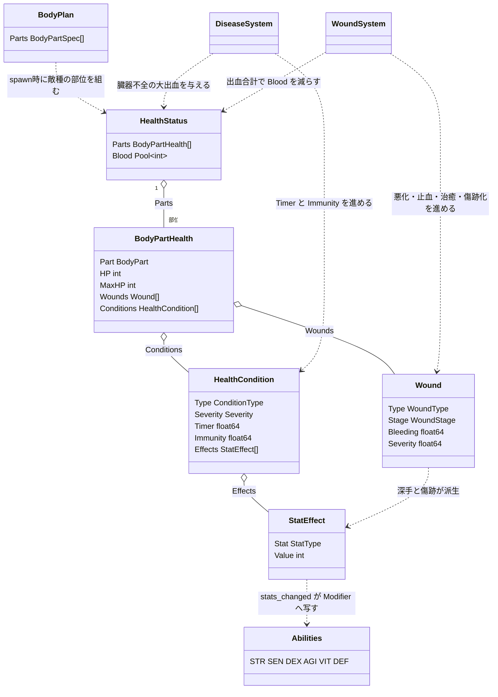
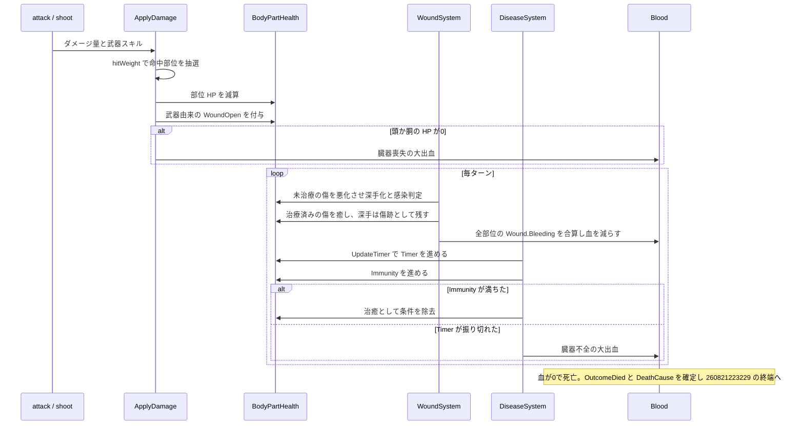

# 身体モデル: 血を生命ゲージに、部位の傷でドラマを作り、病気に免疫レースを足す

## 背景

身体ペナルティと病気を、血という一本の生命ゲージと、部位ごとの傷で表す。RimWorld と CDDA はどちらも部位ごとに HP を持ち、部位ごとの傷を並べて見せる。単独ターン制サバイバルという同ジャンルの CDDA が、この形で成立している。ruins も同じ土俵なので、この形を採る。着想元は参照するが機構は輸入せず、設計は ruins 既存の語彙で自己完結させる。

現状:

- HP は単一プール `type HP Pool[int]`。ダメージは `gameaction.ApplyDamage` の1経路で単一プールを削り、0で死亡する。被弾が生命を直接引くので、どこを撃っても同じで部位に意味が無い。
- 部位 `BodyPart` enum。頭・胴・腕・手・脚・足・全身。`HealthStatus{Parts [BodyPartCount]BodyPartHealth}` が部位ごとに `Conditions` を持つ。部位 HP は無い。
- `HealthCondition`。RimWorld の hediff に相当。`Type`・`Severity`・`Timer`・`Effects []StatEffect`。`StatEffect` は `stats_changed.go` を経て6能力へ配線済みで、ペナルティは戦闘に効く。現状は体温 `Hypothermia`・`Hyperthermia` にしか使われていない。
- `Abilities` 6種 STR/SEN/DEX/AGI/VIT/DEF。ruins はこれを capacity として戦闘式へ流している。

方針転換の核は、**生命を血ひとつで表し、被弾は部位の傷を介してのみ血を減らす**ことである。抽象 HP をやめ、命中は部位を傷つけ、傷が出血し、出血が血を減らし、血が尽きて死ぬ。生命ゲージを血で見せるのは理解しやすく、雪原を血で染めながら逃げるという署名にもなる。そして命中部位に傷が残り、部位ごとに並べて見える。狙いはドラマと手応え、そして分かりやすさである。次のような表示を目標にする。

```
相手  血 ██████░░░░
  左腕: 裂傷  出血
  胴体: 刺し傷 出血大
```

ただし**機能低下は引き続き既存6能力への `StatEffect` で表す**。部位は耐久と傷を持つが、capacity 層は新設しない。部位の耐久は壊れるまでの丈夫さ、機能は6能力、生命は血、と役割を分ける。これは RimWorld の連続 capacity 層まで作り込まず、CDDA 式の部位に寄せた中庸である。

この身体モデルへ、病気の免疫レースを重ねる。病気と負傷は設計 doc `260821223229` の一方向逃避を削る消耗圧、薬は前方へ消費する資源、失血死は run の終端になる。単独機能でなくマクロループの生存圧を厚くする。

## 要件

Hard は満たさねばならない、Soft は最大化したい、Anti は踏んではいけない罠。

**Hard**

- 生命は血ひとつで表す。UI の生命ゲージは血にする。被弾は血を直接削らず、部位の傷を介して血を減らす。
- 死因を失血に一本化する。即死も病死も、臓器を失って血を失う出来事として扱う。
- 機能低下は既存6能力への `StatEffect` に写す。capacity 層を新設しない。部位の耐久は丈夫さに徹する。
- 命中部位に傷が残り、部位ごとに並べて見せられる。攻撃した手応えとドラマを成立させる。
- 未治療の傷は時間で悪化し、浅手が深手になる。深手は癒えても傷跡として永続の軽いペナルティを残す。
- 部位構成は敵種ごとに異なる。蛇に腕、スライムに脚を持たせない。構成は body plan として敵ごとに定義する。
- 病気は悪化と免疫の競走で決着する。severity が振り切れば臓器不全から出血へ至り、免疫が先に満ちれば治癒。
- 発症源を既存機構へ配線する。寒冷は体温系、腐敗食は `Perishable`、負傷は戦闘。新たな乱数源を単独で持ち込まない。
- 失血死は run を終える。`260821223229` の `RunOutcome` 終端へ接続する。

**Soft**

- 部位ごとの傷が並び、どこを攻撃したかが読める。戦術の的が生まれる。敵の弱い部位や vital を狙う読みも生まれる。
- 早期治療は浅く安く済み、放置は深手・感染・傷跡と高くつく。傷跡の蓄積が一方向逃避の消耗を厚くする。
- 治療で出血を止め、血を戻し、悪化を鈍らせる counterplay がある。薬は前方消費の資源で、貯め込む装置にしない。
- 予防と対処の読みが生まれる。腐敗食を食うか飢えるか、寒空に留まるか進むかの賭け。
- 既存スキルを再利用する。`SkillHealing` は治療効果、resist 系は発症・進行の鈍化に効かせる。

**Anti**

- 抽象 HP を被弾で直接削る形へ戻さない。生命は血に保ち、被弾は身体を介す。
- capacity 層を輸入しない。機能低下は6能力で表す。
- 全快の安全地帯を作らない。`260821223229` の Anti を継承し、治療は前進の合間に前方資源で行う。
- 発症を完全乱数にしない。曝露や選択に紐づけ決定論寄りに保つ。
- 死因を独立フラグで分岐させない。臓器喪失も病も血へ流し、一本道に保つ。
- 深手を全快でリセットさせない。取り返しのつかない代償を傷跡として残す。
- 全敵に同一の部位セットを強制しない。身体構成は敵種ごとの body plan で表す。

## 設計

### 全体方針

生命は血ひとつで表す。被弾は部位の耐久と傷を介して血を減らす。機能低下は既存6能力の `StatEffect` のまま。新概念は病気の免疫レースだけに絞る。死因はすべて失血に集約する。

静的構造。部位が傷と条件を持ち、2つの system が血へ書き込む関係を1枚で示す。



動的振る舞い。被弾1回から失血死までを時系列で示す。



### ① 血を生命ゲージに、ダメージは部位と傷へ

生命ゲージを血で表し、UI の HP バーは血にする。**ダメージは血を直接削らない**。命中は部位を傷つけ、傷が出血し、出血が血を減らし、血が尽きて死ぬ。身体を介してのみ生命が減るこの経路が、部位の傷を意味あるものにする。

```go
// HealthStatus へ生命ゲージとしての血を足す。UI はこれを生命ゲージとして表示する
type HealthStatus struct {
	Parts []BodyPartHealth // このエンティティが持つ部位だけ。敵種ごとに異なる可変集合
	Blood Pool[int]        // 生命ゲージ。0で死亡。傷の出血・臓器の喪失・病気で減り、安静と治療で戻る
}

// BodyPartHealth は1部位の状態。部位の耐久と傷と条件を持つ
type BodyPartHealth struct {
	Part       BodyPart          // どの部位か。Parts が可変集合なので各要素が自分の部位を持つ
	HP         int               // 部位の現在耐久。0でその部位が壊れる。生命でなく丈夫さ
	MaxHP      int               // 部位の最大耐久。基準耐久と部位係数から算出
	Wounds     []Wound           // この部位に残る傷。ドラマと出血の単位
	Conditions []HealthCondition // 病気・体温など部位に付く状態
}
```

左右を区別するため、腕・手・脚・足は左右の `BodyPart` 定数へ分ける。enum への定数追加は `modifiers.go` の配線・テスト・UI・体温系の参照へ波及するが、`Parts` を可変長スライスにしたので、`BodyPartCount` で配列サイズが決まる問題と保存済みセーブの配列長不一致は起きない。既存の全身部位 `BodyPartWholeBody` は体温異常など全身状態の管理専用として残し、命中抽選の対象にしない。

**部位構成は敵種ごとに異なる**。人型は頭・胴・四肢、蛇は頭と胴のみ、多脚は脚が多い、ロボットは中枢と外装。どの部位を持つか、各部位の耐久係数・命中重み・vital かは敵種の **body plan** として raw に定義し、spawn 時に `HealthStatus.Parts` を組み立てる。

```go
// BodyPlan は敵種ごとの身体構成。raw から与え、spawn 時に HealthStatus を組む
type BodyPlan struct {
	Parts []BodyPartSpec
}

// BodyPartSpec は body plan の1部位。耐久係数・命中重み・vital かを持つ
type BodyPartSpec struct {
	Part      BodyPart
	HPFactor  float64 // 基準耐久に掛けて MaxHP を出す。胴1.0・頭0.6・四肢0.5 など
	HitWeight int     // 命中抽選の重み。胴が大きい
	Vital     bool    // 破壊で臓器喪失＝致命になる部位か。人型は頭・胴
}
```

`MaxHP` は敵の基準耐久に部位係数を掛けて出す。人型の既定 plan は頭・胴を vital にし、胴の耐久と命中重みを最大にする。蛇やロボットは自前の plan を持ち、vital 部位も命中表も異なる。`partHPFactor` と後述の `hitWeight` はこの既定 plan の値である。

**死因はすべて失血へ一本化する**。即死も病死も、結果として臓器を失い血を失う出来事として扱う。独立した即死フラグも consciousness capacity も設けず、血の一本道にまとめる。

- **失血死**: 出血する傷の bleed rate の合計が毎ターン血を減らす。血が尽きて死ぬ。負傷死の主経路。
- **臓器喪失による即死**: body plan の vital 部位、人型なら頭か胴、の耐久が0になると臓器を失い、血を尽きさせる一撃の減算をその場で与える。継続出血でなく即時の減算にし、とどめの手応えに遅延を挟まない。即死フラグでなく大出血として血の経路へ流す。敵種で vital 部位が違うので、蛇なら胴、ロボットなら中枢が的になる。
- **病死**: 病気が悪化し免疫に負けると臓器が機能を失い出血へ至る。これも血が尽きて死ぬ。
- **四肢の破損**: 腕・手・脚・足の耐久が0でも臓器を失わないので即死しない。破損として強い `StatEffect` ペナルティにし、傷からの出血は続く。

被弾でないダメージも血へ流す。寒暑ダメージ・飢餓・アイテムの毒は部位を介さず血を直接減らす。被弾だけが身体を介す、という Anti はそのままに、凍死も餓死も血が尽きる死として一本化へ合流し、死因は `DeathCause` で区別する。

血モデルの適用範囲は `HealthStatus` を持つ生き物に限る。什器やロボットなど血を持たない対象は部位も傷も持たず、従来どおり単純な耐久で壊す。`ApplyDamage` は対象が `HealthStatus` を持つかで経路を分ける。

生命は血ひとつになり、傷・臓器喪失・病気・環境がすべて血を減らす源になる。死因が一本化してモデルが理解しやすい。

### ② 傷: 命中部位に残るドラマ

被弾ごとに部位へ傷を残す。傷が芝居と出血の単位になる。

```go
// WoundType は傷の種類。武器の性質から決まる
type WoundType int

const (
	WoundLaceration WoundType = iota // 裂傷。斬撃
	WoundStab                        // 刺し傷。刺突
	WoundBlunt                       // 打撲。打撃
	WoundGunshot                     // 銃創。射撃
	WoundBurn                        // 熱傷。火
)

// WoundStage は傷のライフサイクル段階
type WoundStage int

const (
	WoundOpen       WoundStage = iota // 未治療。放置で悪化し出血が続く
	WoundStabilized                   // 治療済み。悪化と出血が止まり癒えていく
	WoundScar                         // 深手が癒えた痕。軽いペナルティを永続で残し、除去されない
)

// Wound は部位に負った1つの傷。段階を持ち、時間で状態が進む
type Wound struct {
	Type     WoundType
	Stage    WoundStage
	Bleeding float64 // 出血の強さ。合算して毎ターン血を減らす。止血で0
	Severity float64 // 深さ 0-1。未治療で上がる。閾値超で深手。治癒時の深さが傷跡の有無を決める
}
```

傷の種類は既存の武器スキルから導く。別テーブルを持たず単一の写像で変換するので、武器を増やせば傷も自然に増える。

```go
// weaponWound は武器スキルから傷の種類を導く
var weaponWound = map[SkillID]WoundType{
	SkillSword:   WoundLaceration, // 斬 → 裂傷
	SkillSpear:   WoundStab,       // 突 → 刺し傷
	SkillFist:    WoundBlunt,      // 打 → 打撲
	SkillBow:     WoundStab,       // 射 → 刺し傷
	SkillHandgun: WoundGunshot,    // 銃 → 銃創
	SkillRifle:   WoundGunshot,
	SkillCannon:  WoundGunshot,
}
```

演出はログと敵ステータスの両方へ出す。命中時に `左腕を切り裂いた！ 出血` とログし、敵ステータス欄へ血の生命ゲージと部位ごとの傷を並べる。深い傷は `StatEffect` で敵の命中や移動を削り、傷が戦術へ跳ね返る。`Severity` は既存の重症度と同じ 0.25 刻みで4段に量子化して `StatEffect` へ写す。例として左腕の裂傷 `Severity 0.6` は中度として DEX-2。治療難度としては薬の消費量と止血の成功率に掛ける。係数の実値は着手後に測る。

傷は付いた瞬間で終わらず、毎ターン状態を進める。実行主体は④の `WoundSystem` である。

- **放置で悪化**: 未治療の `WoundOpen` は毎ターン `Severity` が上がる。深手閾値を超えると出血が増し、⑤の感染創の発症判定に掛かる。浅い切り傷も手当てを怠れば深手になる。
- **治療で安定**: 治療は `WoundOpen` を `WoundStabilized` にする。悪化が止まり、出血が0になり、`Severity` が安静と治療でゆっくり下がって閉じていく。早く治すほど浅い段階で止められる。
- **傷跡が残る**: 深手まで進んだ傷は、癒えても `WoundScar` として残り、軽い `StatEffect` を永続で出す。浅いまま閉じた傷は跡を残さず消える。治癒時の深さが分かれ目になる。

これが早期治療の価値を生む。浅いうちに手当てすれば薬も少なく傷跡も残らない。放置すれば深手・出血増・感染・傷跡と代償が積み上がる。傷跡は run を通じて蓄積し、取り返しのつかない消耗として一方向逃避の緊張を厚くする。深手と傷跡の `StatEffect` は条件の `StatEffect` と同じ集約へ合流させ、部位の傷も6能力へ効かせる。

### ③ ダメージ経路: ApplyDamage を部位対応へ

単一の入口 `gameaction.ApplyDamage` は保ち、その中で部位を扱う。命中部位を選び、その部位の耐久を削り、武器由来の傷を残す。vital 部位の耐久が0になったら臓器喪失として大出血を血へ与える。命中部位は対象の body plan の命中重みで抽選し、人型では胴が最も当たりやすい。

```go
// 人型の既定 body plan の命中重み。敵種は自前の重みを body plan に持つ
var hitWeight = map[BodyPart]int{
	BPTorso: 40, BPHead: 8,
	BPArmLeft: 12, BPArmRight: 12, BPLegLeft: 12, BPLegRight: 12,
	BPHandLeft: 2, BPHandRight: 2, BPFootLeft: 1, BPFootRight: 1,
}
```

重みは合計で正規化した比率として抽選する。合計を100にそろえる必要はない。全身部位は命中抽選に含めない。

将来は狙撃で部位を指定できるよう拡張する。ダメージ入口を1つに保つので、部位ロジックはその中の1ステップに閉じ、rest や回復や serde を巻き込まない。

### ④ 病気の免疫レース

RimWorld の病気は悪化と免疫の競走で、severity が上がりきると死、免疫が先に満ちると治癒する。`HealthCondition` は `Timer` が上下するだけでこの競走が無い。ここだけ足す。

```go
// HealthCondition に免疫を足す。病気系の条件だけが使う
type HealthCondition struct {
	Type     ConditionType
	Severity Severity
	Timer    float64 // 悪化度 0-100。既存のまま
	Effects  []StatEffect
	Immunity float64 // 免疫 0-100。Timer より先に100へ着けば治癒
}

// DiseaseSystem は病気系条件の悪化と免疫の競走だけを毎ターン進める。
// 傷のライフサイクルは WoundSystem が担い、責務を分ける
type DiseaseSystem struct{}
```

対象は病気系 `ConditionType` の集合で絞り、体温条件には触れない。体温の進行は従来どおり `TemperatureSystem` が担う。競走の1ターンは次の順で更新する。既存 `UpdateTimer` が `Timer` から `Severity` を導出する唯一の経路なので、悪化はこれを経由し、二重更新を避ける。

1. `UpdateTimer` で `Timer` を悪化速度ぶん進める。resist 系スキルが速度を鈍らせる
2. `Immunity` を免疫速度ぶん進める。`SkillHealing` と治療が速める
3. `Immunity` が100に満ちたら治癒として条件を除去する。同一ターンに両方が満ちたときも治癒を優先し、判定順の偶然で理不尽に死なせない
4. `Timer` が100で振り切れたら臓器不全として大出血を血へ与え、病死へつなぐ

傷と病気は性質が違うので system を分ける。`WoundSystem` が全部位の傷のライフサイクルを毎ターン進める。未治療の傷を悪化させ、深手化と感染判定を行い、治療済みの傷を癒し、深手が癒えたら傷跡へ移し、そして全部位の `Wound.Bleeding` を合算して血を減らす。②の傷のライフサイクルの実行主体がこれである。`DiseaseSystem`・`WoundSystem` とも新規 system なので `add-component` の手順に従い `InitializeSystems` へ登録する。

### ⑤ 新 ConditionType 群と発症源

病気系の条件を足し、既存の曝露・選択へ発症源を紐づける。新たな乱数源を単独で持たない。

```go
const (
	ConditionInfection ConditionType = "Infection" // 感染創。深手の化膿。免疫レースを持つ
	ConditionFlu       ConditionType = "Flu"       // 風邪。寒冷曝露。免疫レースを持つ
	ConditionPlague    ConditionType = "Plague"    // 疫病。腐敗食の摂取。免疫レースを持つ
)
```

- **寒冷**: `Hypothermia` が Severe まで進んだら風邪の発症判定。体温系の延長。
- **腐敗食**: `Perishable` の rotten 段階を食べたら疫病の発症判定。腐敗 doc `260815125506` の劣化段階を入力にする。
- **負傷**: 傷が放置で深手まで悪化したら感染創の発症判定。②の傷のライフサイクルから連鎖する。

### ⑥ 治療アクション

薬アイテムを消費して、出血を止め、血を戻し、部位の耐久を癒し、病気の悪化を鈍らせる。これが `260821223229` の経済③の sink になる。金で薬を前方注文し、前進の合間に使う。血は安静と食事でゆっくり戻り、治療や輸血で速く戻る。全快の安全地帯は作らない。治療効果は既存 `ModHealingEffect`・`SkillHealing` を再利用して算出する。

治療の主眼は傷の安定化にある。`WoundOpen` を `WoundStabilized` へ移し、悪化と出血を止める。早く手当てするほど浅い段階で止まり、薬の消費が少なく傷跡も残らない。遅れれば深手化と感染で消費がかさむ。これが早めに治療する動機を作る。

### ⑦ 失血死から run 終端へ

血が尽きたとき run を終える。傷の出血、臓器喪失の大出血、病気の臓器不全、いずれも血を減らして死に至る。`260821223229` の `RunOutcome` は `OutcomeDied` と `DeathCause` で受ける設計なので、`OutcomeKind` は増やさず、失血死の死因を傷・臓器・病の `DeathCause` で記録する。消耗が最終的にマクロループの終端へ合流する。

## 変更箇所

| ファイル | 変更内容 |
|---|---|
| `internal/components/components.go` | 単一プール `HP Pool[int]` を廃す。生命ゲージを血へ移す |
| `internal/components/health_status.go` | `Parts` を可変長スライスへ変え `BodyPartHealth.Part` を足す。`HealthStatus` へ `Blood`、`BodyPartHealth` へ `HP`・`MaxHP`・`Wounds`・`Stage` 付き傷、`HealthCondition` へ `Immunity` を足す |
| `internal/components/enum.go` | 腕・手・脚・足を左右の `BodyPart` 定数へ分ける。`WoundStage` を足す。`WoundType` と `ConditionType` を足し表示名を配線する。スライス化で配列サイズ問題は無い |
| `internal/raw/`・`raw.toml` | 敵種ごとの `BodyPlan` を定義し、部位・耐久係数・命中重み・vital を持たせる |
| `internal/world/lifecycle/spawn.go` | `BodyPlan` から `HealthStatus.Parts` を組み立てる |
| `internal/world/gameaction/`（ApplyDamage） | 命中部位抽選・部位耐久の減算・傷付与・頭胴の臓器喪失時の大出血を1経路に閉じ込める。`HealthStatus` を持たない什器は従来の単純耐久で壊す分岐を残す |
| `internal/activity/attack.go`・`shoot.go` | 武器スキルから傷種を導き、命中部位へ傷を残す |
| `internal/activity/rest.go`・回復経路 | 単一 HP でなく血と部位耐久を癒す |
| `internal/systems/disease.go` | `DiseaseSystem` を新規追加し、病気の悪化と免疫の競走を毎ターン進める |
| `internal/systems/wound.go` | `WoundSystem` を新規追加し、傷の悪化・深手化・治癒・傷跡化・出血合計を毎ターン進める |
| `internal/systems/helper.go` ほか初期化 | `DiseaseSystem`・`WoundSystem` を `InitializeSystems` へ登録する |
| `internal/systems/temperature.go` | 寒暑ダメージの行き先を血へ変え、低体温が Severe まで進んだら風邪の発症判定へ渡す |
| 飢餓ダメージ経路 | 行き先を血へ変え、餓死も血の終端に合流させる |
| `internal/activity/`（摂食経路） | 腐敗食の摂取で疫病の発症判定を回す |
| `internal/activity/`（新規 tend アクション） | 薬を消費し止血・血の回復・部位耐久の回復・病気鈍化を効かせる |
| UI（生命ゲージ・敵ステータス） | HP バーを血の生命ゲージにする。部位ごとの傷リストを並べてドラマを見せる |
| `internal/components/`（RunOutcome 側） | 失血死の死因を `DeathCause` で区別し `OutcomeDied` として終端へ渡す。`OutcomeKind` は増やさない |
| serde 経路 | 血 `Blood`・部位耐久・傷と `Stage`・傷跡・`Immunity` を保存対象に含める |
| `raw.toml`・`internal/raw/` | 敵・プレイヤーの血量と部位耐久の基準値、薬、条件カタログを定義する |

## 採用しなかった方法

- **抽象 HP を被弾で直接削る現状維持**。命中がそのまま単一 HP を引く。却下。どこを撃っても同じで、傷のドラマも部位の意味も出ない。生命は血に保ちつつ、被弾は部位と傷を介して血を減らす経路にした。
- **死因を独立フラグで分岐させる**。頭胴0で即 `Dead`、病気で別途死亡。却下。臓器喪失を大出血として血へ流せば死因が失血に一本化し、理解しやすく実装も1経路に閉じる。
- **失血を胴の耐久へ畳む CDDA 式**。血を独立させず、出血を胴の丈夫さとして扱う。却下。血を生命ゲージとして独立させたほうが、止血と輸血という固有の counterplay を出血に持たせられ、構造ダメージと分けて読める。
- **RimWorld の連続 capacity 層を輸入する**。部位機能を Consciousness などの派生層で持つ。却下。機能は6能力への `StatEffect` で表せ、器官ツリーと capacity 層は必要が証明されてから。YAGNI。
- **発症を完全乱数にする**。毎ターン一定確率で病気を振る。却下。理不尽で予防と対処の読みが消える。曝露と選択へ紐づける。
- **什器やロボットにも血と部位を持たせる**。全対象を血モデルへ統一する。却下。血は生き物の生命表現で、什器のような無機物に出血と傷のドラマは要らない。単純耐久のまま残すほうが軽く読みやすい。ただし部位を持つロボット敵は body plan で中枢と外装を定義でき、血の有無は plan 側の選択にできる。
- **全敵に同一の部位セットと固定長配列を持たせる**。`[BodyPartCount]BodyPartHealth` で全敵を人型部位に揃える。却下。蛇に腕、スライムに脚は不自然。可変長スライスと body plan で敵ごとの構成を許し、固定配列の save 破壊問題も同時に避ける。
- **傷を固定の深さにする**。被弾時の `Severity` が変わらず放置しても悪化しない。却下。時間の緊張が消え早期治療の価値が生まれない。現実の創傷どおり手当ての遅れが深手と傷跡を生むほうが decision を厚くする。
- **深手も全快させ傷跡を残さない**。却下。永続の代償が無いと負傷が使い捨ての消耗になり、一方向逃避の取り返しのつかなさが薄れる。傷跡はじわりと蓄積して弱らせる。

## コメント

死因は失血へ一本化した。生命は血 `Blood` ひとつで表示し、傷の出血・臓器喪失の大出血・病気の臓器不全がすべて血を減らす。血の上限・出血率・臓器喪失時の失血量・血の回復率・傷の悪化速度・傷跡ペナルティは着手後に実プレイで測る。傷跡は積もりすぎると死のスパイラルを生むので、1つあたりは軽くし、悪化速度は手当ての猶予を残す。傷跡を消す高度な治療は将来の余地として残す。敵種ごとの body plan の部位数と耐久配分も、戦闘の手触りを見てから調整する。`260821223229` と同じく、まだ触っていない手応えを机上で決め打たない。

HP は最も配線された component で、移行は慎重に行う。単一プールの読み手が広いので、移行中は血を生命ゲージとして既存の表示や呼び出しへ橋渡しし、段階的に部位対応へ寄せる。serde の影響が大きいので `ruins-review` の serde 観点で必ず点検する。`Parts` を可変長スライスにしたので、部位を増やしても配列長の不一致は起きない。ただし単一 HP から血・部位・傷への移行はセーブの構造そのものを変えるため、旧セーブとの互換は失われる。互換の維持はせず、セーブへのバージョン記録と不一致警告で扱う。

## 進捗

- [ ] 生命ゲージ `Blood` を足し、出血・臓器喪失・病気で減らして0で死なせる
- [ ] 単一プール `HP Pool[int]` を廃し、生命を血へ移す。移行中は血で既存読み手を橋渡しする
- [ ] `Parts` を可変長スライスへ変え `BodyPartHealth.Part` を足し、部位を左右へ分ける。参照とテストの波及を `make check` で追う
- [ ] 敵種ごとの `BodyPlan` を raw に定義し、spawn で `HealthStatus.Parts` を組む。vital と命中重みも plan から引く
- [ ] `ApplyDamage` を部位対応へ: 命中部位抽選・部位耐久の減算・傷付与を1経路に閉じる
- [ ] 頭・胴の耐久0を臓器喪失として大出血に変換し、血の経路で死なせる
- [ ] `WoundType`・`Wound` と武器→傷の写像を足し、被弾で命中部位へ傷を残す
- [ ] `WoundSystem` を足し、傷の悪化・深手化・治癒・傷跡化と出血合計を毎ターン進める
- [ ] 傷跡 `WoundScar` の永続 `StatEffect` と、深手→傷跡・浅手→消滅の分岐を実装する
- [ ] 寒暑・飢餓・アイテム毒の被弾でないダメージを血へ向け、凍死・餓死も血の終端に合流させる
- [ ] `HealthStatus` を持たない什器・機械の従来型耐久の分岐を `ApplyDamage` に残す
- [ ] UI の生命ゲージを血にし、部位ごとの傷リストを並べて手応えを見せる
- [ ] ④ `HealthCondition.Immunity` と `DiseaseSystem` を足し `InitializeSystems` へ登録する
- [ ] ⑤ 感染創・風邪・疫病を足し、寒冷 Severe・腐敗食・放置した深手から発症させる
- [ ] ⑥ 薬を消費する治療アクションを足し、止血・血の回復・部位回復・病気鈍化を効かせる
- [ ] ⑦ 失血死を `OutcomeDied` と傷・臓器・病の `DeathCause` で `260821223229` の終端へ接続する
- [ ] 血・部位耐久・傷・`Immunity` の serde 保存経路を確認し保存対象に含める
- [ ] 敵・プレイヤーの血量と部位耐久の基準値、薬、条件カタログを `raw.toml` へ定義する
- [ ] 最小の一周を実プレイし、血・部位耐久・傷・免疫・薬の数値と次段 doc を起こす
