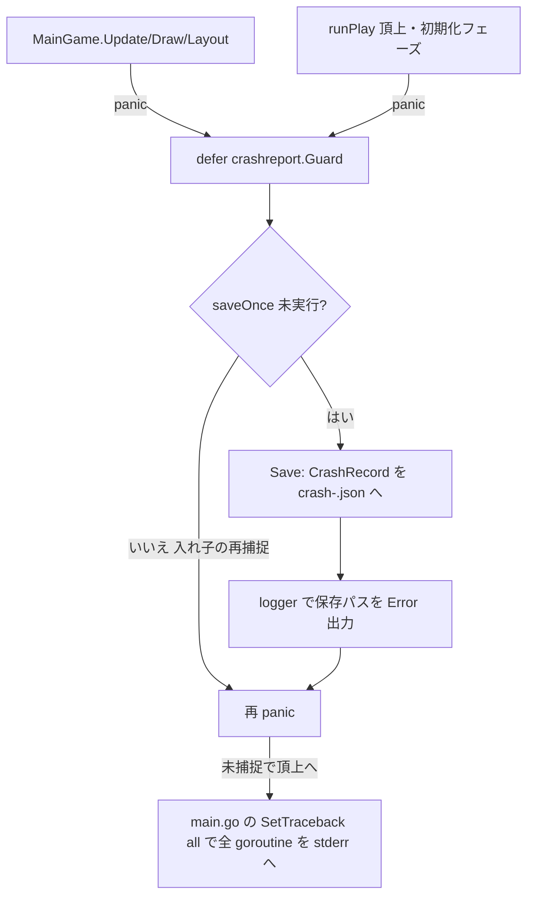

# panic 時のスタックトレースをファイルへ保存するクラッシュレポート

## 背景

配布ビルドで落ちたとき、原因を追う手掛かりが残らない。プレイヤーの端末で起きた panic は
標準エラー出力へ流れて消え、こちらには届かない。落ちた瞬間のスタックトレースを端末上の
ファイルへ残せば、後から回収して原因を追える。

Steam にはクラッシュ報告 API があるが本ゲームでは使えない。`SteamAPI_WriteMiniDump` は
Windows 32bit 限定で、C++ の構造化例外を `_set_se_translator` でフックする設計であり、
Go の panic を捕捉しない。バインディング `internal/steam` も `Init` と `GameLanguage`
だけを公開しており MiniDump 系を持たない。よって外部機構に頼らず、Go の `recover` と
`runtime/debug.Stack` で自前にファイルへ保存する。

`t.Fatal` の禁止は既に達成済み。`.golangci.yml` の `forbidigo` が型情報付きで
`testing.(T|B|TB).(Errorf?|Fatalf?)` を弾き、現状の使用は 0 件。本ドキュメントの対象外。

## 要件

- panic 発生時に、時刻・panic 値・スタックトレース・ビルド情報を**構造化 JSON レコード**として
  ファイルへ1件ずつ残す。既存 `internal/logger` の JSON エントリと同じ命名に揃え、後から機械的に
  集計・検索できるようにする。
- ゲーム由来の panic を取りこぼさない。Ebiten がどの goroutine で呼んでも捕らえる。
- 握りつぶさない。保存後は本来どおりプロセスを落とす。壊れた状態で続行させない。
- desktop のみ。WASM は体験版でファイルシステムが無いので何もしない。
- 保存先はセーブ・設定と同じ `os.UserConfigDir()/ruins/` の下。プレイヤーが辿れる。

## 設計

### なぜ自前コールバックの先頭へ defer を置くか

`recover` は同一 goroutine の panic しか捕らえない。Ebiten は `Update`/`Draw`/`Layout` を
`RunGame` の呼び出し元と同じメイン goroutine で呼ぶ。ebiten v2.10.2 の RunGame doc に
「game's functions are called on the same goroutine」「RunGame must be called on the main
thread」とあり、`runtime.LockOSThread` でメイン goroutine を OS メインスレッドへ束ねる。
つまりゲーム由来の panic は `runPlay` と同じ goroutine で起きる。

置き場を「自前 `MainGame` の各コールバックの先頭」にするのは、Ebiten の内部ループが Update の
panic を握るか外へ伝播させるかに依らず、こちらの関数を抜ける前に確実に捕らえるため。Go の defer
意味論により、その呼び出し内の panic は必ずその defer へ巻き戻る。`runPlay` 頂上の Guard は
`RunGame` に入る前の初期化フェーズの panic を受け持つ。

`cgo`/GL のネイティブな segfault は Go の defer が走らないので捕らえられない。これは
コアダンプの領分で、本機構の対象外とする。

### パッケージ crashreport

```go
package crashreport

// saveOnce は1プロセスで保存を1回に限る。Guard は必ず通る関数ごとに置くので、同一 goroutine で
// 入れ子になった Guard が再 panic を再捕捉しても、クラッシュ1件につきファイルは1つに保たれる。
var saveOnce sync.Once

// userConfigDir は保存先の基底を解決する。既定は os.UserConfigDir。テストが一時ディレクトリへ
// 差し替えられるようパッケージ変数にする。これが唯一の保存先注入経路。
var userConfigDir = os.UserConfigDir

// SetCurrentState は現在の最上位ステート名を記録する。ステート機械が遷移時に呼ぶ。
// Guard の呼び出し側を増やさず、保存時にステート名を添える唯一の受け渡し経路。
func SetCurrentState(name string)

// Guard は defer で使う。panic を捕らえて1回だけ Save し、握りつぶさず再 panic する。
// 同一 goroutine の panic だけを捕らえるので、必ず通る関数の先頭へ置く。
func Guard() {
	if r := recover(); r != nil {
		saveOnce.Do(func() { Save(r, debug.Stack()) })
		panic(r) // 保存後に本来の落ち方へ戻す。stderr へのトレース出力と非0終了を保つ
	}
}

// Save はクラッシュ情報を1ファイルへ書く。desktop のみ。
// WASM はファイルシステムが無いので何もしない。ディレクトリ作成と書き込みの失敗は握りつぶす。
// クラッシュ処理でさらに落ちて元の panic を覆い隠さないため。
func Save(recovered any, stack []byte)
```

`saveOnce` は入れ子の Guard に対する不変条件を担う。Ebiten は同じメイン goroutine で回すので、
`Update` の Guard が再 panic すると、それが `RunGame` を抜けて `runPlay` 頂上の Guard に必ず
再捕捉される。`recover` が同一 goroutine を捕らえるゆえの既定挙動であり、二重保存は仮定でなく
現実に起きる。`saveOnce` はその二重保存を止め、クラッシュ1件につきファイルを1つに保つ。念のための
保険でなく、この設置構成では必須の部品になる。

### 保存先とレコード形式

保存先はセーブ・設定と共通の親の下。1クラッシュ1ファイルにして、時刻をファイル名へ入れる。
上書きされず履歴が残り、クラッシュ中の追記競合や書きかけ混在も起きない。

ファイル名の時刻はコロンを使わない。Windows はファイル名にコロンを許さず、Steam 配布の主対象が
Windows のため。秒未満まで入れて同秒の衝突を避ける。

```go
// <os.UserConfigDir()>/ruins/crash/crash-<YYYYMMDD-HHMMSS-nanos>.json
// 例 crash-20260916-000431-123456789.json
```

ファイルの中身は構造化 JSON レコード1件。フィールド名は既存 `internal/logger` の JSON
エントリ（timestamp・level・category・message）に揃える。スタックトレースは1つの文字列
フィールドに収め、レコード全体を1オブジェクトに保つ。

```go
// CrashRecord は1回のクラッシュを表す構造化ログレコード。
type CrashRecord struct {
	Timestamp string `json:"timestamp"`       // RFC3339
	Level     string `json:"level"`           // "FATAL"。logger.Level.String() の表記に揃える
	Category  string `json:"category"`        // "crash"
	Message   string `json:"message"`         // recover した値の文字列。全文は Stack にある
	Version   string `json:"version"`         // ビルド版
	GOOS      string `json:"goos"`            // runtime.GOOS
	GOARCH    string `json:"goarch"`          // runtime.GOARCH
	Steam     bool   `json:"steam"`           // consts.IsSteamBuild
	State     string `json:"state,omitempty"` // SetCurrentState 由来の最上位ステート名。無ければ空
	Stack     string `json:"stack"`           // debug.Stack の文字列
}
```

`message` と `panic` を分けない。前者は panic 値、後者も recover 値で実質重複するため、panic 値は
`message` 1つに収め、logger の JSON エントリが必ず持つ `message` へ素直に載せる。トレース全文は
`stack` にある。`level` は logger の `Level.String()` が大文字 "FATAL" を返すのに合わせる。

`Save` はこの構造体を組み立て、`json.NewEncoder(file).Encode` で書く。加えて、コンソールにも
気づけるよう既存 logger で Error レベルの短い1行を出し、保存先パスを添える。全文はファイル、
道標は通常のログ経路、と役割を分ける。

### 設置

`MainGame` の Ebiten コールバック3つと、初期化フェーズの頂上へ置く。

```go
func (g *MainGame) Update() error {
	defer crashreport.Guard()
	// ...
}
func (g *MainGame) Draw(screen *ebiten.Image) { defer crashreport.Guard(); /* ... */ }
func (g *MainGame) Layout(w, h int) (int, int) { defer crashreport.Guard(); /* ... */ }
```

`debug.SetTraceback("all")` は `main.go` の最初で1度呼ぶ。設定読み込みより前の初期化で落ちても
全 goroutine のトレースが stderr に残るよう、プロセス起動直後の最早期に置く。`runPlay` の中だと
設定・ウィンドウ設定より後になり、それ以前の panic のトレースが薄くなる。

落ちた時点のステート名は `Guard` の引数を増やさず、ステート機械の遷移で `crashreport.SetCurrentState`
を呼んで記録し、`Save` がそれを `State` に載せる。`Save` の口を汚さず、`omitempty` なので未設定でも
無害。フェーズ1で遷移側の呼び出しを1箇所足す。

### フロー



## 変更箇所

| ファイル | 変更内容 |
|---|---|
| `internal/crashreport/crashreport.go` | 新規。`Guard`/`Save`/`SetCurrentState`・`CrashRecord`・`saveOnce`・`userConfigDir` seam・JSON 整形・logger への道標 |
| `internal/crashreport/crashreport_wasm.go` | 新規。`//go:build js`。`Save` を no-op にする |
| `internal/crashreport/doc.go` | 新規。パッケージの doc |
| `main.go` | 起動最初期に `debug.SetTraceback("all")` |
| `internal/maingame/game.go` | `Update`/`Draw`/`Layout` の先頭へ `defer crashreport.Guard()` |
| `internal/cmd/play.go` | `runPlay` 頂上へ `defer crashreport.Guard()` |
| ステート遷移の1箇所 | 遷移時に `crashreport.SetCurrentState` で最上位ステート名を記録 |
| `internal/crashreport/crashreport_test.go` | 新規。`userConfigDir` を一時ディレクトリへ差し替え、Save の出力内容・Guard の1回保存と再 panic を検証 |

## 採用しなかった方法

- **Steam の `WriteMiniDump`**。Windows 32bit・C++ SEH 前提・非 C++ ランタイム非対応で Go の
  panic を捕らえない。EOL 間近でもある。バインディングにも無い。動機であって手段にはならない。
- **実行ファイルと同じディレクトリへ保存する**。単純で見つけやすいが、出荷ビルドの実行ディレクトリは
  Windows の `Program Files` など UAC 保護で書き込み不可なことが多い。クラッシュがまさに要る出荷
  ビルドで書けない。`UserConfigDir` は必ず書けてセーブ・設定と同じ親で一貫する。発見性は道標の
  ログ1行で補う。
- **`RunGame` を1つの Guard で包むだけにする**。Ebiten は同じ goroutine で回すので、Ebiten が
  panic を外へ伝播させるなら `runPlay` の Guard 1つでゲーム由来も捕らえられる。ただし内部で recover
  される可能性を排除できないので、各コールバック先頭にも置いて確実にする。伝播の有無が確定すれば
  簡素化の余地がある。
- **panic を握りつぶして続行する**。壊れた状態で走らせると二次被害と再現性の喪失を招く。保存後は
  再 panic して本来どおり落とす。
- **fd 2 をファイルへ複製して stderr ごと保存する**。別 goroutine の未捕捉 panic も自動で入る利点は
  あるが、`syscall.Dup2` と Windows の `SetStdHandle` で OS 別コードが要る。まずは recover で
  ゲーム由来を確実に捕らえ、必要が出たら足す。進捗では見送りにする。
- **人が読むプレーンテキストで書く**。読みやすいが機械集計しにくい。構造化 JSON にして、
  既存ログと同じ道具で検索・集計できるようにする。
- **既存 logger でファイルへ全文を出す**。logger は出力先が stdout に固定で、端末に残る
  ファイルにならない。ここへ file シンクを足すのは logger 全体の改修になり本題から広がる。
  クラッシュは専用ファイルへ自前で JSON を書き、logger へは道標の1行だけ流す。
- **`log/slog` を新規に導入する**。標準の構造化ロガーで file シンクも持つが、本プロジェクトは
  既に自前の構造化ロガーを運用している。系を2つに増やさず、既存の JSON エントリの形へ揃える。
- **ログローテーション**。`Guard` は保存後に再 panic してプロセスを落とすので1起動1ファイルで、
  クラッシュ自体も稀。件数上限の間引きすら過剰と判断し、ローテーションは持たない。増え方が問題に
  なれば後から件数キャップを足せる。

## コメント

- 再 panic か `os.Exit` かは再 panic を採る。stderr への標準トレースと非0終了という既定の
  落ち方をそのまま残せるため。
- 保存先の作成失敗や書き込み失敗は握りつぶす。クラッシュ処理でさらに落ちて元の panic を
  覆い隠すのが最悪なので、保存はベストエフォートにする。

## 進捗

- [ ] `internal/crashreport` パッケージ。`CrashRecord`・`Save` の保存先解決と JSON 整形・`Guard`・`saveOnce`・`userConfigDir` seam・logger 道標
- [ ] WASM 向け no-op の `Save`（`//go:build js`）
- [ ] `MainGame.Update/Draw/Layout` へ `defer crashreport.Guard()`
- [ ] `runPlay` 頂上へ設置。`main.go` 最初期に `debug.SetTraceback("all")`
- [ ] `SetCurrentState` をステート遷移へ配線し、最上位ステート名を諸元へ含める
- [ ] テスト。`userConfigDir` を差し替えた Save の出力内容、Guard の1回保存と再 panic
- [ ] 調査。Ebiten の内部ループが Update の panic を recover するか RunGame 外へ伝播させるか。伝播すれば Guard を runPlay 1箇所へ簡素化できる
- [~] fd 2 をファイルへ複製して全 goroutine の未捕捉 panic も保存する。OS 別コードが要るので当面見送り
