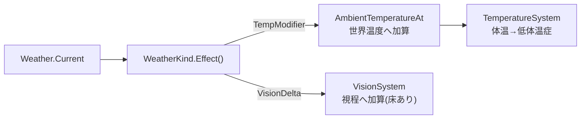

# 世界全体の天候を追加する

## 背景

このゲームの生存圧の中心は寒さである。世界温度は `AmbientTemperatureAt` が
`季節温度 + 時間帯補正 − 緯度勾配` で導き、`TemperatureSystem` が体温へ変換して低体温症へ落とす。
気温を動かす軸は季節と時間帯と奥地の3つだけで、同じ日・同じ場所ならいつ来ても同じ寒さになる。

天候を足すと、この寒さに揺らぎが入る。晴れた時は凌ぎやすく、吹雪の時は同じ場所でも命に関わる。
「今動くか、火を焚いて荒天をやり過ごすか」という判断が生まれ、旅の単調さが減る。

方針は次のとおり。現実の天気に寄せる。

- **世界全体で1つの天候**。地域別・タイル別は持たない。単一グローバル。
- **天候スペルで持続を持つ**。天候を「種類 + 続く長さ」で保存し、長さが尽きたら次の天候へ確率遷移する。
  1日固定でなく数時間〜数日の可変長で、日境界に同期しない。吹雪が長引く時もあれば数時間で抜ける時もある。
- **ベースの傾向は季節と場所で変わる**。奥地すなわち北へ進むほど厳しい天候へ寄る。緯度が寒いのと同じ空間軸。
- **持続の長さも変動する**。晴れは長続きし、吹雪は短くて激しい。冬・奥地では厳しい天候が長引く。
- **効果は気温補正と視界縮小の2つ**。移動コストや消火などのさらなる効果は次段に回す。

季節温度 `SeasonalTemperatureForDay` は保存せず日数から導く純関数だが、天候はスペルの残り時間と
直前の天候に依存するので保存する。導出で足りる状態は保存しない方針の例外で、遷移の記憶と持続の
残りという導出できない状態を持つために component 化する。

## 要件

- 天候は `WeatherKind` の5種で、寒さの厳しさに段階がある。晴れ・曇り・雪・吹雪・寒波。
- 天候は「種類 + 続く長さ」のスペルで持つ。長さが尽きた瞬間に次の天候へ遷移し、新しい長さを引く。
  1日固定でなく数時間〜数日の可変長で、日境界に同期しない。
- 遷移の重みは3因子の積で決まる。天候の粘り、季節の親和、場所すなわち奥地による厳しさ寄せ。
- スペルの長さは天候種と季節・場所で変わる。晴れは長く、吹雪は短い。冬・奥地では厳しい天候が長引く。
- 効果は気温補正 `TempModifier` と視界増減 `VisionDelta` の2つ。視界は下限で床を打ち0にはしない。
- 天候は保存し、ロードで同じ天候と残りの長さに戻る。
- HUD に現在の天候を出し、天候が変わった瞬間にゲームログに知らせる。季節表示の作りに倣う。

## 設計

### データ定義

```go
// Weather は世界全体の天候を保持するシングルトン component。天候はスペルすなわち「種類 + 続く長さ」で持つ。
// 遷移の記憶と持続の残りは日数から導けないので保存する。GameTime と同じくシングルトンに1つだけ持つ。
type Weather struct {
	Current   WeatherKind
	UntilTurn consts.Turn // このスペルが続く終端の総ターン数。TotalTurns が到達したら次のスペルへ遷移する
}

// WeatherKind は天候の種類。寒さの厳しさの昇順に並べ、severity と表示順を兼ねる。
type WeatherKind int

const (
	WeatherClear    WeatherKind = iota // 晴れ。わずかに暖かく視界も良い
	WeatherCloudy                      // 曇り。中立
	WeatherSnow                        // 雪。やや寒く視程がやや落ちる
	WeatherBlizzard                    // 吹雪。強い寒さと大幅な視程低下。厳しい側
	WeatherColdSnap                    // 寒波。晴れているが酷寒。視界は保たれる別種の厳しさ
)

// WeatherEffect は天候1種の効果。気温補正は AmbientTemperatureAt の世界温度へ加算し、
// 視界増減は VisionSystem の視程へ加算する。負で寒く・狭くなる。
type WeatherEffect struct {
	TempModifier int // ℃。世界温度への加算。晴れ +2 / 曇り 0 / 雪 -3 / 吹雪 -8 / 寒波 -15
	VisionDelta  int // 視程レンジへの加算。吹雪 -3 / 雪 -1 / 他 0。下限で床を打つ
}

// Effect は天候種の効果を返す。値は暫定で実プレイで調整する。
func (k WeatherKind) Effect() WeatherEffect

// String は天候名を返す。表示側が i18n の訳を引く msgid になる。Season.String に倣う。
func (k WeatherKind) String() string
```

### 天候スペルと遷移

天候は「種類 + 続く長さ」のスペルとして持つ。スペルが尽きた瞬間に次の天候を抽選し、その天候の
新しい長さを引く。長さは可変なので、天候の変化は日境界に同期せず、数時間で抜ける時も数日続く時もある。

次の天候は3因子の積で重み付けして抽選する。因子はそれぞれ小さな表で、掛け合わせるだけなので
調整点が分離する。

```go
// NextWeather は現在の天候から次の天候を1つ引く。粘り・季節親和・場所寄せの積で重み付けする。
// northDepth はプレイヤーの北への奥行き。奥ほど厳しい天候へ寄る。
func NextWeather(current WeatherKind, season gc.Season, northDepth int, rng *rand.Rand) WeatherKind {
	weights := make([]float64, numWeatherKind)
	for next := WeatherClear; next < numWeatherKind; next++ {
		weights[next] = stickiness[current][next] *
			seasonAffinity[season][next] *
			placeFactor(northDepth, next)
	}
	return drawWeighted(weights, rng)
}

// RollSpellTurns は天候 kind のスペルが続くターン数を引く。天候種で基準長が変わり、季節・場所で伸縮させる。
// 晴れは長く吹雪は短い。冬・奥地では厳しい天候が長引く。裾を作るため下限+乱数で散らす。
func RollSpellTurns(kind WeatherKind, season gc.Season, northDepth int, rng *rand.Rand) consts.Turn
```

- **粘り `stickiness[current][next]`**: 対角を厚くし、遷移先は前の天候の隣接段階へ寄る。晴れから吹雪への
  飛びは小さく、晴れ→曇り→雪→吹雪と段階を踏む。急変しない現実の移り変わりを表す。
- **季節親和 `seasonAffinity[season][next]`**: 季節ごとの各天候の出やすさ。冬は雪・吹雪・寒波を厚く、
  夏はほぼ晴れ・曇り。`GetSeason` の4区分に対応。

  | 季節 | 晴れ | 曇り | 雪 | 吹雪 | 寒波 |
  |---|---|---|---|---|---|
  | 春 | 1.4 | 1.2 | 0.8 | 0.3 | 0.1 |
  | 夏 | 1.8 | 1.0 | 0.3 | 0.1 | 0.0 |
  | 秋 | 1.1 | 1.2 | 1.0 | 0.5 | 0.2 |
  | 冬 | 0.6 | 0.9 | 1.3 | 1.2 | 0.8 |

- **場所寄せ `placeFactor(northDepth, next)`**: `1 + severity(next) * northDepth * k`。severity は
  晴れ0・曇り0・雪1・吹雪2・寒波2。プレイヤーの奥行き `NorthDepthChunks` が大きいほど、厳しい天候の
  重みだけが伸びる。北へ進むほど吹雪・寒波が主役になる。緯度が寒くなるのと同じ空間軸で、進行=北進の
  このゲームでは場所が進行度を兼ねる。

- **スペル長 `RollSpellTurns`**: 天候種ごとの基準ターン数を持ち、季節・場所で伸縮させて乱数で散らす。
  `turnsPerDay=1000` が1日なので、例えば晴れ 1000〜3000、曇り 800〜2000、吹雪 200〜800 のように、
  晴れは長く吹雪は短い。冬・奥地では厳しい天候の基準を伸ばし、荒天が居座る。現実のスペル長は指数分布に
  近いので下限+乱数で裾を作る。値は暫定。

冬×奥地で吹雪・寒波が長く居座り、夏×序盤はほぼ晴れが続く。季節と場所とスペル長の3つで移ろいが動く。

### 効果の接続点

既存系に2点フックする。天候を読むだけで、既存の合成式へ1項足す形にする。



- **気温**: `AmbientTemperatureAt` の `worldTemp` に `Effect().TempModifier` を足す。季節・時間帯・緯度と
  同じ世界温度の一項として入れる。屋内は `shelteredWorldTemp` で緩和されるので、天候の寒さも遮蔽で和らぐ。
- **視界**: `VisionSystem` の視程レンジに `Effect().VisionDelta` を足す。下限で床を打ち、吹雪でも
  0にはせず最低限は見える。
- **スペルの駆動**: 新設の `WeatherSystem` が毎ターン `TotalTurns >= Weather.UntilTurn` を見て、尽きたスペル
  だけを次へ進める。次の天候を `NextWeather` で引き、`RollSpellTurns` で新しい長さを引いて `UntilTurn` を
  更新する。場所はプレイヤーの `NorthDepthChunks` から取る。`InitializeSystems` へ登録する。
- **表示**: HUD に現在の天候を出し、天候が変わった瞬間にゲームログへ知らせる。季節変化の通知に倣う。

### 保存

`Weather` は遷移の記憶とスペルの残りを持つので保存対象にする。`skipComponents` には入れない。フィールドは
`WeatherKind` と `consts.Turn` すなわち int だけで interface も map も持たないので serde 安全。シングルトン
なので `world.go` の初期化で最初のスペルを1つ引いて `Weather.Add(singleton, ...)` する。

## 変更箇所

| ファイル | 変更内容 |
|---|---|
| `internal/components/weather.go` | `Weather`・`WeatherKind`・`WeatherEffect`・`Effect()`・`String()` を新設 |
| `internal/components/genspec/registry.go` | `{Field: "Weather"}` を追加し `make generate` |
| `internal/components/weather.go` | `stickiness`・`seasonAffinity`・`placeFactor`・`NextWeather`・`RollSpellTurns`・`drawWeighted` を定義。乱数と季節・場所に依存するので置き場は要検討、下記コメント参照 |
| `internal/world/world.go` | シングルトンへ最初のスペルを引いて `Weather` を初期化 |
| `internal/world/query/singleton.go` | `GetWeather` を追加 |
| `internal/systems/weather.go` | `WeatherSystem` を新設。毎ターン `UntilTurn` を見て尽きたスペルを次へ進める |
| `internal/systems/systeminit の登録` | `WeatherSystem` を `InitializeSystems` へ登録 |
| `internal/world/query/temperature.go` | `AmbientTemperatureAt` の `worldTemp` に天候の `TempModifier` を加算 |
| `internal/systems/vision.go` | 視程へ天候の `VisionDelta` を加算し、下限で床を打つ |
| `internal/systems/hud_extractor.go` + HUD | 現在の天候を HUD へ出す |
| `internal/systems/turn_system.go` | 天候が変わった瞬間にゲームログへ知らせる |
| `internal/i18n/locale/ja.po` | 天候名と通知文の訳を追加 |
| `internal/save/serde_test.go` | `Weather` の往復テストを追加 |

## 採用しなかった方法

- **1日1回・固定周期の遷移**。日変わりに1回だけ再抽選する案。実装は単純だが、天候が日境界に同期して
  変わるのは不自然で、荒天が必ず丸1日続く・1日で切れるのも硬い。スペルに可変長を持たせ、日境界から
  切り離して現実の移ろいに寄せた。
- **導出・保存なしの天候**。`WeatherForDay(runSeed, day)` の純関数で季節温度と同じ導出方針にする案。
  保存を増やさず再現性もあるが、可変長スペルと前日依存の連続性を持てない。吹雪が居座る手触りを優先し、
  遷移の記憶と残り時間を保存するステートフルにした。
- **地域別・タイル別の天候**。局所天候は表現力が高いが生成・保存・UI が重い。方針の「とりあえず
  世界全体でいい」に沿い単一グローバルにする。場所の傾向はプレイヤーの奥行きで代表させる。
- **効果を気温補正だけにする**。最小だが天候が体験に効く感が薄い。視界を足すと吹雪の緊張が出るので
  気温と視界の二本柱にする。移動コスト・消火などは接続先が広がるので次段へ。
- **フル遷移テンソル `P[current][next][season][place]` を1枚の表で持つ**。網羅的だが巨大で調整不能。
  粘り・季節親和・場所寄せの3因子の積へ分解し、各因子を小さな表にして調整点を分ける。

## コメント

- `NextWeather`・`RollSpellTurns` と重み表の置き場は要検討。乱数と季節・場所に依存し、`components` に
  置くと乱数源の持ち込みが重い。`world/query` か新設の薄い package が候補。実装時に依存方向を見て決める。
- 場所はプレイヤーの `NorthDepthChunks` を使う。プレイヤーが南へ退けば傾向も和らぐ。世界全体で1つの天候
  だが、その傾向は今いる場所の気候を映すという割り切り。プレイヤーが居ないステージでは0で穏やかに倒す。
- severity は `WeatherKind` の並び順から概ね導ける。晴れ0・曇り0・雪1・吹雪2・寒波2 は並びと近いが、
  曇りと雪の段差が並びと合わないので表を残すか `int(kind)` から導くかは実装時に確認する。
- スペル長は指数分布に近い裾を持たせたい。下限+乱数の一様で足りるか、幾何分布ふうにするかは実プレイの
  居座り感を見て決める。荒天が理不尽に長居しないよう上限も置く。
- バランス値、すなわち `TempModifier`・`VisionDelta`・季節親和・`k`・粘り・スペル基準長は全て暫定。
  実プレイで振り直す。冬×奥地で吹雪が「準備なしでは死ぬ」寒さで数日居座り、夏×序盤が凌ぎやすい、の
  両端を先に固める。
- 乱数源は既存のゲーム乱数を使う。スペル遷移は稀にしか起きないので、都度引きで足りるはず。既存の
  乱数の扱いへ揃える。
- 視界の床は「吹雪でも足元は見える」を保証する安全弁。0視界は理不尽なので必ず下限を置く。

## 進捗

- [ ] `Weather`(Current+UntilTurn)・`WeatherKind`・`WeatherEffect` の型と `Effect()`・`String()` を新設
- [ ] `registry.go` へ登録し `make generate`
- [ ] `stickiness`・`seasonAffinity`・`placeFactor`・`NextWeather` を実装。置き場を確定
- [ ] `RollSpellTurns` を実装。天候種×季節×場所で可変長、下限+乱数で裾と上限
- [ ] `world.go` の初期スペル生成と `GetWeather` を追加
- [ ] `WeatherSystem` を新設し `UntilTurn` 到達でスペルを進める。`InitializeSystems` へ登録
- [ ] `AmbientTemperatureAt` に `TempModifier` を加算
- [ ] `VisionSystem` に `VisionDelta` を加算し床を打つ
- [ ] HUD へ天候表示、`turn_system` へ変化ログ
- [ ] ja.po へ天候名と通知文の訳を追加
- [ ] `Weather` の serde 往復テスト
- [ ] バランス値とスペル長を実プレイで調整
