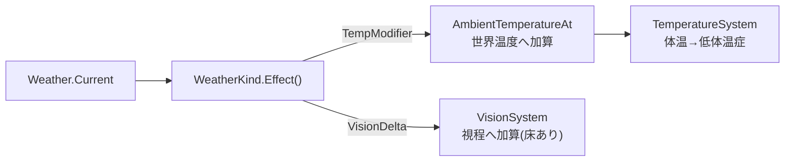

# 世界全体の天候を追加する

## 背景

このゲームの生存圧の中心は寒さである。世界温度は `AmbientTemperatureAt` が
`季節温度 + 時間帯補正 − 緯度勾配` で導き、`TemperatureSystem` が体温へ変換して低体温症へ落とす。
気温を動かす軸は季節と時間帯と奥地の3つだけで、同じ日・同じ場所ならいつ来ても同じ寒さになる。

天候を足すと、この寒さに日ごとの揺らぎが入る。晴れた日は凌ぎやすく、吹雪の日は同じ場所でも
命に関わる。「今日は動くか、火を焚いて待つか」という日単位の判断が生まれ、旅の単調さが減る。

方針は次のとおり合意済み。

- **世界全体で1つの天候**。地域別・タイル別は持たない。単一グローバル。
- **ステートフルなマルコフ遷移**。天候を保存し、1日ごとに昨日の天候から今日を確率遷移させる。
  吹雪が数日続くといった連続性を出す。
- **遷移確率は季節と進行度で変動**し、後半すなわち危険度が高いほど厳しい天候が出やすい。
- **効果は気温補正と視界縮小の2つ**。移動コストや消火などのさらなる効果は次段に回す。

季節温度 `SeasonalTemperatureForDay` は保存せず日数から導く純関数だが、天候だけは
昨日の状態に依存するマルコフ過程なので保存する。導出で足りる状態は保存しない方針の例外で、
遷移の記憶という導出できない状態を持つために component 化する。

## 要件

- 天候は `WeatherKind` の5種で、寒さの厳しさに段階がある。晴れ・曇り・雪・吹雪・寒波。
- 天候は1日1回、日変わりの瞬間にマルコフ遷移する。同じ日の中では変わらない。
- 遷移の重みは3因子の積で決まる。天候の粘り、季節の親和、進行度による厳しさ寄せ。
- 効果は気温補正 `TempModifier` と視界増減 `VisionDelta` の2つ。視界は下限で床を打ち0にはしない。
- 天候は保存し、ロードで同じ天候に戻る。
- HUD に現在の天候を出し、変わった日はゲームログに知らせる。季節表示の作りに倣う。

## 設計

### データ定義

```go
// Weather は世界全体の天候を保持するシングルトン component。1日ごとにマルコフ遷移で変わる。
// 遷移の記憶は日数から導けないので保存する。GameTime と同じくシングルトンに1つだけ持つ。
type Weather struct {
	Current WeatherKind
}

// WeatherKind は天候の種類。寒さの厳しさの昇順に並べ、severity と表示順を兼ねる。
type WeatherKind int

const (
	WeatherClear    WeatherKind = iota // 晴れ。わずかに暖かく視界も良い
	WeatherCloudy                      // 曇り。中立
	WeatherSnow                        // 雪。やや寒く視程がやや落ちる
	WeatherBlizzard                    // 吹雪。強い寒さと大幅な視程低下。厳しい側
	WeatherColdSnap                    // 寒波。晴れているが酷寒。視界は保たれる別種の厳しさ
)

// WeatherEffect は天候1種の効果。気温補正は AmbientTemperatureAt の世界温度へ加算し、
// 視界増減は VisionSystem の視程へ加算する。負で寒く・狭くなる。
type WeatherEffect struct {
	TempModifier int // ℃。世界温度への加算。晴れ +2 / 曇り 0 / 雪 -3 / 吹雪 -8 / 寒波 -15
	VisionDelta  int // 視程レンジへの加算。吹雪 -3 / 雪 -1 / 他 0。下限で床を打つ
}

// Effect は天候種の効果を返す。値は暫定で実プレイで調整する。
func (k WeatherKind) Effect() WeatherEffect

// String は天候名を返す。表示側が i18n の訳を引く msgid になる。Season.String に倣う。
func (k WeatherKind) String() string
```

### マルコフ遷移

日変わりの瞬間に、次の天候を3因子の積で重み付けして抽選する。因子はそれぞれ小さな表で、
掛け合わせるだけなので調整点が分離する。

```go
// NextWeather は現在の天候から翌日の天候を1つ引く。粘り・季節親和・進行度寄せの積で重み付けする。
// rng は日ごとにシードした乱数源で、同じ日・同じ入力なら同じ結果を返す。
func NextWeather(current WeatherKind, season gc.Season, dangerLevel int, rng *rand.Rand) WeatherKind {
	weights := make([]float64, numWeatherKind)
	for next := WeatherClear; next < numWeatherKind; next++ {
		weights[next] = stickiness[current][next] *
			seasonAffinity[season][next] *
			dangerFactor(dangerLevel, next)
	}
	return drawWeighted(weights, rng)
}
```

- **粘り `stickiness[current][next]`**: 対角を厚くし、天候は前日を引き継ぎやすい。隣接段階への遷移は
  起きやすく、晴れから吹雪への飛びは小さい。吹雪が数日続く連続性はここが生む。
- **季節親和 `seasonAffinity[season][next]`**: 季節ごとの各天候の出やすさ。冬は雪・吹雪・寒波を厚く、
  夏はほぼ晴れ・曇り。`GetSeason` の4区分に対応。

  | 季節 | 晴れ | 曇り | 雪 | 吹雪 | 寒波 |
  |---|---|---|---|---|---|
  | 春 | 1.4 | 1.2 | 0.8 | 0.3 | 0.1 |
  | 夏 | 1.8 | 1.0 | 0.3 | 0.1 | 0.0 |
  | 秋 | 1.1 | 1.2 | 1.0 | 0.5 | 0.2 |
  | 冬 | 0.6 | 0.9 | 1.3 | 1.2 | 0.8 |

- **進行度寄せ `dangerFactor(danger, next)`**: `1 + severity(next) * danger * k`。severity は
  晴れ0・曇り0・雪1・吹雪2・寒波2。危険度 `DangerLevelForDay` が上がるほど、厳しい天候の重みだけが
  伸びる。後半ほど吹雪・寒波が主役になる。`k` は伸びの傾きで暫定値。

冬×深部で吹雪・寒波が並び、夏×序盤はほぼ晴れ。季節と進行度の両輪で分布が動く。

### 効果の接続点

既存系に2点フックする。天候を読むだけで、既存の合成式へ1項足す形にする。



- **気温**: `AmbientTemperatureAt` の `worldTemp` に `Effect().TempModifier` を足す。季節・時間帯・緯度と
  同じ世界温度の一項として入れる。屋内は `shelteredWorldTemp` で緩和されるので、天候の寒さも遮蔽で和らぐ。
- **視界**: `VisionSystem` の視程レンジに `Effect().VisionDelta` を足す。下限で床を打ち、吹雪でも
  0にはせず最低限は見える。
- **遷移の駆動**: 日変わりを検知する `turn_system` の `notifyEnvironmentChange` は `DayJustChanged` を持つ。
  同じ判定を使い、新設の `WeatherSystem` が日変わりの瞬間に `NextWeather` で `Weather.Current` を進める。
  `InitializeSystems` へ登録する。
- **表示**: HUD に現在の天候を出し、天候が変わった日はゲームログへ知らせる。季節変化の通知に倣う。

### 保存

`Weather` は遷移の記憶を持つので保存対象にする。`skipComponents` には入れない。フィールドは
`WeatherKind` すなわち int だけで interface も map も持たないので serde 安全。シングルトンなので
`world.go` の初期化で `Weather.Add(singleton, &gc.Weather{Current: WeatherClear})` を1つ足す。

## 変更箇所

| ファイル | 変更内容 |
|---|---|
| `internal/components/weather.go` | `Weather`・`WeatherKind`・`WeatherEffect`・`Effect()`・`String()` を新設 |
| `internal/components/genspec/registry.go` | `{Field: "Weather"}` を追加し `make generate` |
| `internal/components/weather.go` | `stickiness`・`seasonAffinity`・`dangerFactor`・`NextWeather`・`drawWeighted` を定義。乱数と季節・危険度に依存するので置き場は要検討、下記コメント参照 |
| `internal/world/world.go` | シングルトンへ `Weather{Current: WeatherClear}` を初期化 |
| `internal/world/query/singleton.go` | `GetWeather` を追加 |
| `internal/systems/weather.go` | `WeatherSystem` を新設。`DayJustChanged` で `NextWeather` を回し `Current` を進める |
| `internal/systems/systeminit の登録` | `WeatherSystem` を `InitializeSystems` へ登録 |
| `internal/world/query/temperature.go` | `AmbientTemperatureAt` の `worldTemp` に天候の `TempModifier` を加算 |
| `internal/systems/vision.go` | 視程へ天候の `VisionDelta` を加算し、下限で床を打つ |
| `internal/systems/hud_extractor.go` + HUD | 現在の天候を HUD へ出す |
| `internal/systems/turn_system.go` | 天候が変わった日にゲームログへ知らせる |
| `internal/i18n/locale/ja.po` | 天候名と通知文の訳を追加 |
| `internal/save/serde_test.go` | `Weather` の往復テストを追加 |

## 採用しなかった方法

- **導出・保存なしの天候**。`WeatherForDay(runSeed, day)` の純関数で季節温度と同じ導出方針にする案。
  保存を増やさず再現性もあるが、昨日の天候に依存するマルコフの連続性を持てない。吹雪が数日続く
  手触りを優先し、遷移の記憶を保存するステートフルにした。連続性を捨てるなら導出版に戻せる。
- **地域別・タイル別の天候**。局所天候は表現力が高いが生成・保存・UI が重い。方針の「とりあえず
  世界全体でいい」に沿い単一グローバルにする。
- **効果を気温補正だけにする**。最小だが天候が体験に効く感が薄い。視界を足すと吹雪の緊張が出るので
  気温と視界の二本柱にする。移動コスト・消火などは接続先が広がるので次段へ。
- **時間帯単位で変わる連続天候**。粒度が細かいが、季節・危険度が日単位なのに天候だけ細かいと不整合。
  日単位に揃える。
- **フル遷移テンソル `P[current][next][season][danger]` を1枚の表で持つ**。網羅的だが巨大で調整不能。
  粘り・季節親和・進行度寄せの3因子の積へ分解し、各因子を小さな表にして調整点を分ける。

## コメント

- `NextWeather` と重み表の置き場は要検討。乱数と季節・危険度に依存し、`components` に置くと乱数源の
  持ち込みが重い。`world/query` か新設の薄い package が候補。実装時に依存方向を見て決める。
- severity は `WeatherKind` の並び順そのものにできる。晴れ0・曇り0・雪1・吹雪2・寒波2 は並びと概ね
  一致するので、`int(kind)` から導けるなら表を1つ減らせる。ただし曇りと雪の段差が並びと合わないので
  実装時に確認する。
- バランス値、すなわち `TempModifier`・`VisionDelta`・季節親和・`k`・粘りは全て暫定。実プレイで
  振り直す。冬×深部で吹雪が「準備なしでは死ぬ」寒さになり、夏×序盤が凌ぎやすい、の両端を先に固める。
- 乱数源は既存のゲーム乱数を使う。日ごとにシードして同じ日の遷移を安定させるか、都度引きにするかは
  実装時に既存の乱数の扱いへ揃える。
- 視界の床は「吹雪でも足元は見える」を保証する安全弁。0視界は理不尽なので必ず下限を置く。

## 進捗

- [ ] `Weather`・`WeatherKind`・`WeatherEffect` の型と `Effect()`・`String()` を新設
- [ ] `registry.go` へ登録し `make generate`
- [ ] `stickiness`・`seasonAffinity`・`dangerFactor`・`NextWeather` を実装。置き場を確定
- [ ] `world.go` の初期化と `GetWeather` を追加
- [ ] `WeatherSystem` を新設し `InitializeSystems` へ登録
- [ ] `AmbientTemperatureAt` に `TempModifier` を加算
- [ ] `VisionSystem` に `VisionDelta` を加算し床を打つ
- [ ] HUD へ天候表示、`turn_system` へ変化ログ
- [ ] ja.po へ天候名と通知文の訳を追加
- [ ] `Weather` の serde 往復テスト
- [ ] バランス値を実プレイで調整
