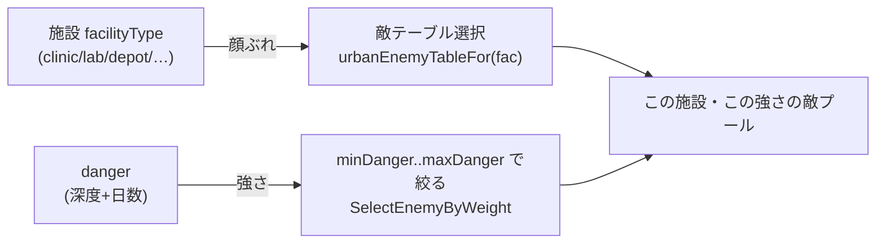
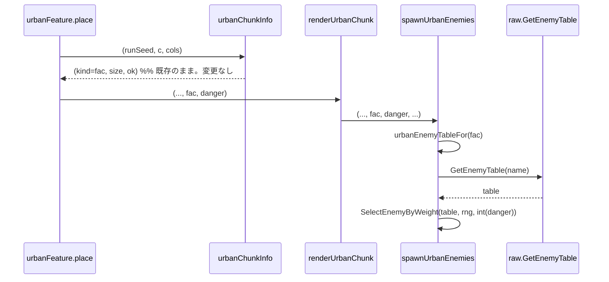

# 市街地の敵テーブルを施設で変える。深度の縦に対する横の多様性

## 背景

難易度の軸は2つある。縦=強さは深度と日数から `danger` を決めエントリを `minDanger/maxDanger` 帯で絞る形で実装済み。参考 memory: `tables-split-by-facility-area-future`、設計 doc 260923193741。

横=多様性、すなわち「どんな顔ぶれが出るか」は非対称に取り残されている。

- **loot は概ね横が効いている**。市街地の内装は施設種別ごとに固有の家具を置き、収納家具 prop の `Storage.LootTableId` が薬棚・商品棚・食料庫テーブルを引く。診療所には `medicine_shelf`、商店には `store_shelf` が置かれ、間接的に施設→loot が成立している。`internal/overworld/interior_furnish.go:171`、raw.toml の itemTables 後半4個。
- **敵は横が全く効いていない**。市街地の敵テーブルは `urbanEnemyTable = "ruins_area"` に固定され、施設を一切見ない。`internal/overworld/urban.go:28-29`、`spawnUrbanEnemies` は `danger` だけでフィルタする。

結果、「診療所には薬があるのに、湧く敵は住宅地と同じ汎用の廃墟モンスター」という納得感の欠落が生まれている。`urban.go:71` のコメントも施設固有の中身を将来課題として名指ししている。

本 doc は敵の横軸を、**施設種別 `facilityType` をキーにテーブルを引く**形で埋める。地区 `zone` を敵の新たな鍵にはしない。施設は既に `zoneCatalog` で地区ごとに固まって湧くので、施設別に引いても近隣は同種へ寄り、地区スケールのまとまりは地区概念を敵側へ持ち込まずに自然に現れる。似た施設に同じテーブルを割り当てれば「産業区は機械、都心は強個体」も表現でき、後で特定施設だけ別テーブルに割る調整も1行で効く。loot と同じ施設スケールで揃う。

## 要件

- 市街地の敵テーブルを施設種別 `facilityType`(house/store/office/depot/antique/clinic/lab)で切り替える。
- **似た施設は同じテーブルを共有できる**。テーブル名を facility→name の写像で持ち、複数施設が同じ名前を指せる。顔ぶれの粒度をデータで決め、コード変更なしに束ね直せる。
- 縦の `danger` と直交させる。深い診療所は「診療所の敵の強い個体」であって別物にならない。テーブル選択が顔ぶれ、`danger` 帯が強さ、と役割を分ける。
- 決定的生成と再訪一致を壊さない。敵配置の乱数ストリーム `0x2` の抽選順を変えない。施設は既存の純関数 `urbanChunkInfo` が座標から決めるので、テーブル選択を足しても座標→結果の決定性は保たれる。
- テーブル未設定の施設は既定の廃墟テーブルへ落ちる。抽選が壊れない安全側の既定を持つ。

## 設計

`spawnUrbanEnemies` を呼ぶ `renderUrbanChunk` は既に `fac facilityType` を保持している(`urban.go:206,222`)。よって施設→テーブル名の写像を1つ足し、`fac` を1引数渡すだけで済む。`urbanChunkInfo` の戻り値は変えない。

### データ定義

```go
// facilityEnemyTable は施設種別ごとの敵テーブル名。似た施設は同じテーブルを共有する。施設は
// zoneCatalog で地区ごとに固まって湧くので、施設別に引いても近隣は同種へ寄り、地区スケールの
// まとまりが地区概念を新設せずに現れる。未設定の施設は urbanEnemyTable へ落ちる。
var facilityEnemyTable = map[facilityType]string{
	facilityClinic:  "downtown_enemies",   // 診療所。治安ロボットや強個体
	facilityLab:     "downtown_enemies",   // 研究施設。診療所と同じ顔ぶれ
	facilityDepot:   "industrial_enemies", // 倉庫。自律機械や作業機
	facilityOffice:  "industrial_enemies", // 事務所。倉庫と同じ
	// house/store/antique は当面 urbanEnemyTable(ruins_area)を流用。分けたくなったら1行足す
}

// urbanEnemyTableFor は施設の敵テーブル名を返す。未登録なら既定の廃墟テーブル。
// facilityEnemyTable は実在テーブル名だけを値に持つ、すなわち空文字列は登録しないので、
// 登録の有無だけを見れば GetEnemyTable が存在しない名前で error にならない。
func urbanEnemyTableFor(fac facilityType) string {
	if name, ok := facilityEnemyTable[fac]; ok {
		return name
	}
	return urbanEnemyTable
}
```

`urbanEnemyTable = "ruins_area"` は定数のまま残し、既定フォールバックとして使う。raw.toml へ `downtown_enemies`・`industrial_enemies` の2テーブルを新設する。house/store/antique は当面 `ruins_area` を流用し、テーブル数を最小に保つ。どの施設をどのテーブルへ束ねるかの中身は needs-decision。

### 縦×横の直交



テーブルが「何が出るか」、`danger` 帯が「どれだけ強いか」。2軸は掛け算で、片方を変えても他方に干渉しない。

### 配線

`fac` を `renderUrbanChunk` から `spawnUrbanEnemies` へ1つ渡すだけ。`urbanChunkInfo` も地図呼び出しも変えない。



シグネチャ変更(現状 → 変更後):

```go
// urban.go:277 spawnUrbanEnemies に fac facilityType を1引数追加。urbanChunkInfo は変えない
func spawnUrbanEnemies(world w.World, g chunkGeom, rng *rand.Rand, size consts.Chunk, danger consts.Danger, isWall func(lx, ly consts.Tile) bool, occupied map[consts.Coord[consts.Tile]]bool) error
func spawnUrbanEnemies(world w.World, g chunkGeom, rng *rand.Rand, size consts.Chunk, fac facilityType, danger consts.Danger, isWall func(lx, ly consts.Tile) bool, occupied map[consts.Coord[consts.Tile]]bool) error
```

## 変更箇所

| ファイル | 変更内容 |
|---|---|
| `internal/overworld/urban.go` | `facilityEnemyTable` 写像と `urbanEnemyTableFor` を追加。`renderUrbanChunk` が持つ `fac` を `spawnUrbanEnemies` へ渡し、固定の `urbanEnemyTable` を `urbanEnemyTableFor(fac)` に置換 |
| `assets/metadata/entities/raw/raw.toml` | `downtown_enemies`・`industrial_enemies` の `[[enemyTables]]` を新設。エントリは `minDanger/maxDanger/weight/pack`。id 衝突を事前 grep |
| `internal/overworld/urban_test.go` ほか | 施設→テーブル選択のテスト。`urbanEnemyTableFor` の既定フォールバックと再訪一致 |

## 採用しなかった方法

- **地区 `zone` を敵の鍵にする**: downtown/residential/industrial の3値でテーブルを引く案。だが zone は `urbanChunkInfo` が内部計算して捨てているので、生成経路へ通す配線が要る。施設キーなら `fac` が既に届いており配線が最小。しかも施設キーは似た施設を同テーブルに束ねれば zone と同じ空間的まとまりを出せるうえ、特定施設だけ別テーブルに割る自由度も持つ。zone を敵の新概念として持ち込む利点がない。
- **建物ごとに完全に別テーブル**: 施設ごとに必ず違うテーブルを持たせる案。隣接建物で顔ぶれが跳ね不自然になりうる。似た施設は同テーブルを共有する運用で、施設スケールの表現力と空間的まとまりを両立させる。
- **単一テーブルにエントリの施設タグを足して絞る**: `minDanger/maxDanger` と同様に facility フィールドでフィルタする案。テーブル数は増えないがエントリ数が膨らみ、oapi/tsp のスキーマ変更と serde 波及が要る。テーブル名で切り替えるほうが既存の `DungeonDefinition.EnemyTableName()` の先例に対称で、スキーマを触らずに済む。
- **バイオーム(広域)を同時に入れる**: 気候帯は現状不在の新概念で、オーバーワールド生成の骨格に触る大改修。北進の世界観拡張として規模が別格なので、独立の設計 doc(Phase 3)に切り出す。本 doc は施設スケールに閉じる。

## コメント

本 doc は横軸のうち敵だけを、既存構造への最小差し込みで埋める。施設 `facilityType` は既に生成経路の `renderUrbanChunk` まで届いているので、施設→テーブル名の写像を1つ足し `fac` を1引数渡すだけで済む。スキーマも乱数規約も、`urbanChunkInfo` の戻り値も変えない。

地区概念を敵側へ持ち込まないのが判断の芯。施設が既に地区ごとに固まって湧くので、施設をキーにしても地区的なまとまりは創発する。似た施設に同じテーブルを割り当てるだけで zone の効果を再現でき、しかも束ね方はデータで決まる。

段階の位置づけ。Phase 1=本 doc(敵の施設変異)、Phase 2=施設固有の内装家具と loot 拡充(内装レシピ TOML 化 260924113529)、Phase 3=バイオーム(広域、別設計 doc)。loot の横軸は Phase 2 に委ね、本 doc では触らない。

## 進捗

- [ ] `facilityEnemyTable` 写像と `urbanEnemyTableFor` フォールバックを追加
- [ ] `renderUrbanChunk` が持つ `fac` を `spawnUrbanEnemies` へ渡し、固定テーブルを `urbanEnemyTableFor(fac)` に置換
- [ ] raw.toml へ `downtown_enemies`・`industrial_enemies` を新設。id 衝突を事前 grep。中身の敵選定は gamedesign 判断
- [ ] 施設→テーブル選択と既定フォールバックのテスト。再訪一致の確認
- [ ] `make check` 緑
