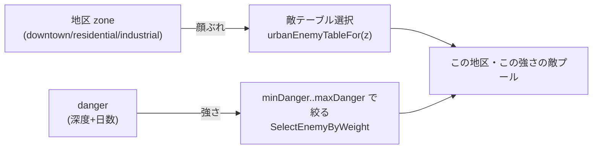
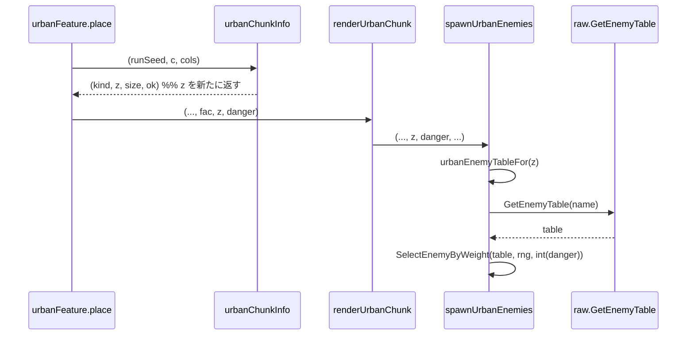

# 市街地の敵テーブルを地区で変える。深度の縦に対する横の多様性

## 背景

難易度の軸は2つある。縦=強さは深度と日数から `danger` を決めエントリを `minDanger/maxDanger` 帯で絞る形で実装済み。参考 memory: `tables-split-by-facility-area-future`、設計 doc 260923193741。

横=多様性、すなわち「どんな顔ぶれが出るか」は非対称に取り残されている。

- **loot は概ね横が効いている**。市街地の内装は施設種別ごとに固有の家具を置き、収納家具 prop の `Storage.LootTableId` が薬棚・商品棚・食料庫テーブルを引く。診療所には `medicine_shelf`、商店には `store_shelf` が置かれ、間接的に施設→loot が成立している。`internal/overworld/interior_furnish.go:171`、raw.toml の itemTables 後半4個。
- **敵は横が全く効いていない**。市街地の敵テーブルは `urbanEnemyTable = "ruins_area"` に固定され、地区や施設を一切見ない。`internal/overworld/urban.go:28-29`、`spawnUrbanEnemies` は `danger` だけでフィルタする。

結果、「診療所には薬があるのに、湧く敵は住宅地と同じ汎用の廃墟モンスター」という納得感の欠落が生まれている。`urban.go:71` のコメントも施設固有の中身を将来課題として名指ししている。

本 doc は敵の横軸を埋める。ただし敵の多様性は建物スケールでなく**地区スケール**が自然という判断を採る。診療所と隣の民家で徘徊する敵が別種なのは不自然で、むしろ「産業区は機械、都心は強個体」のように地区単位で顔ぶれが変わるほうが納得感が高い。loot は施設スケール、敵は地区スケール、と粒度を分ける。

## 要件

- 市街地の敵テーブルを地区 `zone`、すなわち downtown / residential / industrial で切り替える。
- 縦の `danger` と直交させる。深い産業区は「産業区の敵の強い個体」であって別物にならない。テーブル選択が顔ぶれ、`danger` 帯が強さ、と役割を分ける。
- 決定的生成と再訪一致を壊さない。敵配置の乱数ストリーム `0x2` の抽選順を変えない。地区は既存の純関数 `zoneOf` から決まる位置の関数で、テーブル選択を足しても座標→結果の決定性は保たれる。
- テーブル未設定の地区は既定の廃墟テーブルへ落ちる。抽選が壊れない安全側の既定を持つ。

## 設計

`zoneCatalog map[zone][]facilityWeight`(`urban.go:108`)が既に地区別データを持つので、対称に地区別の敵テーブル名を写像で足す。地区は `urbanChunkInfo` が内部で計算しているが今は捨てているので、戻り値へ出して敵生成まで通す。

### データ定義

```go
// zoneEnemyTable は地区ごとの敵テーブル名。loot が施設スケールで変わるのに対し、敵は地区スケールで
// 変える。エントリは danger 帯で絞るので、テーブルが顔ぶれ、danger が強さを担う。未設定の地区は
// urbanEnemyTable へ落ちる。
var zoneEnemyTable = map[zone]string{
	zoneDowntown:    "downtown_enemies",   // 都心。治安ロボットや強個体
	zoneResidential: urbanEnemyTable,      // 住宅地。当面は既定の廃墟テーブルを流用
	zoneIndustrial:  "industrial_enemies", // 産業区。自律機械や作業機
}

// urbanEnemyTableFor は地区の敵テーブル名を返す。未登録なら既定の廃墟テーブル。
// GetEnemyTable が存在しない名前で error にならないよう、必ず実在テーブルへ解決する。
func urbanEnemyTableFor(z zone) string {
	if name, ok := zoneEnemyTable[z]; ok && name != "" {
		return name
	}
	return urbanEnemyTable
}
```

`urbanEnemyTable = "ruins_area"` は定数のまま残し、既定フォールバックとして使う。raw.toml へ `downtown_enemies`・`industrial_enemies` の2テーブルを新設する。住宅地は当面 `ruins_area` を流用し、テーブル数を最小に保つ。どの敵をどの地区に置くかの中身は needs-decision。

### 縦×横の直交



テーブルが「何が出るか」、`danger` 帯が「どれだけ強いか」。2軸は掛け算で、片方を変えても他方に干渉しない。

### 配線

`zone` を `urbanChunkInfo` の戻り値に足し、生成経路を通して `spawnUrbanEnemies` まで運ぶ。`renderUrbanChunk` は既に `fac` を持つので、同じ経路に `zone` を1つ足すだけで済む。



シグネチャ変更（現状 → 変更後）:

```go
// urban.go:179
func urbanChunkInfo(runSeed uint64, c consts.Coord[consts.Chunk], cols consts.Chunk) (kind facilityType, size consts.Chunk, ok bool)
func urbanChunkInfo(runSeed uint64, c consts.Coord[consts.Chunk], cols consts.Chunk) (kind facilityType, z zone, size consts.Chunk, ok bool)

// urban.go:222 renderUrbanChunk / urban.go:277 spawnUrbanEnemies に z zone を1引数追加
func spawnUrbanEnemies(world w.World, g chunkGeom, rng *rand.Rand, size consts.Chunk, danger consts.Danger, isWall func(lx, ly consts.Tile) bool, occupied map[consts.Coord[consts.Tile]]bool) error
func spawnUrbanEnemies(world w.World, g chunkGeom, rng *rand.Rand, size consts.Chunk, z zone, danger consts.Danger, isWall func(lx, ly consts.Tile) bool, occupied map[consts.Coord[consts.Tile]]bool) error
```

`urbanChunkInfo` は地図(記号表示)と生成の両方が呼ぶので、地図側は `z` を `_` で捨てる。

## 変更箇所

| ファイル | 変更内容 |
|---|---|
| `internal/overworld/urban.go` | `zoneEnemyTable` 写像と `urbanEnemyTableFor` を追加。`urbanChunkInfo` の戻り値へ `zone` を足す。`renderUrbanChunk`・`spawnUrbanEnemies` へ `zone` を通し、固定の `urbanEnemyTable` を `urbanEnemyTableFor(z)` に置換 |
| `internal/overworld/` の地図呼び出し | `urbanChunkInfo` の新しい戻り値 `z` を `_` で受ける |
| `assets/metadata/entities/raw/raw.toml` | `downtown_enemies`・`industrial_enemies` の `[[enemyTables]]` を新設。エントリは `minDanger/maxDanger/weight/pack`。id 衝突を事前 grep |
| `internal/overworld/urban_test.go` ほか | 地区→テーブル選択のテスト。`urbanEnemyTableFor` の既定フォールバックと再訪一致 |

## 採用しなかった方法

- **施設スケールで敵を変える**: ユーザーの当初の語彙は「施設によって」だが、建物単位で敵種が変わると隣接建物で顔ぶれが跳ね不自然になる。地区スケールが空間相関と納得感の両立点。特殊施設(lab/clinic)固有の敵は、地区既定の上に施設オーバーライドを重ねる拡張として後日検討しうるが、Phase 1 では持ち込まない。
- **施設→itemTable の直行経路を敵と同時に足す**: loot は既に家具経由で施設色を持つ。敵と別経路の loot 選択を足すと家具経由 loot と二重ソースになり保守が割れる。loot は本 doc の対象外とし、家具機構に一本化したまま残す。
- **単一テーブルにエントリの地区タグを足して絞る**: `minDanger/maxDanger` と同様に zone フィールドでフィルタする案。テーブル数は増えないがエントリ数が膨らみ、oapi/tsp のスキーマ変更と serde 波及が要る。テーブル名で切り替えるほうが既存の `DungeonDefinition.EnemyTableName()` の先例に対称で、スキーマを触らずに済む。
- **バイオーム(広域)を同時に入れる**: 気候帯は現状不在の新概念で、オーバーワールド生成の骨格に触る大改修。北進の世界観拡張として規模が別格なので、独立の設計 doc(Phase 3)に切り出す。本 doc は地区スケールに閉じる。

## コメント

本 doc は横軸のうち敵だけを、既存構造への最小差し込みで埋める。`zoneCatalog` が既に用意した地区別データ構造に敵テーブル写像を対称に足し、`urbanChunkInfo` が捨てていた `zone` を生成経路へ出すだけで、スキーマも乱数規約も変えずに済む。

段階の位置づけ。Phase 1=本 doc(敵の地区変異)、Phase 2=施設固有の内装家具と loot 拡充(データのみ、別 doc 不要)、Phase 3=バイオーム(広域、別設計 doc)。loot の横軸は Phase 2 のデータ追加に委ね、本 doc では触らない。

## 進捗

- [ ] `zoneEnemyTable` 写像と `urbanEnemyTableFor` フォールバックを追加
- [ ] `urbanChunkInfo` の戻り値へ `zone` を足し、地図側の呼び出しを `_` 受けに更新
- [ ] `renderUrbanChunk`・`spawnUrbanEnemies` へ `zone` を通し、固定テーブルを `urbanEnemyTableFor(z)` に置換
- [ ] raw.toml へ `downtown_enemies`・`industrial_enemies` を新設。id 衝突を事前 grep。中身の敵選定は gamedesign 判断
- [ ] 地区→テーブル選択と既定フォールバックのテスト。再訪一致の確認
- [ ] `make check` 緑
