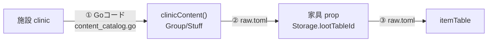
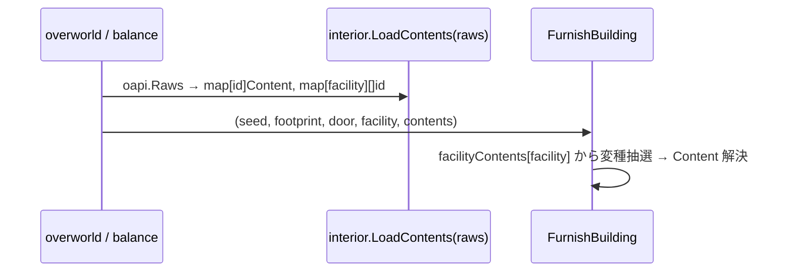

# 内装レシピを raw.toml へ移す。施設の中身をデータ駆動にする

## 背景

施設ごとの中身、すなわち「診療所には薬棚と薬、商店には陳列棚と商品」という納得感は3層で成り立っている。うち loot テーブルと家具→テーブルの紐付けは既に raw.toml だが、**施設→どの家具/戦利品を置くかのレシピは Go にハードコード**されている。`internal/mapplanner/interior/content_catalog.go` の17関数(clinicContent/storeContent など)と `facility.go:48` の `facilityVariants`。



①だけが Go に取り残されている。`archetype.go` のコメント自身が「Go 定義の暫定カタログで、器が固まったら raw/TOML の語彙へ移す」と移行を宣言済み。①をデータ化すれば、施設の顔ぶれ・個数・出現確率をコード変更なしに調整でき、敵の `zoneEnemyTable`(設計 doc 260924111008)や既存の itemTables と器が揃う。

## 要件

- **レシピ本体を raw.toml へ**。Content/Group/Stuff、すなわち「何を・何個・どの確率で・どの重みで」置くかをデータにする。
- **幾何はコードに残す**。相対配置 `Satellites`/`Offsets`(机に対する椅子)と `archetype.go` の Ref→既定配置は Go のまま。TOML の Stuff は Ref で参照するだけ。幾何は構造的で TOML では冗長・低編集性になる。
- **施設→変種・部屋→content の写像もデータへ**。`facilityVariants`(facility.go:48)と部屋名→content(content_catalog.go:309)を raw.toml へ。
- **挙動不変**。ロード後の Content が現行 Go Content とビット等価な生成をする。interior の golden(distribution/fill/sprite の4本と testdata PNG)を保つ。
- **スキーマは tsp 単一ソース**。ruins-tsp 規約に従い oapi/Go/TS を生成する。

## 設計

### スコープ境界

| 層 | 現状 | 移行後 |
|---|---|---|
| 施設→変種写像 | `facilityVariants` (Go) | raw.toml `facilityContents` |
| レシピ(Group/Stuff) | `content_catalog.go` 17関数 (Go) | raw.toml `interiorContents`(主室・奥室ともフラット) |
| 部屋→content写像(役割別) | content_catalog.go:307 (Go) | raw.toml `facilityRooms`(役割別 + fallback) |
| Ref→既定配置 archetype | `archetype.go` (Go) | **Go のまま** |
| 相対配置 Satellites/Offsets | Stuff.Satellites / fixtures.go (Go) | **Go のまま**。TOML の Stuff から省く |
| enum(StuffKind/GroupStyle/Placement) | Go const | tsp enum + Go 生成 |

### データ定義

現状の Go の器(移行元):

```go
// internal/mapplanner/interior/content.go
type Content struct { ID string; Groups []Group }
type Group   struct { Style GroupStyle; Pick int; Items []Stuff }
type Stuff   struct {
    Kind StuffKind; Ref string; Weight int; Chance int
    Amount consts.Dice; Placement Placement
    Satellites []Satellite // ← TOML には出さず Go に残す
}
```

移行後の tsp スキーマ(新設。`oas/typespec/req.tsp`):

```typespec
enum StuffKind { furniture, loot, being, decor, trap }
enum GroupStyle { pick_each, pick_one, pick_n }
enum Placement { near_door, far_from_door, center, wall, row, full_area }

/** 内装レシピの1配置指示。相対配置 Satellites は Go の archetype に残すのでここには持たない */
model ContentStuff {
  kind: StuffKind;
  /** 家具型や戦利品グループの参照名。幾何は archetype が Ref から決める */
  ref: EntityID;
  /** pick_one / pick_n の抽選重み。省略時は 1。pick_each では使わないので省く */
  weight?: EntryWeight;
  /** 0..100。pick_each でこの Stuff を置く確率。省略時は常置。書き忘れを常置へ倒し TOML を素直にする */
  chance?: int32;
  /** 置く個数のダイス表記 */
  amount: Dice;
  /** どこへ置くか。省略時は archetype の既定へ落ちる */
  placement?: Placement;
}

model ContentGroup {
  style: GroupStyle;
  /** pick_n のときの選ぶ個数 */
  pick: int32;
  items: ContentStuff[];
}

/** 内装レシピ。施設まるごと、または奥室1つに対応する */
model InteriorContent {
  id: EntityID;
  groups: ContentGroup[];
}

/** 施設種別ごとの主室の内装変種。抽選で1つ選ぶ */
model FacilityContent {
  /** 施設種別。overworld の facilityType の文字列と揃える */
  facility: EntityID;
  /** InteriorContent の id 参照。抽選で1つ選ぶ */
  variants: EntityID[];
}

/** 奥室の役割名と内装レシピの対。診療所の waiting/exam/pharmacy など */
model RoomContent {
  /** 役割名。roleName に相当する */
  role: EntityID;
  /** InteriorContent の id 参照 */
  content: EntityID;
}

/** 施設種別ごとの奥室カタログ。役割別 content と、カタログに無い役割のフォールバック */
model FacilityRooms {
  /** 施設種別。facilityType の文字列と揃える */
  facility: EntityID;
  /** 役割→content の対。storeRoomContents / clinicRoomContents に相当する */
  rooms: RoomContent[];
  /** カタログに無い役割の既定 content。backRoomContent(facility) に相当する */
  fallback: EntityID;
}
```

room の表現を明確にする。奥室のレシピ(storageRoomContent など)も主室と同じ `InteriorContent` として `interiorContents[]` にフラットに並べ、id で参照する。room 固有のモデルは作らない。施設→役割→content の対応だけを `FacilityRooms` の写像で持つ。現状の `storeRoomContents()`/`clinicRoomContents()`(`content_catalog.go:307,318`, 戻り値 `map[roleName]Content`)と `backRoomContent(facility)`(`furnish.go:184`)が、この `rooms` 配列と `fallback` に1対1で対応する。

`Raws` に `interiorContents: InteriorContent[]`・`facilityContents: FacilityContent[]`・`facilityRooms: FacilityRooms[]` を足す(req.tsp:438 付近)。scalar は既存(EntityID/EntryWeight/Dice)を再利用し、幅・null 規約は ruins-tsp に従う。required 配列は producer が空スライスで初期化する。

### ローダと配線

現状 `interior.FurnishBuilding(seed, footprint, door, facility)` はレシピを Go 定数として内包し rawMaster を受けない。データ化に伴い、ロード済みレシピを渡す。



- `interior.LoadContents(raws oapi.Raws) (*ContentSet, error)` を新設。oapi 生成型を interior の `Content`/`Group`/`Stuff` へ変換する。Satellites は archetype 側で補うので変換では空。
- `FurnishBuilding` の署名に解決済み `*ContentSet` を足す。呼び出しは `internal/overworld/interior_furnish.go:24` と `internal/balance/loot.go:51` の2箇所。
- `content_catalog.go` の17関数は raw.toml へ移植後に削除する。archetype.go は残す。

### golden 保存戦略

挙動不変の移植なので golden は変えない。ロードした Content が現行 Go Content と同一構造・同一順序になるよう1対1で移植し、抽選乱数の消費順を変えない。抽選順は Groups と Items のスライス順に依存するが、TOML の array-of-tables(`[[interiorContents.groups]]`)は記述順を保持し、Go の toml アンマーシャルもその順でスライスへ積むので、ファイルの記述順=生成順を保てる。移植後に `make check` で interior の distribution/fill/sprite golden が不変であることを確認する。ずれたら移植の取りこぼしなので golden を再生成せず移植を直す。

## 変更箇所

| ファイル | 変更内容 |
|---|---|
| `oas/typespec/req.tsp` | `StuffKind`/`GroupStyle`/`Placement` enum、`ContentStuff`/`ContentGroup`/`InteriorContent`/`FacilityContent` model、`Raws` へ2フィールド追加。`cd oas && make genall` |
| `internal/oapi/*.gen.go`, `editor-ui/src/generated/*` | 生成物。手編集しない |
| `assets/metadata/entities/raw/raw.toml` | `[[interiorContents]]` 主室・奥室レシピ、`[[facilityContents]]` 施設→変種、`[[facilityRooms]]` 施設→役割別 content。yq で編集、id 衝突を事前 grep |
| `internal/mapplanner/interior/loader.go`(新規) | `LoadContents(raws)` で oapi→interior.Content 変換 |
| `internal/mapplanner/interior/furnish.go`, `facility.go` | `FurnishBuilding`/`Furnish` に `*ContentSet` を渡す。`facilityVariants`/`content_catalog.go` を削除 |
| `internal/overworld/interior_furnish.go`, `internal/balance/loot.go` | 呼び出しへ解決済みレシピを渡す |
| `internal/raw/raw.go` | 必要なら `GetInteriorContent` 等のアクセサ |

## 採用しなかった方法

- **フルネストを TOML 化**(Satellites/Offsets まで): 相対座標の深いネストが TOML・tsp で冗長になり、golden 再現も最も難しい。幾何は設計者が触らない構造情報なので Go archetype に残すほうが編集性と型安全の両立点。検討時に不採用で合意済み。
- **写像だけ TOML 化**(facilityVariants のみ): レシピ本体が Go のままでは「施設ごとの中身」を調整できず、目的に届かない。
- **エントリに施設タグを足して単一テーブルで絞る**: 既存 itemTable/enemyTable の帯フィルタに寄せる案。だが内装は Group の抽選方式(pick_each/pick_one/pick_n)や個数ダイスを持ち、フラットなエントリ帯では表現できない。専用モデルが要る。
- **archetype.go も同時に TOML 化**: コメントが将来移行を示すが、幾何を今回のスコープに混ぜると規模が跳ねる。レシピ移行を先に固め、archetype は別途。

## コメント

本 doc は施設 loot の横軸(設計 doc 260924111008 の Phase 2 相当)をデータ化で埋める。敵は `zoneEnemyTable` の直接写像、loot は内装レシピ経由と経路は違うが、どちらも「顔ぶれをデータで決める」方向で器を揃える。

移行の芯は、既に content_catalog(レシピ)と archetype(幾何)へ分かれている境界をそのまま TOML/Go の境界にすること。新しい分割を作らず、既存の関心分離を器の境界へ写す。

## 進捗

- [ ] tsp に enum と model を追加し `Raws` へ2フィールド。`make genall` で生成
- [ ] `LoadContents` で oapi→interior.Content 変換を実装。Satellites は archetype 補完で空
- [ ] `content_catalog.go` の主室・奥室レシピを raw.toml `interiorContents` へ移植。yq、id 衝突 grep
- [ ] `facilityVariants` を `facilityContents`、`storeRoomContents`/`clinicRoomContents`/`backRoomContent` を `facilityRooms` データへ移し、Go 側を削除
- [ ] `FurnishBuilding`/`Furnish` に `*ContentSet` を渡し、呼び出し2箇所を更新
- [ ] golden 不変を確認。ずれたら移植を直す
- [ ] `make check` 緑
